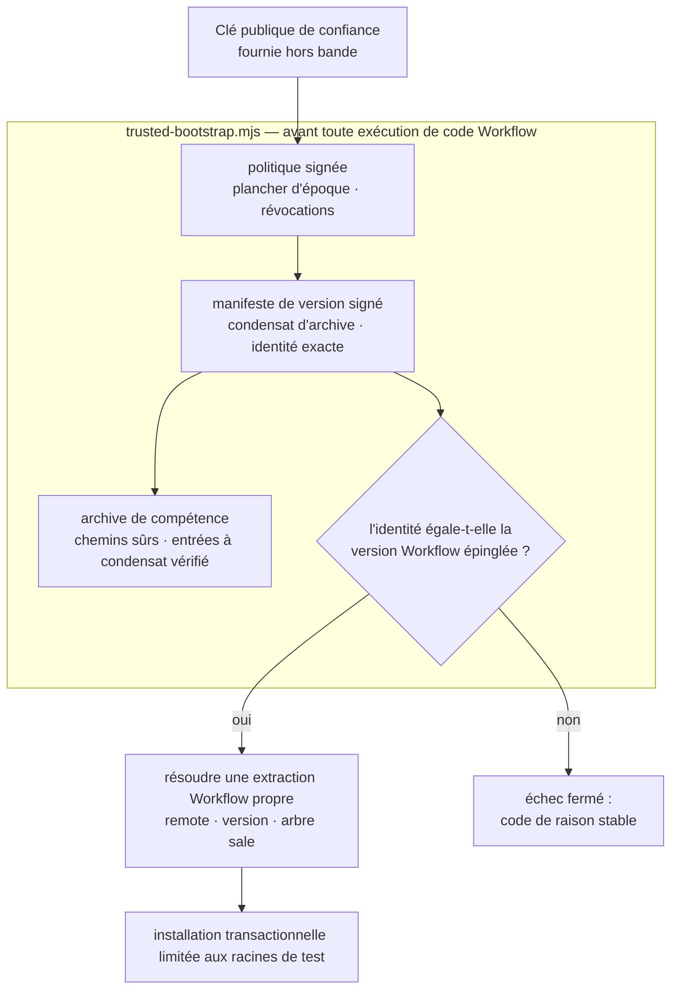

[English](./README.md) | [简体中文](./README.zh-CN.md) | [日本語](./README.ja.md) | [한국어](./README.ko.md) | **Français**

# TCRN Workflow Helper

**Un amorceur de confiance sans dépendances et une compétence d'agent bi-hôte qui refuse d'exécuter une version de TCRN Workflow qu'il ne peut prouver cryptographiquement.**

`Statut : 0.1.0-candidate.4 (candidat de pré-version)` · `Licence : Apache-2.0` · `Node ≥ 24` · `Dépendances : zéro` · `Prend en charge : TCRN Workflow v0.1.0-rc.5`

---

## Pourquoi ce projet existe

Installer une compétence ou un workflow d'agent depuis un dépôt est une décision de chaîne d'approvisionnement, généralement prise à l'aveugle :

- **Aucune identité de version.** Un `git clone` vous donne *un* commit — rien ne le lie à la version qui a été relue et acceptée.
- **Ni signature, ni plancher anti-retour-arrière.** Rien n'arrête une archive silencieusement remplacée, un fichier de politique transplanté, ou une rétrogradation vers une ancienne version vulnérable qui porte encore une signature d'apparence valide.
- **La confiance s'amorce depuis la chose à laquelle on fait confiance.** La plupart des installeurs valident une archive à l'aide de fichiers *à l'intérieur* de cette archive — ce qui ne prouve rien.

Le helper est la réponse pour TCRN Workflow : un amorceur en un seul fichier, sans dépendances, qui valide **l'identité complète de la version signée avant qu'aucun code Workflow ne s'exécute**, sur l'un ou l'autre des hôtes Agent App pris en charge (Codex ou Claude Code). Si une vérification échoue, il s'arrête avec un code de raison stable. Il n'y a pas de `--force`.

## Ce qu'il impose

| Garantie | Mécanisme |
| --- | --- |
| **Identité de version exacte** | La version Workflow acceptée est épinglée par URL de dépôt, version, commit, tree *et* objet de tag annoté. Un manifeste valablement signé pour une version différente échoue fermé (`IDENTITY_MISMATCH`). |
| **Vraies signatures, confiance externe** | Le manifeste de version Ed25519 et une politique signée séparément sont vérifiés avec une clé publique fournie *indépendamment de l'archive* — l'archive ne peut jamais s'authentifier elle-même. La transplantation et le rejeu de politique sont rejetés avant qu'aucun champ de politique ne soit honoré. |
| **Anti-retour-arrière** | Un plancher d'époque de politique monotone persisté hors du répertoire de la Skill ; une époque plus ancienne échoue fermé (`ROLLBACK_REJECTED`), même avec une signature valide. |
| **Sécurité face aux archives hostiles** | Traversée de chemin, chemins absolus, caractères de contrôle, chemins non-NFC, chemins dupliqués/à collision de casse, liens, fichiers spéciaux, altération de condensat par entrée, et limites d'entrées/octets — tout est rejeté avant extraction. |
| **Protection des hôtes en production** | Installation, mise à jour, réinstallation et désinstallation opèrent **uniquement** dans des racines jetables `tcrn-helper-test-*`. Tout chemin contenant un composant `.claude` ou `.codex` — quelle que soit la casse — est rejeté lexicalement (`LIVE_LOCATION_FORBIDDEN`) avant même que le système de fichiers ne soit sondé. |
| **Cycle de vie transactionnel** | Chaque mutation est une transaction échelonnée et journalisée, avec reprise après plantage prouvée par injection de vrais `SIGKILL` ; une opération échouée laisse l'état antérieur identique à l'octet et zéro résidu. |
| **Artefacts de version reproductibles** | L'archive de compétence, l'archive source et le SBOM sont déterministes ; un rejeu CI en clone propre les reconstruit et affirme l'égalité des condensats avec les artefacts committés, sous un environnement de locale/fuseau fixe. |

## Démarrage rapide

```sh
# exécuter la suite de preuves complète (hors ligne ; ~10 min, inclut l'injection de fautes SIGKILL)
npm test

# valider un lot de version signé avant toute exécution
node bootstrap/trusted-bootstrap.mjs validate \
  --archive <archive.json> --manifest <manifest.json> --policy <policy.json> \
  --provenance <provenance.json> --state <state.json> --trusted-key <public-key.pem>

# vérifier en lecture seule une copie de ce Skill placée par un installeur standard dans ~/.claude/skills
node bootstrap/trusted-bootstrap.mjs verify-installed-copy \
  --installed-dir <~/.claude/skills/tcrn-workflow-helper> \
  --manifest <manifest.json> --policy <policy.json> --provenance <provenance.json> \
  --state <state.json> --trusted-key <public-key.pem> --marker <marker.json>

# résoudre exactement une extraction Workflow approuvée (rejette ambiguïté, liens symboliques, arbres sales)
node bootstrap/trusted-bootstrap.mjs resolve --root <workflow-checkout>

# planifier une opération réseau (imprime un plan statique ; n'exécute rien)
node bootstrap/trusted-bootstrap.mjs plan-network --approved true --operation clone

# cycle de vie limité aux racines de test (approbation explicite requise)
node bootstrap/trusted-bootstrap.mjs install --test-root <dir>/tcrn-helper-test-x \
  --archive ... --manifest ... --policy ... --provenance ... --state ... \
  --trusted-key ... --approved true
```

Le succès émet un reçu JSON canonique (`TRUST_VALIDATED`, `ROOT_RESOLVED`, `NETWORK_PLAN_APPROVED`, `INSTALL_COMPLETED`, `UNINSTALL_COMPLETED`). L'échec émet un code de raison stable. Rien entre les deux.

## Comment la chaîne de confiance s'emboîte



## Questions-réponses de conception

### Pourquoi zéro dépendance ?

L'amorceur *est* la frontière de confiance. Chaque dépendance serait du code qui s'exécute avant que la vérification n'existe — exactement le trou que ce projet comble. `bootstrap/trusted-bootstrap.mjs` n'utilise que les modules intégrés de Node, et les scripts de version partagent cette discipline.

### Alors, comment un utilisateur non technique l'installe-t-il ?

Le texte du Skill (`SKILL.md` + `references/`) **peut** être distribué dans un dossier de compétences d'hôte en production (p. ex. `~/.claude/skills`) par un installeur de compétences standard — ce n'est qu'un placement de fichiers, aucun code ne s'y exécute. Ce qui le rend digne de confiance, c'est qu'un amorceur de confiance **obtenu indépendamment** vérifie ensuite cette copie sur disque **en lecture seule** avec `verify-installed-copy` : il reconstruit l'archive de la copie, la confronte au manifeste signé (identité, condensat, plancher anti-retour-arrière) et écrit un marqueur vérifiable par la machine. Ce n'est qu'une fois ce marqueur présent que l'**assistant de premier lancement** (`references/first-run-wizard.md`) se poursuit — récupérant la version épinglée, la validant et guidant l'utilisateur avec des explications en langage clair de chaque code de raison. Donc : installeur standard pour la distribution, amorceur cryptographique pour la confiance.

### Pourquoi les commandes du helper ne peuvent-elles pas s'installer dans un vrai emplacement de compétence ?

Les commandes **mutantes** du helper (`install`/`update`/`reinstall`/`uninstall`) ne font que validation et cycle de vie et restent limitées aux racines de test ; l'activation sur hôte en production par leur biais est une décision de version distincte et gardée. La garde est structurelle : la vérification lexicale d'emplacement s'exécute avant le marqueur de racine de test et avant tout sondage du système de fichiers, replie la casse (`.Claude` ne peut se faufiler), et est couverte par des tests. La distribution du texte du Skill (ci-dessus) utilise un installeur standard plus `verify-installed-copy` en lecture seule — elle ne passe jamais par ces commandes mutantes.

### Pourquoi l'épinglage d'identité est-il si agressif — dépôt, version, commit, tree, *et* objet de tag ?

Chaque champ tue une attaque différente : l'URL du dépôt arrête les remotes sosies ; la version arrête « bon dépôt, mauvaise version » ; le commit et le tree arrêtent les réécritures d'historique qui conservent un nom de tag ; l'objet de tag arrête le re-taggage d'un nom existant sur des octets différents. La suite de tests inclut un manifeste *valablement signé et lié à la politique* mais nommant une version différente — il doit échouer sur la comparaison d'identité elle-même (`IDENTITY_MISMATCH`), prouvant que la vérification n'est pas masquée par la validation de signature.

### Que couvre réellement la suite de tests ?

**79 tests, tous hors ligne** (le seul usage de `node:net` est une fixture de socket de domaine unix locale pour le rejet de fichiers spéciaux) :

- Durcissement du chemin de signature : répertoires de clé accessibles au seul propriétaire, lectures stables par descripteur, rejet de clé malveillante, échecs avant écriture avec zéro résidu.
- Matrice de confiance : substitution de signature/clé, transplantation et rejeu de politique, retour-arrière d'époque, révocation, expiration, provenance altérée, entrées d'archive altérées, et le manifeste à identité non concordante — chacun affirmant son code de raison exact.
- Cycle de vie : installation / mise à jour / réinstallation / désinstallation avec préservation de l'espace de travail privé identique à l'octet, vrais `SIGKILL` à chaque point d'injection effectif (l'inventaire des fautes est découvert à partir des opérations réelles, pas listé à la main), contention de verrou avec concurrents à PID distincts, et préservation des fichiers de remplacement/étrangers.
- Vérification de la copie installée : reconstruction en lecture seule d'un répertoire de compétence placé par un installeur standard, altération → code de raison exact, rejet de répertoire/entrée en lien symbolique, avancée du plancher anti-retour-arrière en cas de succès, et refus d'emplacement en production pour le chemin d'état/de marqueur.
- Garde d'emplacement en production : chemins de niveau utilisateur, de niveau projet, `.codex`, et à variante de casse sur les deux formes d'hôte.
- Reproductibilité : archives déterministes sous environnements `LANG`/`LC_ALL`/`TZ`/`umask` perturbés, égalité à l'octet avec les artefacts committés, et un rejeu CI en clone propre complet (`npm run ci:replay`) qui réexécute toute la séquence de commandes et affirme que les condensats reconstruits égalent les condensats committés.

### Pourquoi le reçu du rejeu CI n'est-il pas un artefact committé ?

Parce qu'un reçu qui certifie une exécution de validation ne devrait pas être lui-même certifié par rien. Des candidats antérieurs committaient `ci-replay-readback.json` ; la relecture a montré qu'il n'était lié par aucune porte et référençait des commits hors de l'historique publié. C'est désormais une sortie CI régénérée (ignorée par git), et l'ensemble d'artefacts committés est exactement les cinq fichiers que chaque porte relie de façon croisée : `candidate-manifest.json`, `checksums.txt`, `sbom.json`, `skill-archive.json`, `source-archive.json`.

## Organisation du dépôt

| Chemin | Contenu |
| --- | --- |
| `bootstrap/trusted-bootstrap.mjs` | La frontière de confiance en un seul fichier : validation d'archive, vérification de signature, épinglage d'identité, anti-retour-arrière, cycle de vie transactionnel. |
| `skill/tcrn-workflow-helper/` | La charge utile de l'Agent Skill : `SKILL.md`, contrat de confiance, référence d'élicitation des réglages, métadonnées par hôte. C'est ce répertoire que contient l'archive signée. |
| `manifests/` | Le manifeste et la politique de version signés Ed25519, plus la provenance de version Workflow copiée à l'octet. |
| `artifacts/` | Les cinq artefacts de version reproductibles. |
| `scripts/` | Générateurs déterministes d'archive/SBOM/sommes de contrôle, vérificateur de version, rejeu CI, outil de signature (la clé privée ne réside jamais dans ce dépôt). |
| `test/` | La suite de preuves de 79 tests. |

## Ce que gouverne la version Workflow épinglée (nouveau en v0.1.0-rc.5)

Le rôle du helper est inchangé — prouver la version avant qu'elle ne s'exécute — mais la version qu'il épingle désormais, TCRN Workflow `v0.1.0-rc.5`, embarque une surface gouvernée plus large que les références du Skill apprennent à l'opérateur à piloter :

- **Gouvernance des conférences et des portes** — les délibérations sont consignées dans le journal d'événements (`conference-open` / `-append-position` / `-close` / `-cancel`), et une porte en attente empêche un élément de travail d'atteindre `done` tant qu'une preuve de compte rendu de conférence ne l'a pas levée (`WORKSPACE_GATE_PENDING`, `WORKSPACE_GATE_EVIDENCE_UNRESOLVED`).
- **Attestation d'acteur** — chaque verbe mutateur doit attribuer un acteur agissant, échouant fermé si l'acteur est absent ou mal formé (`WORKSPACE_ACTOR_REQUIRED`, `WORKSPACE_ACTOR_INVALID`).
- **Échelle d'activation** — la surface gouvernée s'active par échelons successifs plutôt que par un unique interrupteur global ; un espace de travail sans enregistrement de gouvernance reste inchangé dans son comportement.
- **Sauvegarde et restauration** — des instantanés hermétiques, sur le même chemin et de l'arbre entier, avec un reçu déterministe et une preuve identique à l'octet (`snapshot-manifest` / `snapshot-verify` → `SNAPSHOT_VERIFIED`) ; voir `skill/tcrn-workflow-helper/references/backup-elicitation.md`.
- **Distillation** — une distillation de connaissances rapprochée sur le magasin gouverné.

Déclencher ces délibérations à partir de la prose est indicatif et non fiable par conception en attendant gate-v1 ; le Skill l'indique explicitement et confie l'application fiable à des portes vérifiables par la machine.

## Statut, honnêtement

- `0.1.0-candidate.4` est un **candidat de pré-version** prenant en charge exactement TCRN Workflow `v0.1.0-rc.5`.
- L'installation et la suppression sont **limitées aux racines de test** sur les deux hôtes ; aucune prise en charge en production de Codex ou Claude Code n'est revendiquée.
- Les trois comportements spécifiques à Claude Code (réversibilité du fragment de réglages, priorité utilisateur/projet, repli CLAUDE.md) sont implémentés et prouvés **dans la version Workflow épinglée**, pas dans ce dépôt — voir `skill/tcrn-workflow-helper/references/trust-contract.md` pour la carte de preuves exacte.

## Support et sécurité

- Questions → GitHub Discussions · défauts → Issues.
- Rapports de sécurité → signalement privé de vulnérabilités de GitHub (voir `SECURITY.md`).

## Licence

[Apache-2.0](./LICENSE)
