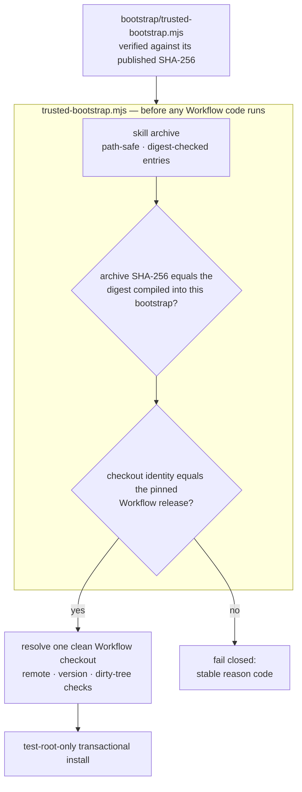

<div align="center">

# TCRN Workflow Helper

**Un seul fichier, que vous vérifiez à la main, une fois. Ensuite, il refuse le moindre octet qui ne soit pas la version qu'on vous a promise.**

[English](./README.md) · [简体中文](./README.zh-CN.md) · [日本語](./README.ja.md) · [한국어](./README.ko.md) · Français

   

    

[Pourquoi](#why-this-project-exists) · [À qui ça s'adresse](#who-this-is-for) · [Vérifiez ceci d'abord](#verify-this-first) · [Ce qu'il impose](#what-it-enforces) · [Installation](#install) · [Licence](#license)

</div>

---

## Pourquoi ce projet existe

Installer une compétence ou un workflow d'agent depuis un dépôt, c'est prendre une décision de chaîne d'approvisionnement — le plus souvent à l'aveugle :

- **Aucune identité de version.** Un `git clone` vous donne *un* commit — rien ne le rattache à la version qui a réellement été relue et acceptée.
- **Rien ne lie les octets.** Une archive remplacée en silence, ou une rétrogradation vers une version ancienne et vulnérable, a exactement l'apparence de la vraie. La clé de signature qu'un éditeur isolé se génère à lui-même n'y change rien : elle ne fait que déplacer la même question sans réponse d'un fichier vers la gauche. Ce qui règle le problème, c'est un condensat que vous pouvez obtenir indépendamment du téléchargement.
- **Une confiance amorcée depuis la chose même qu'il s'agit de croire.** La plupart des installeurs valident une archive à partir de fichiers situés *à l'intérieur* de cette archive — ce qui ne prouve rien. Des candidats antérieurs de ce dépôt ont commis exactement cette erreur, sous un costume plus flatteur : une chaîne Ed25519 dont l'empreinte racine et le condensat de l'amorceur n'étaient publiés nulle part où un utilisateur pouvait aller les chercher, de sorte que chaque contrôle s'exécutait contre une ancre livrée à l'intérieur du téléchargement. Cette chaîne a été supprimée, pas rhabillée.

Le helper est la réponse apportée à TCRN Workflow : un amorceur en un seul fichier, sans aucune dépendance, qui valide **l'intégralité des octets et de l'identité de la version avant qu'une seule ligne de code Workflow ne s'exécute**, sur l'un comme sur l'autre des hôtes Agent App pris en charge (Codex ou Claude Code). Si un contrôle échoue, il s'arrête sur un code de raison stable. Il n'existe pas de `--force`.

## À qui ça s'adresse

**C'est fait pour vous si** vous vous apprêtez à faire tourner le workflow d'agent de quelqu'un d'autre sur une machine qui compte, et que vous voulez mieux qu'une coche verte délivrée par la chose même que vous installez. Également si vous publiez ce genre de workflow et souhaitez donner à vos utilisateurs une vraie raison de faire confiance à une version, sans avoir à exploiter une infrastructure de clés.

**Ce n'est sans doute pas pour vous si** vous installez un workflow que vous avez écrit vous-même, sur une machine que vous seul touchez : vous savez déjà d'où viennent les octets, et cela ne fait qu'ajouter une étape à une question que vous avez déjà tranchée.

## Vérifiez ceci d'abord

L'amorceur est la seule chose que vous ayez à croire ; contrôlez-le donc avant de croire quoi que ce soit qu'il vous dise :

```sh
shasum -a 256 bootstrap/trusted-bootstrap.mjs
# 98888c2c6959479f5867ebe62505ebd63391c84edc9400109f84d21ba37932f0
```

Ce condensat est publié ici, dans `SECURITY.md` et dans les notes de version GitHub. S'il ne correspond pas, arrêtez-vous.

## Ce qu'il impose

| Garantie | Mécanisme |
| --- | --- |
| **Artefacts de version reproductibles** | L'archive de compétence, l'archive source et le SBOM sont déterministes ; un rejeu CI en clone propre les reconstruit et affirme l'égalité des condensats avec les artefacts committés, sous un environnement de locale et de fuseau horaire fixé. C'est le primitif de confiance principal : n'importe qui peut reconstruire les octets et les contrôler. |
| **Identité de version exacte** | La version Workflow acceptée est épinglée par URL de dépôt, version, commit, tree *et* objet de tag annoté. Ces champs sont contrôlés contre une vraie extraction Git, avec de vrais identifiants d'objets Git : ce sont des condensats de contenu, donc auto-authentifiants. |
| **Octets de version figés** | Les condensats de l'archive et de la provenance acceptées sont compilés dans `bootstrap/trusted-bootstrap.mjs`. Le SHA-256 de l'amorceur lui-même est publié dans ce README, dans `SECURITY.md` et dans les notes de version ; vérifiez-le avant de croire ce qu'il affirme. Toute autre archive échoue fermé (`IDENTITY_MISMATCH`). |
| **Anti-retour-arrière** | Versions immuables GitHub : les étiquettes ne peuvent être ni déplacées ni supprimées, et les actifs ne peuvent être modifiés. Une version plus ancienne échoue également la comparaison au condensat figé, puisque chaque amorceur n'accepte exactement qu'une seule archive. |
| **Sécurité face aux archives hostiles** | Traversée de chemin, chemins absolus, caractères de contrôle, chemins non-NFC, chemins dupliqués ou en collision de casse, liens, fichiers spéciaux, altération du condensat d'une entrée, limites d'entrées et d'octets : tout est rejeté avant extraction. |
| **Protection des hôtes en production** | Installation, mise à jour, réinstallation et désinstallation opèrent **uniquement** dans des racines jetables `tcrn-helper-test-*`. Tout chemin contenant un composant `.claude` ou `.codex` — quelle que soit la casse — est rejeté lexicalement (`LIVE_LOCATION_FORBIDDEN`) avant même que le système de fichiers ne soit sondé. |
| **Cycle de vie transactionnel** | Chaque mutation est une transaction échelonnée et journalisée, avec reprise après plantage prouvée par injection de vrais `SIGKILL` ; une opération échouée laisse l'état antérieur identique à l'octet et zéro résidu. |

## Démarrage rapide

```sh
# run the full proof suite (offline; ~10 minutes, includes SIGKILL fault injection)
npm test

# validate a release bundle before anything executes
node bootstrap/trusted-bootstrap.mjs validate \
  --archive <archive.json> --provenance <provenance.json> --state <state.json>

# verify a copy of this Skill that a standard installer placed in ~/.claude/skills (read-only)
node bootstrap/trusted-bootstrap.mjs verify-installed-copy \
  --installed-dir <~/.claude/skills/tcrn-workflow-helper> \
  --provenance <provenance.json> --state <state.json> --marker <marker.json>

# resolve exactly one approved Workflow checkout (rejects ambiguity, symlinks, dirty trees)
node bootstrap/trusted-bootstrap.mjs resolve --root <workflow-checkout>

# plan a network operation (prints a static plan; performs nothing)
node bootstrap/trusted-bootstrap.mjs plan-network --approved true --operation clone

# test-root-only lifecycle (explicit approval required)
node bootstrap/trusted-bootstrap.mjs install --test-root <dir>/tcrn-helper-test-x \
  --archive ... --provenance ... --state ... --approved true
```

Le succès émet un unique reçu JSON canonique (`TRUST_VALIDATED`, `ROOT_RESOLVED`, `NETWORK_PLAN_APPROVED`, `INSTALL_COMPLETED`, `UNINSTALL_COMPLETED`). L'échec émet un unique code de raison stable. Rien entre les deux.

## Comment la chaîne de confiance s'emboîte



## Questions-réponses de conception

### Pourquoi zéro dépendance ?

L'amorceur *est* la frontière de confiance. Chaque dépendance serait du code qui s'exécute avant que la vérification n'existe — exactement le trou que ce projet comble. `bootstrap/trusted-bootstrap.mjs` n'utilise que les modules intégrés de Node, et les scripts de version partagent cette discipline.

### Alors, comment un utilisateur non technique l'installe-t-il ?

Le texte du Skill (`SKILL.md` + `references/`) peut être distribué dans un dossier de compétences d'hôte en production (p. ex. `~/.claude/skills`) par un installeur de compétences standard — ce placement n'est qu'une copie de fichiers, aucun code ne s'y exécute. Ce qui le rend digne de confiance, c'est qu'un amorceur de confiance **obtenu indépendamment** — par un canal distinct du dépôt et contrôlé contre le SHA-256 publié ci-dessus — vérifie ensuite cette copie sur disque **en lecture seule** avec `verify-installed-copy` : il reconstruit l'archive de la copie, compare son condensat à celui compilé dans cet amorceur vérifié, et écrit un marqueur vérifiable par la machine. Ce n'est qu'une fois ce marqueur présent que l'**assistant de premier lancement** (`references/first-run-wizard.md`) se poursuit — récupérant la version épinglée, la validant et guidant l'utilisateur pas à pas, avec des explications en langage clair de chaque code de raison. Donc : installeur standard pour la distribution, amorceur cryptographique pour la confiance.

### Pourquoi les commandes du helper ne peuvent-elles pas s'installer dans un vrai emplacement de compétence ?

Les commandes **mutantes** du helper (`install`/`update`/`reinstall`/`uninstall`) relèvent uniquement de la validation et du cycle de vie, et restent limitées aux racines de test ; l'activation sur hôte en production par leur biais est une décision de version distincte et gardée. La garde est structurelle : le contrôle lexical d'emplacement en production s'exécute avant le contrôle du marqueur de racine de test et avant tout sondage du système de fichiers, il replie la casse (`.Claude` ne peut donc pas se faufiler sur un système de fichiers insensible à la casse), et il est couvert par des tests. La distribution du texte du Skill (ci-dessus) passe par un installeur standard plus `verify-installed-copy` en lecture seule — elle n'emprunte jamais ces commandes mutantes.

### Pourquoi l'épinglage d'identité est-il si agressif — dépôt, version, commit, tree, *et* objet de tag ?

Chaque champ tue une attaque différente : l'URL du dépôt élimine les remotes sosies ; la version élimine le « bon dépôt, mauvaise version » ; le commit et le tree éliminent les réécritures d'historique qui conservent un nom de tag ; l'objet de tag élimine le re-taggage d'un nom existant sur des octets différents. L'identité de l'extraction est vérifiée avec de vrais identifiants d'objets Git, qui sont des condensats de contenu — auto-authentifiants, et jamais tributaires de la signature de qui que ce soit.

### Que couvre réellement la suite de tests ?

**72 tests, tous hors ligne** (le seul usage de `node:net` est une fixture locale de socket de domaine unix, pour le rejet des fichiers spéciaux) :

- Matrice de confiance : condensat figé non concordant, provenance altérée et entrées d'archive altérées — chacun affirmant son code de raison exact.
- Cycle de vie : installation / mise à jour / réinstallation / désinstallation avec préservation de l'espace de travail privé identique à l'octet, vrais `SIGKILL` à chaque point d'injection effectif (l'inventaire des fautes est découvert à partir des opérations réelles, pas listé à la main), contention de verrou avec des concurrents à PID distincts, et préservation des fichiers de remplacement et des fichiers étrangers.
- Vérification de la copie installée : reconstruction en lecture seule d'un répertoire de compétence placé par un installeur standard, altération → code de raison exact, rejet des répertoires et entrées en lien symbolique, enregistrement du condensat vérifié en cas de succès, et refus d'emplacement en production pour le chemin d'état et de marqueur.
- Garde d'emplacement en production : chemins de niveau utilisateur, de niveau projet, `.codex`, et à variante de casse, sur les deux formes d'hôte.
- Reproductibilité : archives déterministes sous environnements `LANG`/`LC_ALL`/`TZ`/`umask` perturbés, égalité à l'octet avec les artefacts committés, et un rejeu CI complet en clone propre (`npm run ci:replay`) qui réexécute toute la séquence de commandes et affirme que les condensats reconstruits égalent les condensats committés.

### Pourquoi le reçu du rejeu CI n'est-il pas un artefact committé ?

Parce qu'un reçu qui certifie une exécution de validation ne devrait pas être lui-même certifié par rien. Des candidats antérieurs committaient `ci-replay-readback.json` ; la relecture a montré qu'il n'était lié par aucune porte et qu'il référençait des commits hors de l'historique publié. C'est désormais une sortie CI régénérée (ignorée par git), et l'ensemble des artefacts committés se réduit exactement aux cinq fichiers que chaque porte relie de façon croisée : `candidate-manifest.json`, `checksums.txt`, `sbom.json`, `skill-archive.json`, `source-archive.json`.

## Organisation du dépôt

| Chemin | Contenu |
| --- | --- |
| `bootstrap/trusted-bootstrap.mjs` | La frontière de confiance en un seul fichier : validation d'archive, condensats d'octets de version figés, épinglage d'identité, cycle de vie transactionnel. **Vérifiez son SHA-256 hors bande avant usage.** |
| `skill/tcrn-workflow-helper/` | La charge utile de l'Agent Skill : `SKILL.md`, contrat de confiance, référence d'élicitation des réglages, métadonnées par hôte. C'est ce répertoire que contient l'archive épinglée. |
| `manifests/` | La provenance de version Workflow copiée à l'octet. Note : il s'agit d'une *déclaration de construction locale auto-affirmée* (type de construction `tcrn.workflow.local-unpublished-candidate.v1`, horodatages à zéro), et non d'une attestation par un constructeur hébergé. Elle est épinglée par condensat et ne peut donc pas être substituée ; la vérifiabilité par un tiers vient de la chaîne de construction reproductible, pas de ce fichier. |
| `artifacts/` | Les cinq artefacts de version reproductibles. |
| `scripts/` | Générateurs déterministes d'archive, de SBOM et de sommes de contrôle, vérificateur de version, rejeu CI. |
| `test/` | La suite de preuves de 72 tests. |

## Ce que gouverne la version Workflow épinglée (nouveau en v0.1.0-rc.5)

Le rôle du helper est inchangé — prouver la version avant qu'elle ne s'exécute — mais la version qu'il épingle désormais, TCRN Workflow `v0.1.0-rc.5`, embarque une surface gouvernée plus large, que les références du Skill apprennent à l'opérateur à piloter :

- **Gouvernance des conférences et des portes** — les délibérations sont consignées dans le journal d'événements (`conference-open` / `-append-position` / `-close` / `-cancel`), et une porte en attente empêche un élément de travail d'atteindre `done` tant qu'une preuve de compte rendu de conférence ne l'a pas levée (`WORKSPACE_GATE_PENDING`, `WORKSPACE_GATE_EVIDENCE_UNRESOLVED`).
- **Attestation d'acteur** — chaque verbe mutateur doit attribuer un acteur agissant, et échoue fermé si l'acteur est absent ou mal formé (`WORKSPACE_ACTOR_REQUIRED`, `WORKSPACE_ACTOR_INVALID`).
- **Échelle d'activation** — la surface gouvernée s'active par échelons successifs plutôt que par un unique interrupteur global ; un espace de travail sans enregistrement de gouvernance conserve exactement le même comportement.
- **Sauvegarde et restauration** — des instantanés hermétiques, sur le même chemin et portant sur l'arbre entier, avec un reçu déterministe et une preuve identique à l'octet (`snapshot-manifest` / `snapshot-verify` → `SNAPSHOT_VERIFIED`) ; voir `skill/tcrn-workflow-helper/references/backup-elicitation.md`.
- **Distillation** — une distillation de connaissances rapprochée sur le magasin gouverné.

Déclencher ces délibérations à partir de la prose est indicatif et non fiable par conception, en attendant gate-v1 ; le Skill l'indique explicitement et confie l'application fiable à des portes vérifiables par la machine.

## Statut, honnêtement

- `0.1.0-candidate.4` est un **candidat de pré-version** prenant en charge exactement TCRN Workflow `v0.1.0-rc.5`.
- L'installation et la suppression sont **limitées aux racines de test** sur les deux hôtes ; aucune prise en charge en production de Codex ou Claude Code n'est revendiquée.
- **La chaîne de signature Ed25519 auto-construite a été supprimée le 2026-07-19, dans `0.1.0-candidate.4`.** Elle n'avait jamais été ancrée : le condensat de l'amorceur et l'empreinte de clé dont elle dépendait n'étaient publiés nulle part où un utilisateur pouvait les obtenir de façon indépendante, si bien que la chaîne ne prouvait rien à personne en dehors de ce dépôt. La clé avait été générée par un agent automatisé plutôt que signée par le propriétaire humain, elle restait en clair sur le disque et n'avait aucun chemin de rotation (égalité à l'octet contre une constante compilée). Son expiration était codée en dur à une date fixe, ce qui programmait une panne pour chaque installation honnête sans contraindre le moindre attaquant. Le parc installé était nul. Ce qui la remplace : un condensat d'amorceur *réellement publié*, les condensats de version acceptés compilés dans cet amorceur, les versions immuables GitHub et la chaîne de construction reproductible.
- Les trois comportements spécifiques à Claude Code (réversibilité du fragment de réglages, priorité utilisateur/projet, repli CLAUDE.md) sont implémentés et prouvés **dans la version Workflow épinglée**, pas dans ce dépôt — voir `skill/tcrn-workflow-helper/references/trust-contract.md` pour la carte de preuves exacte.

## Support et sécurité

- Questions → GitHub Discussions · défauts → Issues.
- Rapports de sécurité → signalement privé de vulnérabilités de GitHub (voir `SECURITY.md`).

## Licence

[Apache-2.0](./LICENSE)
