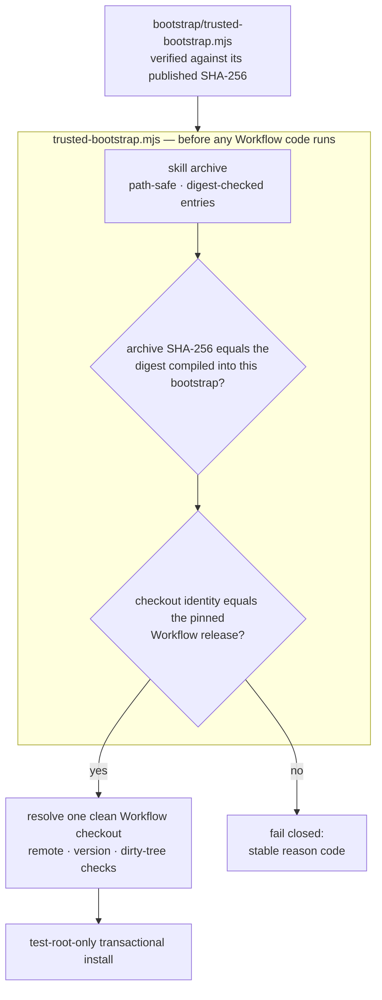

<div align="center">

# TCRN Workflow Helper

### Vérifiez un fichier à la main, une fois. Ensuite, c'est lui qui refuse tout le reste.

**Un amorceur d'un seul fichier, sans aucune dépendance, qui prouve qu'une release est exactement celle qui a été publiée — avant qu'une seule ligne ne s'exécute.**

[English](./README.md) · [简体中文](./README.zh-CN.md) · [日本語](./README.ja.md) · [한국어](./README.ko.md) · Français

   

    

[Vérifiez ceci en premier](#vérifiez-ceci-en-premier) · [Pourquoi ce projet existe](#pourquoi-ce-projet-existe) · [Ce qu'il impose](#ce-quil-impose) · [Démarrage rapide](#démarrage-rapide) · [Réponses directes](#réponses-directes) · [Licence](#licence)

</div>

---

> **Toute l'idée en une phrase :** vous confrontez un petit fichier à une empreinte publiée à plusieurs endroits indépendants — et à partir de là, ce fichier refuse cryptographiquement toute release qui ne serait pas, octet pour octet, celle qui a été relue. Il n'existe pas de `--force`.

## Vérifiez ceci en premier

L'amorceur est la seule chose que vous ayez jamais à croire ; vérifiez-le donc avant de croire ce qu'il vous dira. Une commande, une comparaison :

```sh
shasum -a 256 bootstrap/trusted-bootstrap.mjs
# 4bbe434d901efee52d0d7b76191e3eea481900ad9134b466202a555e41d975cf
```

Cette empreinte est publiée ici, dans `SECURITY.md` et dans les notes de version GitHub. **Si ce que vous calculez ne correspond pas, arrêtez-vous** — n'exécutez rien, n'essayez pas « quand même ». Une divergence, c'est le système qui fonctionne.

## Pourquoi ce projet existe

Installer une compétence ou un workflow d'agent depuis un dépôt est une décision de chaîne d'approvisionnement, et elle se prend généralement à l'aveugle :

- **Aucune identité de release.** Un `git clone` vous remet *un* commit — rien ne le relie à la release qui a réellement été relue et acceptée.
- **Rien ne lie les octets.** Une archive remplacée en silence, ou une régression vers une ancienne version vulnérable, ressemble en tout point à la vraie. Une clé de signature générée par un mainteneur solitaire ne règle pas cela — elle déplace la même question sans réponse d'un fichier vers la gauche. Ce qui règle la question, c'est une empreinte que vous pouvez obtenir *indépendamment du téléchargement*.
- **Une confiance amorcée depuis ce qu'il faudrait justement vérifier.** La plupart des installateurs valident une archive à l'aide de fichiers *contenus dans* cette archive — ce qui ne prouve rien. Les premiers candidats de ce dépôt ont commis exactement cette erreur sous un costume plus flatteur : une chaîne de signature Ed25519 dont l'empreinte racine n'était publiée nulle part où un utilisateur pouvait la trouver. Cette chaîne a été supprimée plutôt que rhabillée, et la version honnête est celle que vous lisez.

Le helper est la réponse pour TCRN Workflow : un amorceur d'un seul fichier, sans dépendances, qui valide **l'intégralité des octets et de l'identité de la release avant que le moindre code de Workflow ne s'exécute**, sur l'un ou l'autre des hôtes pris en charge (Codex ou Claude Code). Si un contrôle échoue, il s'arrête avec un reason code stable et lisible par machine.

## Est-ce fait pour vous

| | |
| --- | --- |
| ✅ **Oui, si** | vous vous apprêtez à exécuter le workflow d'agent de quelqu'un d'autre sur une machine qui compte, et que vous voulez mieux qu'une coche verte dessinée par la chose même que vous installez. Ou si vous publiez un tel workflow et voulez donner à vos utilisateurs une *vraie* raison de faire confiance à une release — sans exploiter vous-même une infrastructure de clés. |
| ❌ **Probablement pas, si** | vous installez un workflow que vous avez écrit, sur une machine que vous seul touchez. Vous savez déjà d'où viennent les octets ; ceci ajoute une étape à une question déjà réglée. |

## Ce qu'il impose

| Garantie | Comment cela fonctionne |
| --- | --- |
| **Artefacts reproductibles** | L'archive de compétence, l'archive source et le SBOM sont déterministes. Un rejeu CI sur clone propre les reconstruit de zéro et affirme l'égalité des empreintes avec celles qui sont committées. N'importe qui peut reconstruire les octets et vérifier — c'est la primitive de confiance principale. |
| **Identité de release exacte** | La release Workflow acceptée est épinglée par l'URL du dépôt, la version, le commit, l'arbre *et* l'objet d'étiquette annotée — le tout contrôlé face à une véritable copie de travail Git. Les identifiants d'objets Git sont des hachages de contenu : le lien s'authentifie donc lui-même. |
| **Octets de release épinglés** | Les empreintes de l'archive et de la provenance acceptées sont compilées dans `bootstrap/trusted-bootstrap.mjs` lui-même. Toute autre archive échoue en fermeture (`IDENTITY_MISMATCH`). Le SHA-256 de l'amorceur est la seule valeur que vous vérifiez à la main, ci-dessus. |
| **Anti-retour arrière** | Releases immuables GitHub : les étiquettes ne peuvent être déplacées, les fichiers ne peuvent être échangés. Une release plus ancienne échoue également à la comparaison d'empreinte épinglée, car chaque amorceur n'accepte qu'une seule archive. |
| **Sûreté face aux archives hostiles** | Traversée de chemin, chemins absolus, caractères de contrôle, chemins non NFC, chemins dupliqués ou en collision de casse, liens, fichiers spéciaux, altération d'empreinte par entrée, limites d'entrées et d'octets — tout est rejeté *avant* extraction. |
| **Protection de l'hôte réel** | install, update, reinstall et uninstall n'opèrent **que** dans des racines jetables `tcrn-helper-test-*`. Tout chemin comportant un composant `.claude` ou `.codex` — quelle que soit la casse — est rejeté avant même que le système de fichiers ne soit sondé (`LIVE_LOCATION_FORBIDDEN`). |
| **Cycle de vie transactionnel** | Chaque modification est une transaction préparée et journalisée, dont la reprise après plantage est prouvée par une injection réelle de `SIGKILL`. Une opération échouée laisse l'état antérieur identique octet pour octet, et zéro résidu. |

## Démarrage rapide

```sh
# run the full proof suite (offline; expect 10-20 minutes — it includes real SIGKILL fault injection)
npm test

# validate a release bundle before anything executes
node bootstrap/trusted-bootstrap.mjs validate \
  --archive <archive.json> --provenance <provenance.json> --state <state.json>

# verify a copy of this Skill that a standard installer placed in ~/.claude/skills (read-only)
node bootstrap/trusted-bootstrap.mjs verify-installed-copy \
  --installed-dir <~/.claude/skills/tcrn-workflow-helper> \
  --provenance <provenance.json> --state <state.json> --marker <marker.json>

# resolve exactly one approved Workflow checkout (rejects ambiguity, symlinks, dirty trees)
node bootstrap/trusted-bootstrap.mjs resolve --root <workflow-checkout>

# plan a network operation (prints a static plan; performs nothing)
node bootstrap/trusted-bootstrap.mjs plan-network --approved true --operation clone

# test-root-only lifecycle (explicit approval required)
node bootstrap/trusted-bootstrap.mjs install --test-root <dir>/tcrn-helper-test-x \
  --archive ... --provenance ... --state ... --approved true
```

En cas de succès, un seul reçu JSON canonique est émis (`TRUST_VALIDATED`, `ROOT_RESOLVED`, `NETWORK_PLAN_APPROVED`, `INSTALL_COMPLETED`, `UNINSTALL_COMPLETED`). En cas d'échec, un seul reason code stable. Rien entre les deux.

## L'utiliser au quotidien

Les commandes ci-dessus sont la machinerie de confiance. Au quotidien, vous ne les lancez presque jamais vous-même — votre agent s'en charge, et le vrai produit de ce dépôt est la discipline qu'il remet à votre agent.

1. **Placer une fois.** Faites placer `skill/tcrn-workflow-helper/` par votre agent (ou tout installateur de skills standard) dans le dossier de skills de votre hôte — pour Claude Code, `~/.claude/skills` ou le `.claude/skills` d'un projet. Le placement n'est que des fichiers ; aucun code ne s'exécute depuis là.
2. **Faire confiance une fois.** Vérifiez votre téléchargement de `trusted-bootstrap.mjs` contre le SHA-256 publié ci-dessus, puis laissez-le inspecter la copie placée en lecture seule : `verify-installed-copy` répond `INSTALLED_COPY_VALIDATED` ou nomme exactement ce qui ne va pas. Chaque session ultérieure rejoue ce seul contrôle en lecture seule, si bien qu'une copie périmée ou modifiée est attrapée avant de guider quoi que ce soit.
3. **Configurer par la conversation.** Demandez à votre agent de mettre en place TCRN Workflow. L'assistant de première exécution de la Skill le guide — et vous avec — pour le reste, en langage clair : résolution de l'unique checkout Workflow approuvé (`ROOT_RESOLVED`), création de l'espace de travail, choix de la destination et du rythme de sauvegarde. Vous ne tapez aucun chemin.
4. **Puis travaillez, simplement.** La Skill apprend à votre agent quels moments de travail méritent un enregistrement — une décision, une décomposition, un livrable achevé, un « terminé » contesté — et quel verbe l'enregistre. Une seule règle dure traverse tout : il propose, et rien ne s'écrit sans votre oui explicite. Pour voir la boucle sous-jacente de vos propres yeux, le dépôt Workflow embarque un tutoriel épinglé par la preuve dans `docs/tutorial/governed-loop.md`.

### Installer via le registre Skills

Après autorisation par l'Owner d'une source publique, utilisez l'installateur standard orienté copie :

```sh
npx skills add <owner>/<repository> \
  --skill tcrn-workflow-helper \
  --global --agent claude-code --agent codex --copy --yes
```

L'installateur ne fait que placer les fichiers de la Skill ; `trusted-bootstrap.mjs` vérifie séparément la racine de confiance. Pour la matrice de test, utilisez `<scratch-host>/.claude/skills` et `<scratch-host>/.agents/skills` ; une racine symbolique n'est pas une copie validée.

Ce qui reste à vous : chaque décision. Ce qui reste au moteur : leur application. Ce qui reste vérifiable : tout cela.

## Comment la chaîne de confiance s'assemble



## Réponses directes

### Pourquoi zéro dépendance

L'amorceur *est* la frontière de confiance. Chaque dépendance serait du code s'exécutant avant même que la vérification n'existe — exactement la brèche que ce projet ferme. `bootstrap/trusted-bootstrap.mjs` n'utilise que les modules natifs de Node, et les scripts de release partagent la même discipline.

### Alors comment un utilisateur non technique installe-t-il tout cela

La prose de la compétence (`SKILL.md` et `references/`) peut être distribuée vers un dossier de compétences d'un hôte réel (par exemple `~/.claude/skills`) par un installateur standard — ce placement n'est que des fichiers ; aucun code ne s'exécute depuis là. La confiance vient ensuite : un amorceur **obtenu indépendamment** — confronté au SHA-256 publié ci-dessus — vérifie cette copie sur disque en lecture seule avec `verify-installed-copy` et écrit un marqueur vérifiable par machine. Ce n'est qu'une fois ce marqueur présent que l'**assistant de premier lancement** (`references/first-run-wizard.md`) démarre, guidant la configuration avec une explication en langage clair de chaque reason code. Donc : installateur standard pour la distribution, amorceur cryptographique pour la confiance.

### Pourquoi les commandes du helper ne peuvent-elles pas installer dans un vrai emplacement de compétence

Les commandes modifiantes du helper (`install`/`update`/`reinstall`/`uninstall`) ne font que valider et gérer le cycle de vie, et restent cantonnées aux racines de test ; activer un hôte réel par leur intermédiaire est une décision de release encadrée séparément. La garde est structurelle : le contrôle d'emplacement réel s'exécute avant le contrôle de racine de test et avant toute exploration du système de fichiers, compare en repliant la casse (un `.Claude` sur un système insensible à la casse ne peut donc pas passer) et est couvert par des tests.

### Pourquoi l'épinglage d'identité est-il si agressif — dépôt, version, commit, arbre *et* objet d'étiquette

Chaque champ tue une attaque différente : l'URL du dépôt arrête les dépôts sosies ; la version arrête le « bon dépôt, mauvaise release » ; le commit et l'arbre arrêtent les réécritures d'historique qui conservent un nom d'étiquette ; l'objet d'étiquette empêche de réattribuer un nom existant à d'autres octets. Tout est vérifié avec de véritables identifiants d'objets Git — des hachages de contenu, auto-authentifiants, jamais tributaires de la signature de quiconque.

### Que couvre réellement la suite de tests

**87 tests, tous hors ligne** (le seul usage de `node:net` est une fixture locale de socket de domaine Unix pour le rejet des fichiers spéciaux) :

- Matrice de confiance : empreinte épinglée divergente, provenance altérée, entrées d'archive altérées — chacune affirmant son reason code exact.
- Cycle de vie : install / update / reinstall / uninstall avec préservation octet pour octet de l'espace de travail privé, `SIGKILL` réel à chaque point d'injection effectif (l'inventaire des pannes est découvert à partir des opérations réelles, pas listé à la main), contention de verrou avec des concurrents de PID distincts, et préservation des fichiers remplacés ou étrangers.
- Vérification de copie installée : reconstruction en lecture seule d'un répertoire de compétence placé par un installateur standard, altération → reason code exact, rejet des liens symboliques, et refus d'emplacement réel pour le chemin d'état et de marqueur.
- Garde d'emplacement réel : chemins au niveau utilisateur, au niveau projet, `.codex`, et variantes de casse sur les deux formes d'hôtes.
- Reproductibilité : archives déterministes sous des environnements `LANG`/`LC_ALL`/`TZ`/`umask` perturbés, égalité octet pour octet avec les artefacts committés, et un rejeu CI complet sur clone propre (`npm run ci:replay`).
- Ordre : tout parcours produisant une empreinte compare par unité de code, jamais par locale — une installation ne peut donc jamais être refusée parce que l'hôte parle une autre langue.

### Pourquoi le reçu du rejeu CI n'est-il pas un artefact committé

Parce qu'un reçu qui certifie une exécution de validation ne devrait pas être lui-même certifié par rien. Des candidats antérieurs committaient `ci-replay-readback.json` ; la relecture a montré qu'il n'était lié par aucune porte et qu'il référençait des commits hors de l'historique publié. C'est désormais une sortie CI régénérée (ignorée par git), et l'ensemble des artefacts committés se réduit exactement aux cinq fichiers que chaque porte relie de façon croisée : `candidate-manifest.json`, `checksums.txt`, `sbom.json`, `skill-archive.json`, `source-archive.json`.

## Organisation du dépôt

| Chemin | Contenu |
| --- | --- |
| `bootstrap/trusted-bootstrap.mjs` | La frontière de confiance en un seul fichier : validation d'archive, empreintes d'octets de release épinglées, épinglage d'identité, cycle de vie transactionnel. **Vérifiez son SHA-256 hors bande avant usage.** |
| `skill/tcrn-workflow-helper/` | La charge utile de l'Agent Skill : `SKILL.md`, contrat de confiance, référence de sollicitation des réglages, métadonnées par hôte. Ce répertoire est précisément ce que contient l'archive épinglée. |
| `manifests/` | La provenance de release Workflow, copiée octet pour octet. C'est une *déclaration de build locale auto-affirmée* (horodatages à zéro), pas une attestation d'un constructeur hébergé — elle est épinglée par empreinte et ne peut donc être échangée ; la vérifiabilité par un tiers vient de la chaîne de build reproductible. |
| `artifacts/` | Les cinq artefacts de release reproductibles. |
| `scripts/` | Générateurs déterministes d'archive/SBOM/sommes de contrôle, vérificateur de release, rejeu CI, porte de push. |
| `test/` | La suite de preuves de 87 tests. |
| `RELEASING.md` | Le runbook de release — l'ordre imposé, la règle de copie de la provenance, et la règle de suite complète pour les commits touchant la surface de confiance. |

## Ce que gouverne la release Workflow épinglée

Le rôle du helper est inchangé — prouver la release avant qu'elle ne s'exécute. Et la release qu'il épingle, TCRN Workflow `v0.11.9`, apporte une surface gouvernée que les références de la compétence apprennent à l'opérateur à piloter :

- **Gouvernance des conférences et des portes** — les délibérations sont consignées dans le journal d'événements (`conference-open` / `-append-position` / `-close` / `-cancel`), et une porte non satisfaite empêche un élément de travail d'atteindre `done` tant que les preuves du compte rendu ne la résolvent pas (`WORKSPACE_GATE_PENDING`, `WORKSPACE_GATE_EVIDENCE_UNRESOLVED`).
- **Attestation d'acteur** — une fois activée, chaque verbe modifiant doit attribuer un acteur agissant, et échoue en fermeture si celui-ci est absent ou mal formé (`WORKSPACE_ACTOR_REQUIRED`, `WORKSPACE_ACTOR_INVALID`).
- **Échelle d'activation** — la surface gouvernée s'active par échelons progressifs et réversibles plutôt que par un interrupteur global ; un espace de travail sans enregistrement de gouvernance se comporte exactement comme avant.
- **Sauvegarde et restauration** — instantanés hermétiques de l'arbre entier au même chemin, avec un reçu déterministe et une preuve octet pour octet (`snapshot-manifest` / `snapshot-verify` → `SNAPSHOT_VERIFIED`) ; voir `skill/tcrn-workflow-helper/references/backup-elicitation.md`.
- **Relocalisation gouvernée** — un espace de travail dispose d'une route consignée vers un nouveau chemin ou une nouvelle machine (`relocation-plan` / `-vacate` / `-adopt` / `-abort` / `-inspect`). Ces verbes déplacent la liaison, l'opérateur déplace les octets, et aucun événement n'est réécrit. Cela n'empêche pas une bifurcation ; cela la rend lisible — lisez `docs/adr/0003-workspace-relocation.md` de la release avant de vous y appuyer.
- **Une chaîne lisible** — `event-list` renvoie les événements tels quels, page par page, de sorte qu'un consommateur peut redériver une chaîne trop grande pour `export`.
- **Distillation** — distillation de connaissances réconciliée au-dessus du magasin gouverné.

Déclencher ces délibérations par la prose reste consultatif et non fiable par conception en attendant gate-v1 ; la compétence le dit explicitement et renvoie l'application fiable à des portes vérifiables par machine.

## Statut, honnêtement

- `0.1.0-candidate.34` est un **candidat de pré-version** prenant en charge exactement TCRN Workflow `v0.11.9`.
- L'installation et la suppression sont **limitées aux racines de test** sur les deux hôtes ; aucune prise en charge active de Codex ou Claude Code n'est affirmée.
- **La chaîne de signature Ed25519 maison a été supprimée le 2026-07-19.** Elle n'a jamais été ancrée : l'empreinte et le doigt de clé dont elle dépendait n'étaient publiés nulle part où un utilisateur pouvait les obtenir indépendamment, si bien que la chaîne ne prouvait rien à quiconque hors de ce dépôt. Ce qui la remplace est plus simple et honnête : une empreinte d'amorceur *réellement publiée* à des endroits indépendants, des empreintes de release acceptées compilées dans cet amorceur, les releases immuables GitHub et la chaîne de build reproductible.
- Les trois comportements propres à Claude Code (réversibilité du fragment de réglages, précédence utilisateur/projet, repli CLAUDE.md) sont implémentés et prouvés **dans la release Workflow épinglée**, pas dans ce dépôt — voir `skill/tcrn-workflow-helper/references/trust-contract.md` pour la carte exacte des preuves.

## Support et sécurité

- Questions → GitHub Discussions · défauts → Issues.
- Rapports de sécurité → signalement privé de vulnérabilité GitHub (voir `SECURITY.md`).

## Licence

[Apache-2.0](./LICENSE)
