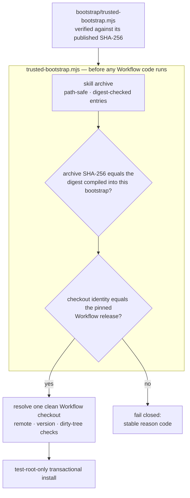

<div align="center">

# TCRN Workflow Helper

### 手作業で一つのファイルを一度だけ確認する。あとはそれが、他のすべてを拒みます。

**単一ファイル・依存ゼロのブートストラップが、コードが一行でも動く前に、そのリリースが公開されたものと寸分違わないことを証明します。**

[English](./README.md) · [简体中文](./README.zh-CN.md) · 日本語 · [한국어](./README.ko.md) · [Français](./README.fr.md)

   

    

[まずこれを確認](#まずこれを確認) · [なぜこのプロジェクトが存在するのか](#なぜこのプロジェクトが存在するのか) · [何を強制するのか](#何を強制するのか) · [クイックスタート](#クイックスタート) · [率直な回答](#率直な回答) · [ライセンス](#ライセンス)

</div>

---

> **一文で言うと**：小さなファイルを一つ、複数の独立した場所で公開されている digest と照合するだけです——それ以降、そのファイルは、レビューされたものとバイト単位で同一でないリリースを暗号学的に拒み続けます。`--force` はありません。

## まずこれを確認

ブートストラップは、あなたが信頼しなければならない唯一のものです。ですから、それが語ることを信じる前に、それ自体を確認してください。コマンド一つ、比較一回です。

```sh
shasum -a 256 bootstrap/trusted-bootstrap.mjs
# 6532ea795c1a7fa9f3b945e117060cdb0edc73498bcf893b9b36072c4be8dacd
```

この digest はここ、`SECURITY.md`、そして GitHub のリリースノートで公開されています。**計算した値が一致しなければ、そこで止めてください**——何も実行せず、「とりあえず試す」こともしないでください。一致しないことこそ、この仕組みが働いている証拠です。

## なぜこのプロジェクトが存在するのか

リポジトリからエージェントのスキルやワークフローを導入することは、サプライチェーン上の判断であり、たいていは目隠しのまま行われます。

- **リリースの同一性がない**。`git clone` が渡してくれるのは*なんらかの*コミットであって、レビューされ受理されたリリースに結びつけるものは何もありません。
- **バイト列を縛るものが何もない**。静かに差し替えられたアーカイブや、脆弱な旧版へのダウングレードは、本物と見分けがつきません。個人発行者が自分で作った署名鍵はこれを解決しません——同じ未回答の問いを一つ左にずらすだけです。解決するのは、*ダウンロードとは独立に*入手できる digest です。
- **信頼が、信頼すべき当の対象から自己起動している**。多くのインストーラーはアーカイブ*の中の*ファイルでそのアーカイブを検証します——それは何も証明しません。このリポジトリの初期候補は、もっと見栄えのする衣装でまさにその誤りを犯しました：ルート指紋がユーザーの手の届くどこにも公開されていない Ed25519 署名チェーンです。そのチェーンは取り繕われるのではなく削除され、いま読んでいるのが正直な版です。

Helper は TCRN Workflow に対する答えです：単一ファイル・依存ゼロのブートストラップが、対応する二つのホスト（Codex または Claude Code）のいずれにおいても、**Workflow のコードが実行される前に、リリースのバイト列と同一性を完全に検証します**。いずれかの検査が失敗すれば、安定した機械可読の reason code とともに停止します。

## あなたに向いているか

| | |
| --- | --- |
| ✅ **向いています** | 大切なマシンで他人のエージェントワークフローを動かそうとしていて、インストール対象自身が描いた緑のチェックマーク以上のものが欲しい場合。あるいは、あなたがそうしたワークフローを公開する側で、鍵基盤を自分で運用することなく、利用者にリリースを信じる*本当の*理由を与えたい場合。 |
| ❌ **おそらく向きません** | 自分で書いたワークフローを、自分しか触らないマシンに入れる場合。バイト列の出所はすでに分かっており、これは答え済みの問いに手順を一つ足すだけです。 |

## 何を強制するのか

| 保証 | 仕組み |
| --- | --- |
| **再現可能な成果物** | スキルアーカイブ、ソースアーカイブ、SBOM は決定的です。クリーンクローンの CI リプレイがそれらをゼロから再構築し、digest がコミット済みのものと一致することを主張します。誰でもバイト列を再構築して確認できる——これが第一の信頼原理です。 |
| **厳密なリリース同一性** | 受理された Workflow リリースは、リポジトリ URL、バージョン、commit、tree、**そして**注釈付きタグオブジェクトで固定され、実際の Git チェックアウトに対して検査されます。Git のオブジェクト id は内容ハッシュなので、この結びつきは自己認証的です。 |
| **固定されたリリースバイト列** | 受理されたアーカイブと provenance の digest は `bootstrap/trusted-bootstrap.mjs` 自身にコンパイルされています。それ以外のアーカイブはフェイルクローズします（`IDENTITY_MISMATCH`）。ブートストラップ自身の SHA-256 こそ、上で手作業で確認するただ一つの値です。 |
| **ロールバック防止** | GitHub のイミュータブルリリース：タグは移動できず、アセットは差し替えられません。古いリリースも固定 digest の比較で失敗します。各ブートストラップはちょうど一つのアーカイブしか受理しないからです。 |
| **敵対的アーカイブへの安全性** | パストラバーサル、絶対パス、制御文字、非 NFC パス、重複およびケース衝突するパス、リンク、特殊ファイル、エントリ単位の digest 改竄、エントリ/バイト上限——すべて展開*前に*拒否されます。 |
| **ライブホストの保護** | install、update、reinstall、uninstall は使い捨ての `tcrn-helper-test-*` ルート内**のみ**で動作します。`.claude` または `.codex` を含むパスは——大文字小文字を問わず——ファイルシステムを探る前に拒否されます（`LIVE_LOCATION_FORBIDDEN`）。 |
| **トランザクショナルなライフサイクル** | すべての変更はステージングされジャーナル化されたトランザクションであり、そのクラッシュ復旧は本物の `SIGKILL` 注入で証明されています。失敗した操作はバイト単位で同一の以前の状態と、残渣ゼロを残します。 |

## クイックスタート

```sh
# run the full proof suite (offline; expect 10-20 minutes — it includes real SIGKILL fault injection)
npm test

# validate a release bundle before anything executes
node bootstrap/trusted-bootstrap.mjs validate \
  --archive <archive.json> --provenance <provenance.json> --state <state.json>

# verify a copy of this Skill that a standard installer placed in ~/.claude/skills (read-only)
node bootstrap/trusted-bootstrap.mjs verify-installed-copy \
  --installed-dir <~/.claude/skills/tcrn-workflow-helper> \
  --provenance <provenance.json> --state <state.json> --marker <marker.json>

# resolve exactly one approved Workflow checkout (rejects ambiguity, symlinks, dirty trees)
node bootstrap/trusted-bootstrap.mjs resolve --root <workflow-checkout>

# plan a network operation (prints a static plan; performs nothing)
node bootstrap/trusted-bootstrap.mjs plan-network --approved true --operation clone

# test-root-only lifecycle (explicit approval required)
node bootstrap/trusted-bootstrap.mjs install --test-root <dir>/tcrn-helper-test-x \
  --archive ... --provenance ... --state ... --approved true
```

成功時は正規化された JSON レシートが一つだけ出力されます（`TRUST_VALIDATED`、`ROOT_RESOLVED`、`NETWORK_PLAN_APPROVED`、`INSTALL_COMPLETED`、`UNINSTALL_COMPLETED`）。失敗時は安定した reason code が一つ。その中間はありません。

## 信頼チェーンの組み立て方



## 率直な回答

### なぜ依存ゼロなのか

ブートストラップ*こそ*が信頼境界だからです。あらゆる依存は、検証が存在する前に走るコードになります——まさにこのプロジェクトが塞ぐ穴です。`bootstrap/trusted-bootstrap.mjs` は Node 組み込みのみを使い、リリーススクリプトも同じ規律を共有します。

### では技術者でない利用者はどう導入するのか

スキルの散文部分（`SKILL.md` と `references/`）は、標準的なスキルインストーラーによってライブホストのスキルフォルダ（たとえば `~/.claude/skills`）へ配布して構いません——その配置はただのファイルであり、そこからコードは走りません。信頼はその後に来ます：**独立に入手した**ブートストラップが——上で公開された SHA-256 と照合済みで——ディスク上のそのコピーを `verify-installed-copy` で読み取り専用に検証し、機械が確認できるマーカーを書きます。そのマーカーが存在して初めて、案内付きの**初回実行ウィザード**（`references/first-run-wizard.md`）が進み、すべての reason code を平易な言葉で説明しながらセットアップを導きます。配布は標準インストーラー、信頼は暗号学的ブートストラップ、というわけです。

### なぜ helper 自身のコマンドは本物のスキル配置先にインストールできないのか

helper の変更系コマンド（`install`/`update`/`reinstall`/`uninstall`）は検証とライフサイクルのみを担い、テストルート限定にとどまります。それらを通じたライブホストの有効化は、別途ゲートされたリリース判断です。ガードは構造的です：ライブ配置の検査はテストルートの検査よりも前、そしていかなるファイルシステム探査よりも前に走り、大文字小文字を畳んで比較し（大文字小文字を区別しないファイルシステム上の `.Claude` もすり抜けられません）、テストで覆われています。

### 同一性の固定はなぜここまで厳しいのか——リポジトリ、バージョン、commit、tree、さらにタグオブジェクトまで

各項目が別々の攻撃を潰します：リポジトリ URL は似せた remote を止め、バージョンは「リポジトリは正しいがリリースが違う」を止め、commit と tree はタグ名を保ったままの履歴改変を止め、タグオブジェクトは既存のタグ名を別のバイト列へ付け替えることを止めます。すべては実際の Git オブジェクト id で検証されます——内容ハッシュであり、自己認証的で、誰の署名にも依存しません。

### テストスイートは実際に何を覆っているのか

**77 テスト、すべてオフライン**（`node:net` を使う唯一の箇所は、特殊ファイル拒否のためのローカル unix ドメインソケットのフィクスチャです）：

- トラストマトリクス：固定 digest の不一致、改竄された provenance、改竄されたアーカイブエントリ——それぞれが正確な reason code を主張します。
- ライフサイクル：install / update / reinstall / uninstall を、バイト単位で同一のプライベートワークスペース保全、あらゆる有効な注入点での本物の `SIGKILL`（障害目録は実際の操作から発見され、手書きの一覧ではありません）、異なる PID の競合者によるロック競合、置換・外来ファイルの保全とともに。
- インストール済みコピーの検証：標準インストーラーが配置したスキルディレクトリの読み取り専用再構築、改竄 → 正確な reason code、シンボリックリンクの拒否、state/marker パスに対するライブ配置の拒否。
- ライブ配置ガード：ユーザーレベル、プロジェクトレベル、`.codex`、そして両ホスト形状におけるケース変種パス。
- 再現性：`LANG`/`LC_ALL`/`TZ`/`umask` を撹乱した環境での決定的アーカイブ、コミット済み成果物とのバイト一致、そしてクリーンクローンによる完全な CI リプレイ（`npm run ci:replay`）。
- 順序付け：digest を生むあらゆる走査はコードユニットで比較し、ロケールでは比較しません——ホストが別の言語を話すという理由でインストールが拒まれることは決してありません。

### なぜ CI リプレイのレシートはコミット成果物でないのか

検証の実行を証明するレシートが、それ自体は何によっても裏づけられていない、という状態を避けるためです。以前の候補版は `ci-replay-readback.json` をコミットしていましたが、レビューの結果、どのゲートにも束縛されておらず、公開履歴の外にあるコミットを参照していることが分かりました。現在これは再生成される CI 出力（gitignore 対象）であり、コミットされるアーティファクト集合は、すべてのゲートが相互に束縛するちょうど 5 ファイルです：`candidate-manifest.json`、`checksums.txt`、`sbom.json`、`skill-archive.json`、`source-archive.json`。

## リポジトリ構成

| パス | 内容 |
| --- | --- |
| `bootstrap/trusted-bootstrap.mjs` | 単一ファイルの信頼境界：アーカイブ検証、固定されたリリースバイト digest、同一性の固定、トランザクショナルなライフサイクル。**使用前に SHA-256 を帯域外で確認してください。** |
| `skill/tcrn-workflow-helper/` | Agent Skill のペイロード：`SKILL.md`、トラストコントラクト、settings 聴取リファレンス、ホスト別メタデータ。このディレクトリこそ、固定アーカイブが含む中身です。 |
| `manifests/` | バイト単位で複製された Workflow リリースの provenance。これは*自己申告のローカルビルド声明*（タイムスタンプはゼロ化）であって、ホスト型ビルダーの証明ではありません——digest で固定されているため差し替えは不可能で、第三者による確認可能性は再現ビルドの連鎖から来ます。 |
| `artifacts/` | 五つの再現可能なリリース成果物。 |
| `scripts/` | 決定的なアーカイブ/SBOM/チェックサム生成器、リリース検証器、CI リプレイ、プッシュゲート。 |
| `test/` | 77 テストの証明スイート。 |
| `RELEASING.md` | リリースのランブック——強制される順序、provenance の複製ルール、信頼面に触れるコミットのフルスイート規則。 |

## 固定された Workflow リリースが統治するもの

helper の役割は変わりません——動く前にリリースを証明すること。そして固定しているリリース、TCRN Workflow `v0.1.0` は、スキルのリファレンスがオペレーターに操作を教える統制された面を備えています。

- **カンファレンスとゲートの統治**——熟議はイベントログに記録され（`conference-open` / `-append-position` / `-close` / `-cancel`）、未充足のゲートは、カンファレンス議事録の証拠が解決するまで作業項目が `done` に達するのを阻みます（`WORKSPACE_GATE_PENDING`、`WORKSPACE_GATE_EVIDENCE_UNRESOLVED`）。
- **アクター署名**——有効化されると、すべての変更系動詞は行為したアクターを帰属させねばならず、欠落や不正形式ではフェイルクローズします（`WORKSPACE_ACTOR_REQUIRED`、`WORKSPACE_ACTOR_INVALID`）。
- **アクティベーションのはしご**——統制面は単一のグローバルスイッチではなく、段階的で可逆な段を通じて有効化されます。統制レコードのないワークスペースの挙動は変わりません。
- **バックアップとリストア**——密閉された、同一パスの全ツリースナップショットと、決定的なレシートおよびバイト単位の証明（`snapshot-manifest` / `snapshot-verify` → `SNAPSHOT_VERIFIED`）。`skill/tcrn-workflow-helper/references/backup-elicitation.md` を参照。
- **蒸留**——統制されたストア上での照合済み知識蒸留。

これらの熟議を散文で引き起こすことは助言的であり、gate-v1 までは設計上信頼できません。スキルはそれを明示し、信頼できる強制は機械が確認できるゲートに委ねます。

## ステータス、正直に

- `0.1.0-candidate.21` は**プレリリース候補**で、TCRN Workflow `v0.1.0` をちょうど対象とします。
- インストールと削除は両ホストとも**テストルート限定**であり、ライブの Codex / Claude Code ホスト対応は主張しません。
- **自前で構築した Ed25519 署名チェーンは 2026-07-19 に削除されました**。それは一度も錨を持ちませんでした：依存していた digest と鍵指紋は、ユーザーが独立に入手できるどこにも公開されておらず、このリポジトリの外の誰に対しても何も証明しませんでした。それに代わるものは、より単純で正直です：*実際に公開されている*ブートストラップ digest、そのブートストラップにコンパイルされた受理リリース digest、GitHub のイミュータブルリリース、そして再現ビルドの連鎖です。
- Claude Code 固有の三つの挙動（settings フラグメントの可逆性、ユーザー対プロジェクトの優先順位、CLAUDE.md フォールバック）は、このリポジトリではなく**固定された Workflow リリース**で実装・証明されています——正確な証拠対応は `skill/tcrn-workflow-helper/references/trust-contract.md` を参照してください。

## サポートとセキュリティ

- 質問 → GitHub Discussions ｜ 不具合 → Issues。
- セキュリティ報告 → GitHub の非公開脆弱性報告（`SECURITY.md` を参照）。

## ライセンス

[Apache-2.0](./LICENSE)
