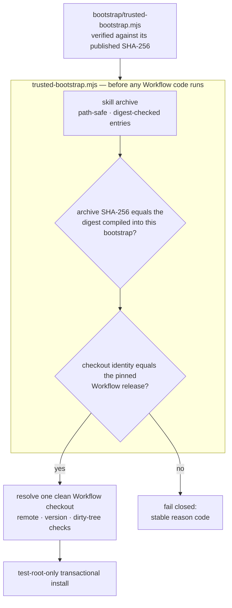

<div align="center">

# TCRN Workflow Helper

**手作業で一度だけ確認する、たった 1 つのファイル。それ以降は、約束されたリリース以外のバイト列をすべて拒否します。**

[English](./README.md) · [简体中文](./README.zh-CN.md) · 日本語 · [한국어](./README.ko.md) · [Français](./README.fr.md)

   

    

[なぜ](#why-this-project-exists) · [対象となる人](#who-this-is-for) · [まずこれを検証](#verify-this-first) · [何を強制するのか](#what-it-enforces) · [インストール](#install) · [ライセンス](#license)

</div>

---

## Why this project exists

リポジトリからエージェントスキルやワークフローをインストールすることは、本来サプライチェーン上の意思決定です。しかし普通、それは目隠しのまま下されます。

- **リリース同一性がない。**`git clone` が渡すのは*何らかの*コミットにすぎず、レビューされ受理されたリリースにそれを束縛するものは何もありません。
- **バイト列を縛るものが何もない。**静かに差し替えられたアーカイブも、脆弱な旧版へのダウングレードも、本物とまったく同じ見た目をしています。個人発行者が自分で生成した署名鍵はこれを解決しません——同じ未解決の問いを 1 ファイル左へずらすだけです。解決するのは、ダウンロード経路とは独立に入手できるダイジェストです。
- **信頼が、信頼すべき当の対象から自己起動している。**多くのインストーラはアーカイブ*内部*のファイルを使ってそのアーカイブを検証します——それは何の証明にもなりません。本リポジトリの以前の候補版も、より体裁のよい装いで同じ誤りを犯していました。ルート指紋もブートストラップのダイジェストも利用者が到達できる場所には公開されていない Ed25519 チェーンで、すべての検査はダウンロードに同梱されたアンカーに対して行われていたのです。そのチェーンは取り繕うのではなく、削除しました。

Helper は TCRN Workflow に対する答えです。単一ファイル・依存ゼロのブートストラップが、対応する 2 つの Agent App ホスト(Codex または Claude Code)のいずれにおいても、**あらゆる Workflow コードが実行される前に、リリースのバイト列と同一性の全体**を検証します。いずれかの検査に失敗すれば、安定した理由コードを出して停止します。`--force` は存在しません。

## Who this is for

**向いているのは**、他人が書いたエージェントワークフローを、壊れては困るマシンで動かそうとしていて、インストール対象そのものが出す緑のチェックマーク以上のものを求めている人です。また、そうしたワークフローを公開する側で、鍵の運用基盤を自分で抱えることなく、利用者にリリースを信頼する実質的な根拠を与えたい人にも向いています。

**おそらく向いていないのは**、自分で書いたワークフローを自分しか触らないマシンに入れる場合です。バイト列の出どころはすでに分かっているので、これは答えの出ている問いに手順を 1 つ足すだけになります。

## Verify this first

信頼しなければならないのはブートストラップだけです。それが語ることを信じる前に、それ自体を確認してください。

```sh
shasum -a 256 bootstrap/trusted-bootstrap.mjs
# 0904ee654af8b4c590917cb7dfcb0156f9b4c3247ea3b1f799621cecd9bdc233
```

このダイジェストは本ファイル、`SECURITY.md`、GitHub リリースノートに公開されています。一致しなければ中止してください。

## What it enforces

| 保証 | メカニズム |
| --- | --- |
| **再現可能なリリースアーティファクト** | スキルアーカイブ、ソースアーカイブ、SBOM は決定論的です。クリーンクローンでの CI リプレイが固定されたロケール/タイムゾーン環境下でそれらを再構築し、コミット済みアーティファクトとのダイジェスト一致を検証します。これが第一の信頼プリミティブです——誰でもバイト列を再構築して確かめられます。 |
| **正確なリリース同一性** | 受理された Workflow リリースはリポジトリ URL・バージョン・commit・tree・**そして**注釈付きタグオブジェクトで固定されます。これらは実在の Git チェックアウトに対し、実在の Git オブジェクト ID で照合されます。オブジェクト ID は内容ハッシュであり、それ自体が自己認証的です。 |
| **固定されたリリースバイト** | 受理されるアーカイブと来歴のダイジェストは `bootstrap/trusted-bootstrap.mjs` にコンパイル時組み込みされています。ブートストラップ自身の SHA-256 は本 README、`SECURITY.md`、リリースノートに公開されています。それが語ることを信じる前に検証してください。それ以外のアーカイブはすべてフェイルクローズドします(`IDENTITY_MISMATCH`)。 |
| **ロールバック防止** | GitHub のイミュータブルリリース:タグは移動も削除もできず、アセットも変更できません。古いリリースは固定ダイジェスト比較にも通りません——各ブートストラップはただ 1 つのアーカイブしか受理しないからです。 |
| **敵対的アーカイブへの安全性** | パストラバーサル、絶対パス、制御文字、非 NFC パス、重複/大文字小文字衝突パス、リンク、特殊ファイル、エントリ単位のダイジェスト改竄、エントリ数/バイト数の上限——すべて展開前に拒否されます。 |
| **ライブホスト保護** | インストール・更新・再インストール・アンインストールは、使い捨ての `tcrn-helper-test-*` ルート内**のみ**で動作します。パスに `.claude` または `.codex` の成分を含むものは——大文字小文字を問わず——ファイルシステムを探る前に字句的に拒否されます(`LIVE_LOCATION_FORBIDDEN`)。 |
| **トランザクショナルなライフサイクル** | すべての変更はステージングされジャーナルされたトランザクションであり、クラッシュ回復は本物の `SIGKILL` 注入で証明されています。失敗した操作は、バイト単位で同一の以前の状態と、残留物ゼロを残します。 |

## Quick start

```sh
# run the full proof suite (offline; ~10 minutes, includes SIGKILL fault injection)
npm test

# validate a release bundle before anything executes
node bootstrap/trusted-bootstrap.mjs validate \
  --archive <archive.json> --provenance <provenance.json> --state <state.json>

# verify a copy of this Skill that a standard installer placed in ~/.claude/skills (read-only)
node bootstrap/trusted-bootstrap.mjs verify-installed-copy \
  --installed-dir <~/.claude/skills/tcrn-workflow-helper> \
  --provenance <provenance.json> --state <state.json> --marker <marker.json>

# resolve exactly one approved Workflow checkout (rejects ambiguity, symlinks, dirty trees)
node bootstrap/trusted-bootstrap.mjs resolve --root <workflow-checkout>

# plan a network operation (prints a static plan; performs nothing)
node bootstrap/trusted-bootstrap.mjs plan-network --approved true --operation clone

# test-root-only lifecycle (explicit approval required)
node bootstrap/trusted-bootstrap.mjs install --test-root <dir>/tcrn-helper-test-x \
  --archive ... --provenance ... --state ... --approved true
```

成功時は正規化された JSON レシートを 1 つだけ出力します(`TRUST_VALIDATED`、`ROOT_RESOLVED`、`NETWORK_PLAN_APPROVED`、`INSTALL_COMPLETED`、`UNINSTALL_COMPLETED`)。失敗時は安定した理由コードを 1 つだけ出力します。その中間はありません。

## How the trust chain fits together



## Design Q&A

### なぜ依存ゼロなのか?

ブートストラップ*こそが*信頼境界だからです。依存関係はどれも、検証が存在する前に走るコードになります——まさにこのプロジェクトが塞ぐ穴です。`bootstrap/trusted-bootstrap.mjs` は Node の組み込みモジュールのみを使い、リリーススクリプトも同じ規律を守っています。

### では技術に詳しくないユーザーはどうインストールするのか?

Skill の説明テキスト(`SKILL.md` + `references/`)は、標準的なスキルインストーラによってライブホストのスキルフォルダ(例:`~/.claude/skills`)に配布して構いません——それは単なるファイルの配置であり、そこからコードが実行されることはありません。それを信頼できるものにするのは、その後の手順です。**独立に入手した**信頼ブートストラップ——リポジトリとは別の経路で取得し、上に公開された SHA-256 と照合したもの——が、`verify-installed-copy` でそのディスク上のコピーを**読み取り専用**で検証します。この処理はコピーからアーカイブを再構築し、そのダイジェストを検証済みブートストラップに組み込まれたダイジェストと比較し、機械可検証なマーカーを書き出します。そのマーカーが存在して初めて、ガイド付きの**初回ウィザード**(`references/first-run-wizard.md`)が動き出し、固定されたリリースを取得・検証し、あらゆる理由コードを平易な言葉で説明しながらユーザーをセットアップまで導きます。つまり、配布は標準インストーラ、信頼はブートストラップによる検証、という分担です。

### なぜ helper 自身のコマンドは本物のスキルロケーションにインストールできないのか?

helper の**変更系**コマンド(`install`/`update`/`reinstall`/`uninstall`)は検証とライフサイクルのためだけのもので、テストルート限定のままです。これら経由でのライブホスト活性化は、別途ゲートされたリリース判断になります。ガードは構造的です。字句的なライブロケーション検査はテストルートマーカー検査よりも前、そしてあらゆるファイルシステムプローブよりも前に走り、大文字小文字を畳み込んで比較し(大文字小文字を区別しないファイルシステムで `.Claude` がすり抜けることはありません)、テストで覆われています。Skill 説明テキストの配布(上記)は標準インストーラと読み取り専用の `verify-installed-copy` を使い、これら変更系コマンドを一切経由しません。

### 同一性の固定はなぜここまで攻撃的なのか——リポジトリ、バージョン、commit、tree、*さらに*タグオブジェクトまで?

各フィールドが別々の攻撃を潰します。リポジトリ URL は見た目のよく似たリモートを止め、バージョンは「リポジトリは正しいがリリースが違う」を止め、commit と tree はタグ名を保ったままの履歴書き換えを止め、タグオブジェクトは既存の名前を別のバイト列へ付け替える再タグ付けを止めます。チェックアウトの同一性は実在の Git オブジェクト ID で検証されます——それは内容ハッシュであり、自己認証的で、誰かの署名に依存することは一切ありません。

### テストスイートは実際に何をカバーしているのか?

**72 テスト、すべてオフライン**(唯一の `node:net` 使用は、特殊ファイル拒否のためのローカル unix ドメインソケットフィクスチャです):

- 信頼マトリクス:固定ダイジェストの不一致、改竄された来歴、改竄されたアーカイブエントリ——それぞれが正確な理由コードを返すことを検証。
- ライフサイクル:バイト単位で同一のプライベートワークスペース保全を伴うインストール/更新/再インストール/アンインストール、有効な注入ポイントすべてに対する本物の `SIGKILL`(障害インベントリは手書きではなく実際の操作から発見されます)、異なる PID の競合者によるロック競合、置換ファイル/外来ファイルの保全。
- インストール済みコピーの検証:標準インストーラが配置したスキルディレクトリの読み取り専用な再構築、改竄 → 正確な理由コード、シンボリックリンクのディレクトリ/エントリの拒否、成功時の検証済みダイジェストの記録、および state/marker パスに対するライブロケーション拒否。
- ライブロケーションガード:両ホスト形態におけるユーザーレベル、プロジェクトレベル、`.codex`、大文字小文字バリアントのパス。
- 再現性:`LANG`/`LC_ALL`/`TZ`/`umask` を撹乱した環境下での決定論的アーカイブ、コミット済みアーティファクトとのバイト一致、そして全コマンド列を再実行して再構築ダイジェストがコミット済みダイジェストと等しいことを検証する完全なクリーンクローン CI リプレイ(`npm run ci:replay`)。

### なぜ CI リプレイのレシートはコミット済みアーティファクトではないのか?

検証の実行を証明するレシートが、それ自体は何によっても裏づけられていない、という状態を避けるためです。以前の候補版は `ci-replay-readback.json` をコミットしていましたが、レビューの結果、どのゲートにも束縛されておらず、公開履歴の外にあるコミットを参照していることが分かりました。現在これは再生成される CI 出力(gitignore 対象)であり、コミットされるアーティファクト集合は、すべてのゲートが相互に束縛するちょうど 5 ファイルです:`candidate-manifest.json`、`checksums.txt`、`sbom.json`、`skill-archive.json`、`source-archive.json`。

## Repository layout

| パス | 内容 |
| --- | --- |
| `bootstrap/trusted-bootstrap.mjs` | 単一ファイルの信頼境界:アーカイブ検証、固定されたリリースバイトのダイジェスト、同一性の固定、トランザクショナルなライフサイクル。**使用前にその SHA-256 を帯域外で検証してください。** |
| `skill/tcrn-workflow-helper/` | Agent Skill のペイロード:`SKILL.md`、信頼契約、設定引き出しリファレンス、ホスト別メタデータ。固定されたアーカイブが含むのは、このディレクトリです。 |
| `manifests/` | バイトコピーされた Workflow リリースの来歴。注意:これは*自己申告のローカルビルド宣言*(ビルド種別 `tcrn.workflow.local-unpublished-candidate.v1`、タイムスタンプはゼロ)であり、ホスト型ビルダーによる証明ではありません。ダイジェストで固定されているため差し替えはできませんが、第三者が検査できる根拠は再現可能ビルドの連鎖であって、このファイルではありません。 |
| `artifacts/` | 5 つの再現可能なリリースアーティファクト。 |
| `scripts/` | 決定論的なアーカイブ/SBOM/チェックサム生成器、リリース検証器、CI リプレイ。 |
| `test/` | 72 テストの証明スイート。 |

## What the pinned Workflow release governs (new in v0.1.0-rc.5)

helper の役割は変わりません——実行前にリリースを証明すること——が、いま固定しているリリース TCRN Workflow `v0.1.0-rc.5` は、より広い統治対象面を備えており、Skill のリファレンスがその操作をオペレーターに教えます。

- **カンファレンスとゲートの統治** — 審議はイベントログに記録され(`conference-open` / `-append-position` / `-close` / `-cancel`)、ペンディングのゲートは、カンファレンス議事録の証拠がそれを解決するまで作業項目が `done` に到達するのを阻止します(`WORKSPACE_GATE_PENDING`、`WORKSPACE_GATE_EVIDENCE_UNRESOLVED`)。
- **アクター証明** — すべての変更系動詞は実行アクターを帰属させねばならず、アクターが不在または不正な形式ならフェイルクローズドします(`WORKSPACE_ACTOR_REQUIRED`、`WORKSPACE_ACTOR_INVALID`)。
- **アクティベーションの段階** — 統治対象面は単一のグローバルスイッチではなく段階的な段(rung)で有効化され、統治レコードを持たないワークスペースの挙動は変わりません。
- **バックアップとリストア** — 密閉的・同一パス・ツリー全体のスナップショットを、決定論的なレシートとバイト単位で同一であることの証明つきで取得します(`snapshot-manifest` / `snapshot-verify` → `SNAPSHOT_VERIFIED`)。`skill/tcrn-workflow-helper/references/backup-elicitation.md` を参照してください。
- **蒸留** — 統治ストアに対する、突合済みのナレッジ蒸留。

これらの審議を散文で発火させることは助言的であり、gate-v1 が入るまでは設計上信頼できません。Skill はその旨を明示し、信頼できる強制は機械検証可能なゲートに委ねています。

## Status, honestly

- `0.1.0-candidate.4` は**プレリリース候補**であり、対応するのは TCRN Workflow `v0.1.0-rc.5` ちょうど 1 つです。
- インストールと削除は両ホストとも**テストルート限定**です。ライブの Codex / Claude Code ホストのサポートは主張しません。
- **自前で構築した Ed25519 署名チェーンは 2026-07-19、`0.1.0-candidate.4` で削除されました。**それは一度もアンカーされていませんでした。依拠していたブートストラップのダイジェストと鍵の指紋は、利用者が独立に入手できる場所のどこにも公開されておらず、このチェーンは本リポジトリの外にいる誰に対しても何も証明していませんでした。鍵は人間のオーナーが署名して発行したものではなく自動エージェントが生成したもので、暗号化されないままディスク上に置かれ、ローテーション経路もありませんでした(組み込み定数とのバイト一致比較のため)。有効期限は固定日付にハードコードされており、正直なインストールすべてに障害を予定する一方で、攻撃者を何ら制約しませんでした。導入実績はゼロでした。これに代わるものは、*実際に公開されている*ブートストラップのダイジェスト、そのブートストラップに組み込まれた受理済みリリースダイジェスト、GitHub のイミュータブルリリース、そして再現可能ビルドの連鎖です。
- Claude Code 固有の 3 つの挙動(設定フラグメントの可逆性、ユーザー設定とプロジェクト設定の優先順位、CLAUDE.md フォールバック)は、本リポジトリではなく**固定された Workflow リリース側**で実装・証明されています——正確な証拠マップは `skill/tcrn-workflow-helper/references/trust-contract.md` を参照してください。

## Support & security

- 質問 → GitHub Discussions · 不具合 → Issues。
- セキュリティ報告 → GitHub の非公開脆弱性報告(`SECURITY.md` を参照)。

## License

[Apache-2.0](./LICENSE)
