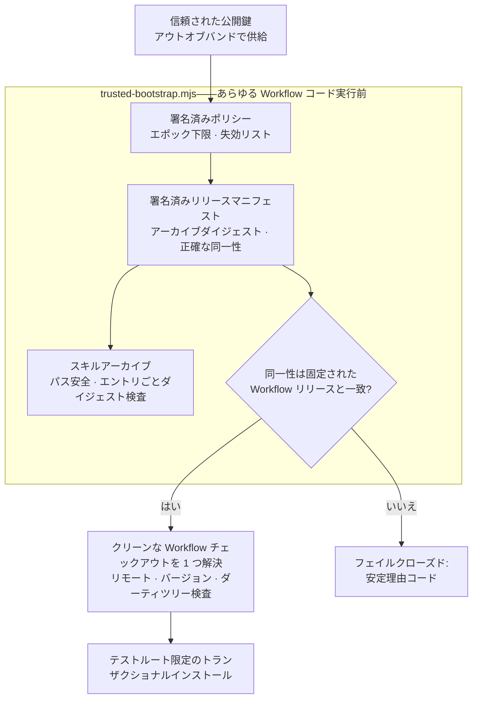

[English](./README.md) | [简体中文](./README.zh-CN.md) | **日本語** | [한국어](./README.ko.md) | [Français](./README.fr.md)

# TCRN Workflow Helper

**依存ゼロの信頼ブートストラップ+デュアルホスト Agent Skill——暗号学的に証明できない TCRN Workflow リリースの実行を拒否します。**

`ステータス: 0.1.0-candidate.3(プレリリース候補)` · `ライセンス: Apache-2.0` · `Node ≥ 24` · `依存関係: ゼロ` · `対応: TCRN Workflow v0.1.0-rc.4`

---

## なぜこのプロジェクトが存在するのか

リポジトリからエージェントスキルやワークフローをインストールすることは、本来サプライチェーン上の意思決定です。しかし普通、それは盲目的に行われます。

- **リリース同一性がない。**`git clone` が渡すのは*何らかの*コミット——レビューされ受理されたリリースに束縛するものは何もありません。
- **署名も、ロールバック防止の下限もない。**静かに差し替えられたアーカイブ、移植されたポリシーファイル、「有効に見える」署名を保ったままの脆弱な旧版へのダウングレードを、何も止めません。
- **信頼が、信頼すべき対象から自己起動する。**多くのインストーラはアーカイブ*内部*のファイルでアーカイブ自身を検証します——それは何の証明にもなりません。

Helper は TCRN Workflow に対する答えです:単一ファイル・依存ゼロのブートストラップが、**あらゆる Workflow コードの実行前に**署名済みリリース同一性の全体を検証します。対応ホストは Codex と Claude Code の 2 つ。いずれかの検査に失敗すれば、安定した理由コードで停止します。`--force` はありません。

## 何を強制するのか

| 保証 | メカニズム |
| --- | --- |
| **正確なリリース同一性** | 受理された Workflow リリースはリポジトリ URL・バージョン・commit・tree・**そして**注釈付きタグオブジェクトで固定。署名は有効でも別リリースを指すマニフェストはフェイルクローズド(`IDENTITY_MISMATCH`)。 |
| **本物の署名、外部の信頼** | Ed25519 リリースマニフェストと個別署名のポリシーを、*アーカイブとは独立に供給される*公開鍵で検証——アーカイブは決して自己認証できません。ポリシーの移植と再生は、いかなるポリシーフィールドが信頼される前に拒否されます。 |
| **ロールバック防止** | Skill ディレクトリ外に永続化された単調なポリシーエポック下限。古いエポックは署名が有効でもフェイルクローズド(`ROLLBACK_REJECTED`)。 |
| **敵対的アーカイブへの安全性** | パストラバーサル、絶対パス、制御文字、非 NFC パス、重複/大文字小文字衝突パス、リンク、特殊ファイル、エントリ単位のダイジェスト改竄、エントリ/バイト上限——すべて展開前に拒否。 |
| **ライブホスト保護** | インストール・更新・再インストール・アンインストールは使い捨ての `tcrn-helper-test-*` ルート内**のみ**。パスに `.claude` または `.codex` 成分を含むもの——大文字小文字を問わず——はファイルシステムに触れる前に字句的に拒否(`LIVE_LOCATION_FORBIDDEN`)。 |
| **トランザクショナルなライフサイクル** | すべての変更はステージング+ジャーナル付きトランザクション。クラッシュ回復は本物の `SIGKILL` 注入で証明され、失敗した操作はバイト単位で同一の以前の状態と残留ゼロを残します。 |
| **再現可能なリリースアーティファクト** | スキルアーカイブ、ソースアーカイブ、SBOM は決定論的。クリーンクローンの CI リプレイが固定ロケール/タイムゾーン環境で再構築し、コミット済みアーティファクトとのダイジェスト一致を検証します。 |

## クイックスタート

```sh
# 完全な証明スイートを実行(オフライン;約 10 分、SIGKILL 障害注入を含む)
npm test

# 何かが実行される前に署名済みリリースバンドルを検証
node bootstrap/trusted-bootstrap.mjs validate \
  --archive <archive.json> --manifest <manifest.json> --policy <policy.json> \
  --provenance <provenance.json> --state <state.json> --trusted-key <public-key.pem>

# 標準インストーラが ~/.claude/skills に置いた本 Skill のコピーを読み取り専用で検証
node bootstrap/trusted-bootstrap.mjs verify-installed-copy \
  --installed-dir <~/.claude/skills/tcrn-workflow-helper> \
  --manifest <manifest.json> --policy <policy.json> --provenance <provenance.json> \
  --state <state.json> --trusted-key <public-key.pem> --marker <marker.json>

# 承認済みの Workflow チェックアウトをちょうど 1 つ解決(曖昧さ・シンボリックリンク・ダーティツリーを拒否)
node bootstrap/trusted-bootstrap.mjs resolve --root <workflow-checkout>

# ネットワーク操作を計画(静的プランを印字するのみ;何も実行しない)
node bootstrap/trusted-bootstrap.mjs plan-network --approved true --operation clone

# テストルート限定ライフサイクル(明示的承認が必要)
node bootstrap/trusted-bootstrap.mjs install --test-root <dir>/tcrn-helper-test-x \
  --archive ... --manifest ... --policy ... --provenance ... --state ... \
  --trusted-key ... --approved true
```

成功時は正規化 JSON レシートを 1 つ出力(`TRUST_VALIDATED`、`ROOT_RESOLVED`、`NETWORK_PLAN_APPROVED`、`INSTALL_COMPLETED`、`UNINSTALL_COMPLETED`)。失敗時は安定理由コードを 1 つ。中間はありません。

## 信頼チェーンの噛み合わせ



## 設計 Q&A

### なぜ依存ゼロなのか?

ブートストラップ*こそが*信頼境界だからです。あらゆる依存関係は、検証が存在する前に走るコード——まさにこのプロジェクトが塞ぐ穴です。`bootstrap/trusted-bootstrap.mjs` は Node 組み込みのみを使い、リリーススクリプトも同じ規律を共有します。

### では技術に詳しくないユーザーはどうインストールするのか?

Skill の説明テキスト(`SKILL.md` + `references/`)は、標準のスキルインストーラによってライブホストのスキルフォルダ(例:`~/.claude/skills`)に配布**できます**——それは単なるファイル配置で、そこからコードは実行されません。信頼できるものにするのは、その後に**独立に入手した**信頼ブートストラップが `verify-installed-copy` でそのディスク上のコピーを**読み取り専用**で検証することです:コピーのアーカイブを再構築し、署名済みマニフェスト(同一性・ダイジェスト・ロールバック下限)と照合し、機械可検証のマーカーを書き込みます。そのマーカーが存在して初めて、ガイド付き**初回ウィザード**(`references/first-run-wizard.md`)が進行し、固定リリースを取得・検証し、あらゆる理由コードを平易な言葉で説明しながらユーザーを導きます。つまり:配布は標準インストーラ、信頼は暗号ブートストラップ。

### なぜ helper 自身のコマンドは本物のスキルロケーションにインストールできないのか?

helper の**変更系**コマンド(`install`/`update`/`reinstall`/`uninstall`)は検証とライフサイクルのみで、**テストルート限定**のままです。それら経由のライブホスト活性化は別途ゲートされたリリース判断です。ガードは構造的です:字句的ライブロケーション検査はテストルートマーカー検査より前、あらゆるファイルシステムプローブより前に走り、大文字小文字を畳み込み(`.Claude` もすり抜けられません)、テストで覆われています。Skill 説明テキストの配布(上記)は標準インストーラ + 読み取り専用の `verify-installed-copy` を使い、これら変更系コマンドを経由しません。

### 同一性の固定はなぜここまで攻撃的なのか——リポジトリ、バージョン、commit、tree、さらにタグオブジェクトまで?

各フィールドが異なる攻撃を殺します:リポジトリ URL は偽装リモートを止め、バージョンは「正しいリポジトリ、間違ったリリース」を止め、commit と tree はタグ名を保った履歴書き換えを止め、タグオブジェクトは既存の名前を別のバイト列に付け替える再タグ付けを止めます。テストスイートには*有効に署名されポリシーにも束縛された*、しかし別バージョンを名乗るマニフェストが含まれ——署名検証に遮蔽されず、同一性比較そのもの(`IDENTITY_MISMATCH`)で失敗しなければなりません。

### テストスイートは実際に何をカバーしているのか?

**79 テスト、すべてオフライン**(唯一の `node:net` 使用は特殊ファイル拒否テスト用のローカル unix ドメインソケットフィクスチャ):

- 署名経路の強化:所有者限定の鍵ディレクトリ、ディスクリプタ安定読み取り、不正鍵拒否、残留ゼロの書き込み前失敗。
- 信頼マトリクス:署名/鍵の差し替え、ポリシー移植と再生、エポックロールバック、失効、期限切れ、来歴改竄、アーカイブエントリ改竄、同一性不一致マニフェスト——それぞれ正確な理由コードを検証。
- ライフサイクル:バイト単位のプライベートワークスペース保全を伴うインストール/更新/再インストール/アンインストール、全有効注入ポイントへの本物の `SIGKILL`(障害インベントリは手書きではなく実操作から発見)、異なる PID の競合者によるロック競合、置換/外来ファイルの保全。
- インストール済みコピー検証:標準インストーラが配置したスキルディレクトリの読み取り専用再構築、改竄 → 正確な理由コード、シンボリックリンクのディレクトリ/エントリ拒否、成功時のロールバック下限の前進、および state/marker パスへのライブロケーション拒否。
- ライブロケーションガード:両ホストのユーザーレベル、プロジェクトレベル、`.codex`、大文字小文字バリアントのパス。
- 再現性:撹乱された `LANG`/`LC_ALL`/`TZ`/`umask` 環境下の決定論的アーカイブ、コミット済みアーティファクトとのバイト一致、そして全コマンド列を再実行し再構築ダイジェスト=コミット済みダイジェストを検証する完全クリーンクローン CI リプレイ(`npm run ci:replay`)。

### なぜ CI リプレイのレシートはコミット済みアーティファクトではないのか?

検証の実行を証明するレシートが、それ自体は何にも証明されていない、という状態を許さないためです。以前の候補は `ci-replay-readback.json` をコミットしていましたが、レビューでどのゲートにも束縛されておらず、公開履歴の外のコミットを参照していることが判明しました。現在は再生成される CI 出力(gitignore 対象)であり、コミット済みアーティファクト集合は全ゲートが相互束縛するちょうど 5 ファイルです:`candidate-manifest.json`、`checksums.txt`、`sbom.json`、`skill-archive.json`、`source-archive.json`。

## リポジトリ構成

| パス | 内容 |
| --- | --- |
| `bootstrap/trusted-bootstrap.mjs` | 単一ファイルの信頼境界:アーカイブ検証、署名検証、同一性固定、ロールバック防止、トランザクショナルライフサイクル。 |
| `skill/tcrn-workflow-helper/` | Agent Skill ペイロード:`SKILL.md`、信頼契約、設定引き出しリファレンス、ホスト別メタデータ。署名アーカイブが含むのはこのディレクトリです。 |
| `manifests/` | Ed25519 署名のリリースマニフェストとポリシー、およびバイトコピーされた Workflow リリース来歴。 |
| `artifacts/` | 5 つの再現可能なリリースアーティファクト。 |
| `scripts/` | 決定論的アーカイブ/SBOM/チェックサム生成器、リリース検証器、CI リプレイ、署名ツール(秘密鍵は決してこのリポジトリに置かれません)。 |
| `test/` | 79 テストの証明スイート。 |

## ステータス(正直に)

- `0.1.0-candidate.3` は TCRN Workflow `v0.1.0-rc.4` をちょうど対象とする**プレリリース候補**です。
- 両ホストでインストールと削除は**テストルート限定**。ライブの Codex / Claude Code ホストサポートは主張しません。
- Claude Code 固有の 3 挙動(設定フラグメントの可逆性、ユーザー/プロジェクト優先順位、CLAUDE.md フォールバック)は本リポジトリではなく**固定された Workflow リリース側**で実装・証明されています——正確な証拠マップは `skill/tcrn-workflow-helper/references/trust-contract.md` を参照。

## サポートとセキュリティ

- 質問 → GitHub Discussions · 不具合 → Issues。
- セキュリティ報告 → GitHub 非公開脆弱性報告(`SECURITY.md` 参照)。

## ライセンス

[Apache-2.0](./LICENSE)
