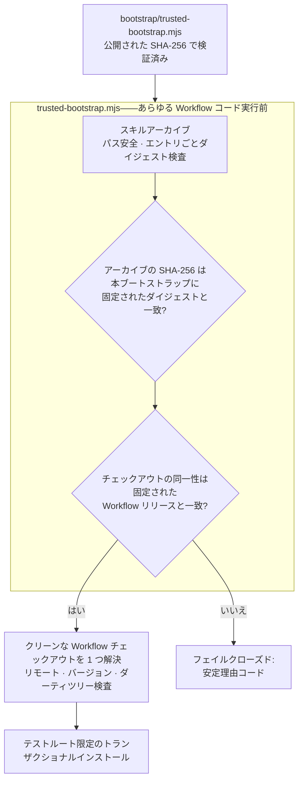

[English](./README.md) | [简体中文](./README.zh-CN.md) | **日本語** | [한국어](./README.ko.md) | [Français](./README.fr.md)

# TCRN Workflow Helper

**依存ゼロの信頼ブートストラップ+デュアルホスト Agent Skill——バイト列が、帯域外で検証したブートストラップに固定されたダイジェストと一致しない TCRN Workflow リリースの実行を拒否します。**

**まずこれを検証してください。**信頼しなければならないのはブートストラップだけです。それが語ることを信じる前に、それ自体を確認してください:

```sh
shasum -a 256 bootstrap/trusted-bootstrap.mjs
# 7fa9f51fa024bb38db299f3604a33d071a2fe17e9dc45bc17fe80edc86aea3aa
```

このダイジェストは本ファイル、`SECURITY.md`、GitHub リリースノートに公開されています。一致しなければ中止してください。

`ステータス: 0.1.0-candidate.4(プレリリース候補)` · `ライセンス: Apache-2.0` · `Node ≥ 24` · `依存関係: ゼロ` · `対応: TCRN Workflow v0.1.0-rc.5`

---

## なぜこのプロジェクトが存在するのか

リポジトリからエージェントスキルやワークフローをインストールすることは、本来サプライチェーン上の意思決定です。しかし普通、それは盲目的に行われます。

- **リリース同一性がない。**`git clone` が渡すのは*何らかの*コミット——レビューされ受理されたリリースに束縛するものは何もありません。
- **バイト列を縛るものが何もない。**静かに差し替えられたアーカイブも、脆弱な旧版へのダウングレードも、本物と見分けがつきません。個人発行者が自分で生成した署名鍵はこれを解決しません——同じ未解決の問いを 1 ファイル左へずらすだけです。解決するのは、ダウンロード経路とは独立に入手できるダイジェストです。
- **信頼が、信頼すべき対象から自己起動する。**多くのインストーラはアーカイブ*内部*のファイルでアーカイブ自身を検証します——それは何の証明にもなりません。本リポジトリの以前の候補版も、より体裁のよい装いで同じ誤りを犯していました。ルート指紋もブートストラップのダイジェストも利用者が到達できる場所には公開されていない Ed25519 チェーンで、すべての検査はダウンロードに同梱されたアンカーに対して行われていたのです。そのチェーンは取り繕うのではなく削除されました。

Helper は TCRN Workflow に対する答えです:単一ファイル・依存ゼロのブートストラップが、**あらゆる Workflow コードの実行前に**リリースのバイト列と同一性の全体を検証します。対応ホストは Codex と Claude Code の 2 つ。いずれかの検査に失敗すれば、安定した理由コードで停止します。`--force` はありません。

## 何を強制するのか

| 保証 | メカニズム |
| --- | --- |
| **正確なリリース同一性** | 受理された Workflow リリースはリポジトリ URL・バージョン・commit・tree・**そして**注釈付きタグオブジェクトで固定。これらは実在の Git チェックアウトに対して照合されます。Git のオブジェクト ID は内容ハッシュであり、自己認証的です。 |
| **固定されたリリースバイト** | 受理されるアーカイブと来歴のダイジェストは `bootstrap/trusted-bootstrap.mjs` に固定されています。ブートストラップ自身の SHA-256 は本ファイル、`SECURITY.md`、リリースノートに公開されています。それが語ることを信じる前に検証してください。他のアーカイブはすべてフェイルクローズド(`IDENTITY_MISMATCH`)。 |
| **ロールバック防止** | GitHub のイミュータブルリリース:タグは移動も削除もできず、アセットは変更できません。古いリリースは固定ダイジェスト比較にも通りません——各ブートストラップはただ一つのアーカイブしか受理しないからです。 |
| **敵対的アーカイブへの安全性** | パストラバーサル、絶対パス、制御文字、非 NFC パス、重複/大文字小文字衝突パス、リンク、特殊ファイル、エントリ単位のダイジェスト改竄、エントリ/バイト上限——すべて展開前に拒否。 |
| **ライブホスト保護** | インストール・更新・再インストール・アンインストールは使い捨ての `tcrn-helper-test-*` ルート内**のみ**。パスに `.claude` または `.codex` 成分を含むもの——大文字小文字を問わず——はファイルシステムに触れる前に字句的に拒否(`LIVE_LOCATION_FORBIDDEN`)。 |
| **トランザクショナルなライフサイクル** | すべての変更はステージング+ジャーナル付きトランザクション。クラッシュ回復は本物の `SIGKILL` 注入で証明され、失敗した操作はバイト単位で同一の以前の状態と残留ゼロを残します。 |
| **再現可能なリリースアーティファクト** | スキルアーカイブ、ソースアーカイブ、SBOM は決定論的。クリーンクローンの CI リプレイが固定ロケール/タイムゾーン環境で再構築し、コミット済みアーティファクトとのダイジェスト一致を検証します。 |

## クイックスタート

```sh
# 完全な証明スイートを実行(オフライン;約 10 分、SIGKILL 障害注入を含む)
npm test

# 何かが実行される前にリリースバンドルを検証
node bootstrap/trusted-bootstrap.mjs validate \
  --archive <archive.json> --provenance <provenance.json> --state <state.json>

# 標準インストーラが ~/.claude/skills に置いた本 Skill のコピーを読み取り専用で検証
node bootstrap/trusted-bootstrap.mjs verify-installed-copy \
  --installed-dir <~/.claude/skills/tcrn-workflow-helper> \
  --provenance <provenance.json> --state <state.json> --marker <marker.json>

# 承認済みの Workflow チェックアウトをちょうど 1 つ解決(曖昧さ・シンボリックリンク・ダーティツリーを拒否)
node bootstrap/trusted-bootstrap.mjs resolve --root <workflow-checkout>

# ネットワーク操作を計画(静的プランを印字するのみ;何も実行しない)
node bootstrap/trusted-bootstrap.mjs plan-network --approved true --operation clone

# テストルート限定ライフサイクル(明示的承認が必要)
node bootstrap/trusted-bootstrap.mjs install --test-root <dir>/tcrn-helper-test-x \
  --archive ... --provenance ... --state ... --approved true
```

成功時は正規化 JSON レシートを 1 つ出力(`TRUST_VALIDATED`、`ROOT_RESOLVED`、`NETWORK_PLAN_APPROVED`、`INSTALL_COMPLETED`、`UNINSTALL_COMPLETED`)。失敗時は安定理由コードを 1 つ。中間はありません。

## 信頼チェーンの噛み合わせ



## 設計 Q&A

### なぜ依存ゼロなのか?

ブートストラップ*こそが*信頼境界だからです。あらゆる依存関係は、検証が存在する前に走るコード——まさにこのプロジェクトが塞ぐ穴です。`bootstrap/trusted-bootstrap.mjs` は Node 組み込みのみを使い、リリーススクリプトも同じ規律を共有します。

### では技術に詳しくないユーザーはどうインストールするのか?

Skill の説明テキスト(`SKILL.md` + `references/`)は、標準のスキルインストーラによってライブホストのスキルフォルダ(例:`~/.claude/skills`)に配布**できます**——それは単なるファイル配置で、そこからコードは実行されません。信頼できるものにするのは、その後に**独立に入手した**(リポジトリとは独立の経路で取得し、上に公開された SHA-256 で照合した)信頼ブートストラップが `verify-installed-copy` でそのディスク上のコピーを**読み取り専用**で検証することです:コピーのアーカイブを再構築し、そのダイジェストを検証済みブートストラップに固定されたダイジェストと比較し、機械可検証のマーカーを書き込みます。そのマーカーが存在して初めて、ガイド付き**初回ウィザード**(`references/first-run-wizard.md`)が進行し、固定リリースを取得・検証し、あらゆる理由コードを平易な言葉で説明しながらユーザーを導きます。つまり:配布は標準インストーラ、信頼は暗号ブートストラップ。

### なぜ helper 自身のコマンドは本物のスキルロケーションにインストールできないのか?

helper の**変更系**コマンド(`install`/`update`/`reinstall`/`uninstall`)は検証とライフサイクルのみで、**テストルート限定**のままです。それら経由のライブホスト活性化は別途ゲートされたリリース判断です。ガードは構造的です:字句的ライブロケーション検査はテストルートマーカー検査より前、あらゆるファイルシステムプローブより前に走り、大文字小文字を畳み込み(`.Claude` もすり抜けられません)、テストで覆われています。Skill 説明テキストの配布(上記)は標準インストーラ + 読み取り専用の `verify-installed-copy` を使い、これら変更系コマンドを経由しません。

### 同一性の固定はなぜここまで攻撃的なのか——リポジトリ、バージョン、commit、tree、さらにタグオブジェクトまで?

各フィールドが異なる攻撃を殺します:リポジトリ URL は偽装リモートを止め、バージョンは「正しいリポジトリ、間違ったリリース」を止め、commit と tree はタグ名を保った履歴書き換えを止め、タグオブジェクトは既存の名前を別のバイト列に付け替える再タグ付けを止めます。チェックアウトの同一性は実在の Git オブジェクト ID で検証されます——それは内容ハッシュであり自己認証的で、誰かの署名に依存することは決してありません。

### テストスイートは実際に何をカバーしているのか?

**72 テスト、すべてオフライン**(唯一の `node:net` 使用は特殊ファイル拒否テスト用のローカル unix ドメインソケットフィクスチャ):

- 信頼マトリクス:固定ダイジェスト不一致、来歴改竄、アーカイブエントリ改竄——それぞれ正確な理由コードを検証。
- ライフサイクル:バイト単位のプライベートワークスペース保全を伴うインストール/更新/再インストール/アンインストール、全有効注入ポイントへの本物の `SIGKILL`(障害インベントリは手書きではなく実操作から発見)、異なる PID の競合者によるロック競合、置換/外来ファイルの保全。
- インストール済みコピー検証:標準インストーラが配置したスキルディレクトリの読み取り専用再構築、改竄 → 正確な理由コード、シンボリックリンクのディレクトリ/エントリ拒否、成功時のロールバック下限の前進、および state/marker パスへのライブロケーション拒否。
- ライブロケーションガード:両ホストのユーザーレベル、プロジェクトレベル、`.codex`、大文字小文字バリアントのパス。
- 再現性:撹乱された `LANG`/`LC_ALL`/`TZ`/`umask` 環境下の決定論的アーカイブ、コミット済みアーティファクトとのバイト一致、そして全コマンド列を再実行し再構築ダイジェスト=コミット済みダイジェストを検証する完全クリーンクローン CI リプレイ(`npm run ci:replay`)。

### なぜ CI リプレイのレシートはコミット済みアーティファクトではないのか?

検証の実行を証明するレシートが、それ自体は何にも証明されていない、という状態を許さないためです。以前の候補は `ci-replay-readback.json` をコミットしていましたが、レビューでどのゲートにも束縛されておらず、公開履歴の外のコミットを参照していることが判明しました。現在は再生成される CI 出力(gitignore 対象)であり、コミット済みアーティファクト集合は全ゲートが相互束縛するちょうど 5 ファイルです:`candidate-manifest.json`、`checksums.txt`、`sbom.json`、`skill-archive.json`、`source-archive.json`。

## リポジトリ構成

| パス | 内容 |
| --- | --- |
| `bootstrap/trusted-bootstrap.mjs` | 単一ファイルの信頼境界:アーカイブ検証、固定されたリリースバイトのダイジェスト、同一性固定、トランザクショナルライフサイクル。**使用前にその SHA-256 を帯域外で検証してください。** |
| `skill/tcrn-workflow-helper/` | Agent Skill ペイロード:`SKILL.md`、信頼契約、設定引き出しリファレンス、ホスト別メタデータ。固定ダイジェストの対象となるアーカイブが含むのはこのディレクトリです。 |
| `manifests/` | バイトコピーされた Workflow リリース来歴。注意:これは*自己申告のローカルビルド宣言*(ビルド種別 `tcrn.workflow.local-unpublished-candidate.v1`、タイムスタンプはゼロ)であり、ホスト型ビルダーによる証明ではありません。ダイジェストで固定されているため差し替えはできませんが、第三者が検査できる根拠は再現可能ビルド連鎖であって、このファイルではありません。 |
| `artifacts/` | 5 つの再現可能なリリースアーティファクト。 |
| `scripts/` | 決定論的アーカイブ/SBOM/チェックサム生成器、リリース検証器、CI リプレイ。 |
| `test/` | 72 テストの証明スイート。 |

## 固定された Workflow リリースが統治する機能(v0.1.0-rc.5 で新規)

ヘルパーの役割は変わりません——リリースを実行前に証明する——が、いま固定するリリース TCRN Workflow `v0.1.0-rc.5` は、より広い統治対象面を備えており、Skill のリファレンスがその操作をオペレーターに教えます:

- **カンファレンスとゲートの統治** — 審議はイベントログに記録され(`conference-open` / `-append-position` / `-close` / `-cancel`)、ペンディングのゲートは、カンファレンス議事録の証拠が解決するまで作業項目が `done` に到達するのを阻止します(`WORKSPACE_GATE_PENDING`、`WORKSPACE_GATE_EVIDENCE_UNRESOLVED`)。
- **アクター証明** — すべての変更系動詞は実行アクターを帰属させねばならず、アクターが不在または不正な形式なら fail-closed します(`WORKSPACE_ACTOR_REQUIRED`、`WORKSPACE_ACTOR_INVALID`)。
- **アクティベーションの段階** — 統治対象面は単一のグローバルスイッチではなく段階的な段で有効化され、統治レコードを持たないワークスペースの挙動は変わりません。
- **バックアップとリストア** — 密閉・同一パス・ツリー全体のスナップショットを、決定論的レシートとバイト同一の証明つきで取得します(`snapshot-manifest` / `snapshot-verify` → `SNAPSHOT_VERIFIED`)。`skill/tcrn-workflow-helper/references/backup-elicitation.md` を参照。
- **蒸留** — 統治ストアに対する突合済みのナレッジ蒸留。

これらの審議を散文で発火させることは助言的であり、gate-v1 が入るまでは設計上信頼できません。Skill はその旨を明示し、信頼できる強制は機械検証可能なゲートに委ねます。

## ステータス(正直に)

- `0.1.0-candidate.4` は TCRN Workflow `v0.1.0-rc.5` をちょうど対象とする**プレリリース候補**です。
- 両ホストでインストールと削除は**テストルート限定**。ライブの Codex / Claude Code ホストサポートは主張しません。
- Claude Code 固有の 3 挙動(設定フラグメントの可逆性、ユーザー/プロジェクト優先順位、CLAUDE.md フォールバック)は本リポジトリではなく**固定された Workflow リリース側**で実装・証明されています——正確な証拠マップは `skill/tcrn-workflow-helper/references/trust-contract.md` を参照。

## サポートとセキュリティ

- 質問 → GitHub Discussions · 不具合 → Issues。
- セキュリティ報告 → GitHub 非公開脆弱性報告(`SECURITY.md` 参照)。

## ライセンス

[Apache-2.0](./LICENSE)
