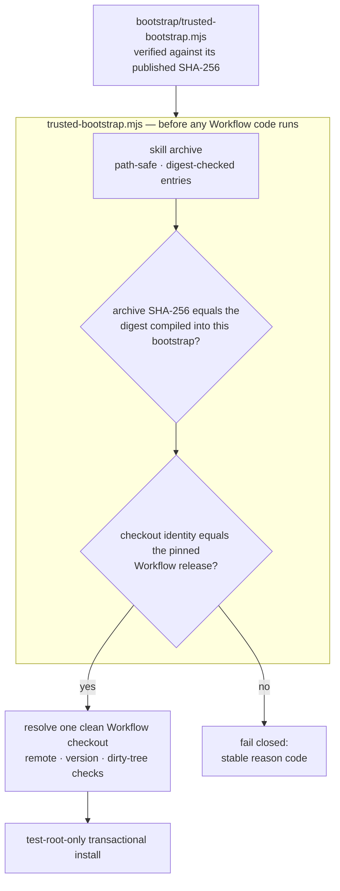

<div align="center">

# TCRN Workflow Helper

**손으로 한 번만 확인하면 되는 파일 하나. 그 뒤로는 약속받은 릴리스가 아닌 바이트를 전부 거부합니다.**

[English](./README.md) · [简体中文](./README.zh-CN.md) · [日本語](./README.ja.md) · 한국어 · [Français](./README.fr.md)

   

    

[왜 필요한가](#why-this-project-exists) · [누구를 위한 것인가](#who-this-is-for) · [먼저 이것부터 검증하세요](#verify-this-first) · [무엇을 강제하는가](#what-it-enforces) · [설치](#install) · [라이선스](#license)

</div>

---

## 왜 이 프로젝트가 존재하는가

저장소에서 에이전트 스킬이나 워크플로를 설치하는 일은 공급망에 관한 결정입니다. 그런데 대개는 눈을 감은 채 내리게 됩니다.

- **릴리스 정체성이 없습니다.** `git clone`은 *어떤* 커밋 하나를 줄 뿐, 그것을 리뷰되고 수락된 릴리스에 묶어 주는 것은 아무것도 없습니다.
- **바이트를 붙잡아 두는 것이 없습니다.** 조용히 바꿔치기된 아카이브도, 취약점이 있는 옛 릴리스로의 다운그레이드도 겉보기에는 진짜와 구별되지 않습니다. 1인 배포자가 혼자 만든 서명 키로는 이 문제가 풀리지 않습니다 — 답하지 못한 똑같은 질문을 파일 하나만큼 옆으로 옮겨 놓을 뿐입니다. 실제로 문제를 푸는 것은 다운로드와 무관한 경로로 직접 구할 수 있는 다이제스트입니다.
- **신뢰의 근거를, 신뢰해야 할 대상에서 끌어옵니다.** 대부분의 설치기는 아카이브 *안에* 들어 있는 파일로 그 아카이브를 검증합니다 — 아무것도 증명하지 못하는 방식입니다. 이 저장소의 이전 후보판도 조금 더 그럴듯한 옷을 입었을 뿐 똑같은 잘못을 저질렀습니다. 루트 지문도, 부트스트랩 다이제스트도 사용자가 닿을 수 있는 어디에도 게시되지 않은 Ed25519 체인이었으니, 모든 검사는 결국 다운로드에 함께 실려 온 앵커를 상대로 이뤄진 셈이었습니다. 그 체인은 손질된 것이 아니라 제거되었습니다.

Helper는 TCRN Workflow에 대한 그 답입니다. 단일 파일, 의존성 제로의 부트스트랩이 **Workflow 코드가 단 한 줄이라도 실행되기 전에** 릴리스의 바이트와 정체성 전체를 검증합니다. 지원되는 두 Agent App 호스트(Codex, Claude Code) 모두에서 동일하게 동작합니다. 검사 중 하나라도 실패하면 안정적인 사유 코드를 남기고 멈춥니다. `--force`는 존재하지 않습니다.

## 누구를 위한 것인가

**잘 맞습니다:** 남이 만든 에이전트 워크플로를 정말로 중요한 머신에서 돌리려는 참이고, 지금 설치하려는 그 물건이 스스로 찍어 주는 초록색 체크 표시 이상의 근거를 원한다면. 그런 워크플로를 배포하는 쪽이면서, 키 인프라를 직접 운영하지 않고도 사용자에게 릴리스를 믿을 진짜 이유를 주고 싶다면.

**아마 필요 없습니다:** 직접 작성한 워크플로를 본인만 쓰는 머신에 설치하는 경우라면 — 바이트가 어디서 왔는지 이미 알고 있고, 이미 답한 질문에 절차만 하나 더 붙는 셈입니다.

## 먼저 이것부터 검증하세요

신뢰해야 하는 것은 부트스트랩 하나뿐입니다. 그러니 그것이 하는 말을 믿기 전에, 그것부터 확인하세요.

```sh
shasum -a 256 bootstrap/trusted-bootstrap.mjs
# 1651b88d82522dfc48febc5de26a226de6ed13930b2fb1f218f38bb50d34e8a1
```

이 다이제스트는 이 문서와 `SECURITY.md`, 그리고 GitHub 릴리스 노트에 게시되어 있습니다. 값이 맞지 않으면 거기서 멈추세요.

## 무엇을 강제하는가

| 보장 | 메커니즘 |
| --- | --- |
| **재현 가능한 릴리스 아티팩트** | 스킬 아카이브, 소스 아카이브, SBOM은 결정론적으로 생성됩니다. 클린 클론 CI 리플레이가 고정된 로케일/타임존 환경에서 이들을 다시 빌드하고 커밋된 아티팩트와 다이제스트가 같음을 단언합니다. 이것이 기본 신뢰 근거입니다: 누구든 바이트를 직접 다시 만들어 확인할 수 있습니다. |
| **정확한 릴리스 정체성** | 수락된 Workflow 릴리스는 저장소 URL·버전·commit·tree, *그리고* 주석 태그 객체로 고정됩니다. 이 값들은 실제 Git 체크아웃의 실제 Git 객체 ID와 대조되며, 객체 ID는 내용 해시이므로 그 자체로 자기 인증적입니다. |
| **고정된 릴리스 바이트** | 허용되는 아카이브 및 출처 다이제스트가 `bootstrap/trusted-bootstrap.mjs` 안에 컴파일되어 있습니다. 부트스트랩 자신의 SHA-256은 이 README와 `SECURITY.md`, 릴리스 노트에 게시되어 있으니, 그것이 하는 말을 믿기 전에 먼저 검증하세요. 그 밖의 아카이브는 모두 페일 클로즈드로 거부됩니다(`IDENTITY_MISMATCH`). |
| **롤백 방지** | GitHub 불변 릴리스: 태그를 옮기거나 삭제할 수 없고 자산도 변경할 수 없습니다. 게다가 각 부트스트랩은 정확히 하나의 아카이브만 허용하므로, 옛 릴리스는 고정 다이제스트 비교에서도 걸립니다. |
| **적대적 아카이브 안전성** | 경로 순회, 절대 경로, 제어 문자, 비 NFC 경로, 중복·대소문자 충돌 경로, 링크, 특수 파일, 항목별 다이제스트 변조, 항목 수 및 바이트 상한 — 모두 추출 이전에 거부됩니다. |
| **라이브 호스트 보호** | 설치·업데이트·재설치·제거는 일회용 `tcrn-helper-test-*` 루트 안에서**만** 동작합니다. 경로에 `.claude` 또는 `.codex` 성분이 들어 있으면 — 대소문자를 가리지 않고 — 파일시스템을 조회하기도 전에 어휘적으로 거부됩니다(`LIVE_LOCATION_FORBIDDEN`). |
| **트랜잭션 라이프사이클** | 모든 변경은 단계화·저널링된 트랜잭션이며, 크래시 복구는 실제 `SIGKILL` 주입으로 증명됩니다. 실패한 작업은 바이트 단위로 동일한 이전 상태를 남기고 잔여물은 하나도 남기지 않습니다. |

## 빠른 시작

```sh
# run the full proof suite (offline; ~10 minutes, includes SIGKILL fault injection)
npm test

# validate a release bundle before anything executes
node bootstrap/trusted-bootstrap.mjs validate \
  --archive <archive.json> --provenance <provenance.json> --state <state.json>

# verify a copy of this Skill that a standard installer placed in ~/.claude/skills (read-only)
node bootstrap/trusted-bootstrap.mjs verify-installed-copy \
  --installed-dir <~/.claude/skills/tcrn-workflow-helper> \
  --provenance <provenance.json> --state <state.json> --marker <marker.json>

# resolve exactly one approved Workflow checkout (rejects ambiguity, symlinks, dirty trees)
node bootstrap/trusted-bootstrap.mjs resolve --root <workflow-checkout>

# plan a network operation (prints a static plan; performs nothing)
node bootstrap/trusted-bootstrap.mjs plan-network --approved true --operation clone

# test-root-only lifecycle (explicit approval required)
node bootstrap/trusted-bootstrap.mjs install --test-root <dir>/tcrn-helper-test-x \
  --archive ... --provenance ... --state ... --approved true
```

성공하면 정규 JSON 영수증 하나가 출력됩니다(`TRUST_VALIDATED`, `ROOT_RESOLVED`, `NETWORK_PLAN_APPROVED`, `INSTALL_COMPLETED`, `UNINSTALL_COMPLETED`). 실패하면 안정적인 사유 코드 하나가 출력됩니다. 그 중간은 없습니다.

## 신뢰 체인이 맞물리는 방식



## 설계 Q&A

### 왜 의존성이 하나도 없는가?

부트스트랩이 *곧* 신뢰 경계이기 때문입니다. 의존성은 하나하나가 검증이 존재하기도 전에 실행되는 코드이며, 그것이 바로 이 프로젝트가 막으려는 구멍입니다. `bootstrap/trusted-bootstrap.mjs`는 Node 내장 모듈만 사용하고, 릴리스 스크립트도 같은 규율을 따릅니다.

### 그러면 기술에 익숙하지 않은 사용자는 어떻게 설치하나?

Skill의 설명 문서(`SKILL.md` + `references/`)는 표준 스킬 설치기가 라이브 호스트의 스킬 폴더(예: `~/.claude/skills`)에 배포해도 됩니다 — 그 배치는 파일을 놓는 일일 뿐이고, 거기서 코드가 실행되지는 않습니다. 이를 신뢰할 수 있게 만드는 것은 그다음 단계입니다. **독립적으로 구한** 신뢰 부트스트랩 — 저장소와 무관한 경로로 얻어 위에 게시된 SHA-256과 대조한 것 — 이 `verify-installed-copy`로 디스크 위의 그 사본을 **읽기 전용** 검증합니다. 사본의 아카이브를 재구성하고, 그 다이제스트를 검증된 부트스트랩에 컴파일된 다이제스트와 비교한 뒤, 기계가 확인 가능한 마커를 씁니다. 그 마커가 있어야만 안내형 **첫 실행 마법사**(`references/first-run-wizard.md`)가 진행되어 고정된 릴리스를 가져오고 검증하며, 모든 사유 코드를 쉬운 말로 설명하면서 사용자를 설정까지 이끕니다. 정리하면, 배포는 표준 설치기가 맡고 신뢰는 암호학적 부트스트랩이 맡습니다.

### 왜 helper 자신의 명령으로는 실제 스킬 위치에 설치할 수 없는가?

helper의 **변경** 명령(`install`/`update`/`reinstall`/`uninstall`)은 검증과 라이프사이클 전용이며 테스트 루트 안에만 머무릅니다. 이들을 통한 라이브 호스트 활성화는 별도 게이트를 거치는 릴리스 결정 사항입니다. 가드는 구조적으로 걸려 있습니다. 어휘적 라이브 위치 검사는 테스트 루트 마커 검사보다도, 어떤 파일시스템 조회보다도 먼저 실행되고, 대소문자를 접어 비교하며(그래서 대소문자를 구분하지 않는 파일시스템에서 `.Claude`가 빠져나갈 수 없습니다), 테스트로 덮여 있습니다. 위에서 말한 Skill 문서 배포는 표준 설치기와 읽기 전용 `verify-installed-copy`를 쓰며, 이 변경 명령들을 전혀 거치지 않습니다.

### 정체성 고정은 왜 이토록 공격적인가 — 저장소, 버전, commit, tree에 태그 객체까지?

각 항목이 서로 다른 공격을 막습니다. 저장소 URL은 비슷하게 생긴 원격을 막고, 버전은 "저장소는 맞는데 릴리스가 틀린" 경우를 막고, commit과 tree는 태그 이름만 유지한 채 히스토리를 다시 쓰는 수법을 막고, 태그 객체는 기존 이름을 다른 바이트에 다시 붙이는 재태깅을 막습니다. 체크아웃 정체성은 실제 Git 객체 ID로 검증되는데, 이는 내용 해시이므로 자기 인증적이며 누군가의 서명에 기대지 않습니다.

### 테스트 스위트는 실제로 무엇을 커버하는가?

**72개 테스트, 전부 오프라인**입니다(`node:net`을 쓰는 유일한 곳은 특수 파일 거부를 위한 로컬 유닉스 도메인 소켓 픽스처입니다).

- 신뢰 매트릭스: 고정 다이제스트 불일치, 출처 변조, 아카이브 항목 변조 — 각각 정확한 사유 코드를 단언합니다.
- 라이프사이클: 프라이빗 워크스페이스가 바이트 단위로 보존되는 설치/업데이트/재설치/제거, 유효한 모든 주입 지점에서의 실제 `SIGKILL`(결함 목록은 손으로 적은 것이 아니라 실제 연산에서 찾아냅니다), 서로 다른 PID를 가진 경쟁자와의 락 경합, 교체 및 외부 파일 보존.
- 설치된 사본 검증: 표준 설치기가 배치한 스킬 디렉터리의 읽기 전용 재구성, 변조 → 정확한 사유 코드, 심볼릭 링크 디렉터리/항목 거부, 성공 시 검증된 다이제스트 기록, state/marker 경로에 대한 라이브 위치 거부.
- 라이브 위치 가드: 두 호스트 형태 모두에서 사용자 수준, 프로젝트 수준, `.codex`, 대소문자 변형 경로.
- 재현성: `LANG`/`LC_ALL`/`TZ`/`umask`를 흔든 환경에서의 결정론적 아카이브, 커밋된 아티팩트와의 바이트 동일성, 그리고 전체 명령 시퀀스를 다시 실행해 재빌드 다이제스트가 커밋된 다이제스트와 같음을 단언하는 완전한 클린 클론 CI 리플레이(`npm run ci:replay`).

### 왜 CI 리플레이 영수증은 커밋된 아티팩트가 아닌가?

검증 실행을 증명하는 영수증이 정작 자신은 아무 근거도 없는 상태여서는 안 되기 때문입니다. 이전 후보판은 `ci-replay-readback.json`을 커밋했지만, 리뷰 결과 그 파일은 어떤 게이트에도 결속되어 있지 않았고 공개 히스토리 바깥의 커밋을 참조하고 있었습니다. 지금은 매번 새로 생성되는 CI 출력(gitignore 대상)이며, 커밋되는 아티팩트 집합은 모든 게이트가 서로 교차 결속하는 정확히 다섯 파일입니다: `candidate-manifest.json`, `checksums.txt`, `sbom.json`, `skill-archive.json`, `source-archive.json`.

## 저장소 구조

| 경로 | 내용 |
| --- | --- |
| `bootstrap/trusted-bootstrap.mjs` | 단일 파일 신뢰 경계: 아카이브 검증, 고정된 릴리스 바이트 다이제스트, 정체성 고정, 트랜잭션 라이프사이클. **사용 전에 SHA-256을 대역 외로 검증하세요.** |
| `skill/tcrn-workflow-helper/` | Agent Skill 페이로드: `SKILL.md`, 신뢰 계약, 설정 유도 참조, 호스트별 메타데이터. 고정된 아카이브가 담고 있는 것이 바로 이 디렉터리입니다. |
| `manifests/` | 바이트 그대로 복사한 Workflow 릴리스 출처 정보. 참고: 이것은 *스스로 선언한 로컬 빌드 진술*(빌드 유형 `tcrn.workflow.local-unpublished-candidate.v1`, 타임스탬프 0)이며, 호스팅 빌더의 증명이 아닙니다. 다이제스트로 고정되어 있어 바꿔치기할 수는 없지만, 제3자가 확인할 수 있는 근거는 이 파일이 아니라 재현 가능한 빌드 체인에서 나옵니다. |
| `artifacts/` | 재현 가능한 다섯 개의 릴리스 아티팩트. |
| `scripts/` | 결정론적 아카이브/SBOM/체크섬 생성기, 릴리스 검증기, CI 리플레이. |
| `test/` | 72개 테스트로 이루어진 증명 스위트. |

## 고정된 Workflow 릴리스가 통치하는 범위 (v0.1.0-rc.5 신규)

helper가 하는 일은 그대로입니다 — 릴리스를 실행 전에 증명하는 것. 다만 지금 고정하는 릴리스인 TCRN Workflow `v0.1.0-rc.5`는 더 넓은 통치 면을 제공하며, Skill의 참조 문서가 운영자에게 그것을 다루는 법을 가르칩니다.

- **컨퍼런스 및 게이트 통치** — 심의는 이벤트 로그에 기록되며(`conference-open` / `-append-position` / `-close` / `-cancel`), 대기 중인 게이트는 컨퍼런스 회의록 증거가 해소해 주기 전까지 작업 항목이 `done`에 도달하는 것을 막습니다(`WORKSPACE_GATE_PENDING`, `WORKSPACE_GATE_EVIDENCE_UNRESOLVED`).
- **행위자 증명** — 모든 변경 동사는 수행 행위자를 명시해야 하며, 행위자가 없거나 형식이 잘못되면 페일 클로즈드로 거부됩니다(`WORKSPACE_ACTOR_REQUIRED`, `WORKSPACE_ACTOR_INVALID`).
- **활성화 사다리** — 통치 면은 전역 스위치 하나가 아니라 단계별 단으로 활성화되며, 통치 레코드가 없는 워크스페이스의 동작은 달라지지 않습니다.
- **백업 및 복원** — 밀폐된 동일 경로 전체 트리 스냅샷을 결정론적 영수증과 바이트 동일성 증명과 함께 제공합니다(`snapshot-manifest` / `snapshot-verify` → `SNAPSHOT_VERIFIED`). `skill/tcrn-workflow-helper/references/backup-elicitation.md`를 참조하세요.
- **증류** — 통치되는 저장소 위에서 이루어지는 대사 완료된 지식 증류.

이러한 심의를 산문으로 촉발하는 방식은 권고적이며, gate-v1 이전까지는 설계상 신뢰할 수 없습니다. Skill은 이 점을 명시하고, 신뢰할 수 있는 강제는 기계가 확인 가능한 게이트에 맡깁니다.

## 상태, 솔직하게

- `0.1.0-candidate.4`는 TCRN Workflow `v0.1.0-rc.5` 하나만을 지원하는 **프리릴리스 후보**입니다.
- 두 호스트 모두에서 설치와 제거는 **테스트 루트 전용**이며, 라이브 Codex 또는 Claude Code 호스트 지원은 주장하지 않습니다.
- **자체 구축한 Ed25519 서명 체인은 2026-07-19에 `0.1.0-candidate.4`에서 제거되었습니다.** 그것은 애초에 어디에도 닻을 내리지 못했습니다. 체인이 의존하던 부트스트랩 다이제스트와 키 지문이 사용자가 독립적으로 구할 수 있는 어디에도 게시되지 않았기 때문에, 이 저장소 바깥의 누구에게도 아무것도 증명하지 못했습니다. 키는 사람인 소유자가 서명해 승인한 것이 아니라 자동화 에이전트가 생성했고, 암호화되지 않은 채 디스크에 놓여 있었으며, 회전 경로도 없었습니다(컴파일된 상수와의 바이트 동일성 비교뿐이었습니다). 만료일은 고정된 날짜로 하드코딩되어 있어서, 공격자에게는 아무 제약도 주지 못한 채 정직한 설치마다 장애를 예약해 두는 셈이었습니다. 설치 기반은 0이었습니다. 그 자리를 대신하는 것은 *실제로 게시된* 부트스트랩 다이제스트, 그 부트스트랩에 컴파일된 수락 릴리스 다이제스트, GitHub 불변 릴리스, 그리고 재현 가능한 빌드 체인입니다.
- Claude Code 전용 세 가지 동작(설정 프래그먼트 가역성, 사용자 대 프로젝트 우선순위, CLAUDE.md 폴백)은 이 저장소가 아니라 **고정된 Workflow 릴리스 쪽**에서 구현·증명됩니다 — 정확한 증거 맵은 `skill/tcrn-workflow-helper/references/trust-contract.md`를 참조하세요.

## 지원 및 보안

- 질문 → GitHub Discussions · 결함 → Issues.
- 보안 보고 → GitHub 비공개 취약점 보고(`SECURITY.md` 참조).

## 라이선스

[Apache-2.0](./LICENSE)
