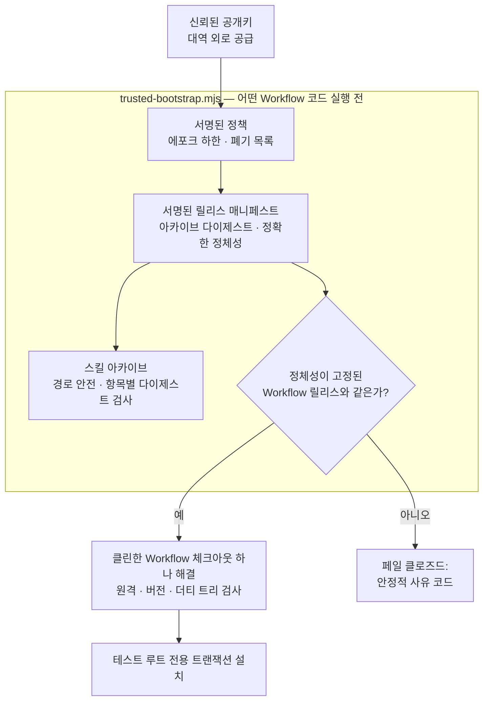

[English](./README.md) | [简体中文](./README.zh-CN.md) | [日本語](./README.ja.md) | **한국어** | [Français](./README.fr.md)

# TCRN Workflow Helper

**의존성 없는 신뢰 부트스트랩 + 듀얼 호스트 Agent Skill — 암호학적으로 증명할 수 없는 TCRN Workflow 릴리스는 실행을 거부합니다.**

`상태: 0.1.0-candidate.3 (프리릴리스 후보)` · `라이선스: Apache-2.0` · `Node ≥ 24` · `의존성: 없음` · `지원: TCRN Workflow v0.1.0-rc.4`

---

## 왜 이 프로젝트가 존재하는가

저장소에서 에이전트 스킬이나 워크플로를 설치하는 것은 공급망 결정이며, 보통 눈을 감은 채 이루어집니다.

- **릴리스 정체성이 없습니다.** `git clone`은 *어떤* 커밋을 줄 뿐 — 리뷰되고 수락된 릴리스에 그것을 결속하는 것은 없습니다.
- **서명도, 롤백 하한도 없습니다.** 조용히 교체된 아카이브, 이식된 정책 파일, "유효해 보이는" 서명을 그대로 지닌 취약한 구버전으로의 다운그레이드를 아무것도 막지 못합니다.
- **신뢰가 신뢰 대상으로부터 자기 부트스트랩합니다.** 대부분의 설치기는 아카이브 *내부*의 파일로 아카이브 자신을 검증합니다 — 아무것도 증명하지 못합니다.

Helper는 TCRN Workflow에 대한 답입니다: 단일 파일, 의존성 제로 부트스트랩이 **어떤 Workflow 코드도 실행되기 전에** 서명된 릴리스 정체성 전체를 검증합니다. 지원 호스트는 Codex와 Claude Code 둘. 어떤 검사든 실패하면 안정적 사유 코드로 멈춥니다. `--force`는 없습니다.

## 무엇을 강제하는가

| 보장 | 메커니즘 |
| --- | --- |
| **정확한 릴리스 정체성** | 수락된 Workflow 릴리스는 저장소 URL·버전·commit·tree **그리고** 주석 태그 객체로 고정됩니다. 서명은 유효하나 다른 릴리스를 가리키는 매니페스트는 페일 클로즈드(`IDENTITY_MISMATCH`). |
| **진짜 서명, 외부 신뢰** | Ed25519 릴리스 매니페스트와 별도 서명된 정책을 *아카이브와 독립적으로 공급된* 공개키로 검증 — 아카이브는 결코 자기 인증할 수 없습니다. 정책 이식과 재생은 어떤 정책 필드가 신뢰되기 전에 거부됩니다. |
| **롤백 방지** | Skill 디렉터리 밖에 지속되는 단조 정책 에포크 하한. 오래된 에포크는 서명이 유효해도 페일 클로즈드(`ROLLBACK_REJECTED`). |
| **적대적 아카이브 안전성** | 경로 순회, 절대 경로, 제어 문자, 비 NFC 경로, 중복/대소문자 충돌 경로, 링크, 특수 파일, 항목별 다이제스트 변조, 항목/바이트 상한 — 모두 추출 전에 거부. |
| **라이브 호스트 보호** | 설치·업데이트·재설치·제거는 일회용 `tcrn-helper-test-*` 루트 안에서**만**. 경로에 `.claude`나 `.codex` 성분을 포함하면 — 어떤 대소문자든 — 파일시스템을 건드리기 전에 어휘적으로 거부(`LIVE_LOCATION_FORBIDDEN`). |
| **트랜잭션 라이프사이클** | 모든 변경은 단계화·저널링된 트랜잭션. 충돌 복구는 진짜 `SIGKILL` 주입으로 증명되며, 실패한 작업은 바이트 단위로 동일한 이전 상태와 잔여물 제로를 남깁니다. |
| **재현 가능한 릴리스 아티팩트** | 스킬 아카이브, 소스 아카이브, SBOM은 결정론적. 클린 클론 CI 리플레이가 고정 로케일/타임존 환경에서 재구축하고 커밋된 아티팩트와의 다이제스트 동일성을 단언합니다. |

## 빠른 시작

```sh
# 전체 증명 스위트 실행 (오프라인; 약 10분, SIGKILL 결함 주입 포함)
npm test

# 무언가 실행되기 전에 서명된 릴리스 번들 검증
node bootstrap/trusted-bootstrap.mjs validate \
  --archive <archive.json> --manifest <manifest.json> --policy <policy.json> \
  --provenance <provenance.json> --state <state.json> --trusted-key <public-key.pem>

# 표준 설치기가 ~/.claude/skills 에 놓은 이 Skill 사본을 읽기 전용으로 검증
node bootstrap/trusted-bootstrap.mjs verify-installed-copy \
  --installed-dir <~/.claude/skills/tcrn-workflow-helper> \
  --manifest <manifest.json> --policy <policy.json> --provenance <provenance.json> \
  --state <state.json> --trusted-key <public-key.pem> --marker <marker.json>

# 승인된 Workflow 체크아웃을 정확히 하나 해결 (모호성·심볼릭 링크·더티 트리 거부)
node bootstrap/trusted-bootstrap.mjs resolve --root <workflow-checkout>

# 네트워크 작업 계획 (정적 계획만 인쇄; 아무것도 실행하지 않음)
node bootstrap/trusted-bootstrap.mjs plan-network --approved true --operation clone

# 테스트 루트 전용 라이프사이클 (명시적 승인 필요)
node bootstrap/trusted-bootstrap.mjs install --test-root <dir>/tcrn-helper-test-x \
  --archive ... --manifest ... --policy ... --provenance ... --state ... \
  --trusted-key ... --approved true
```

성공 시 정규화 JSON 영수증 하나(`TRUST_VALIDATED`, `ROOT_RESOLVED`, `NETWORK_PLAN_APPROVED`, `INSTALL_COMPLETED`, `UNINSTALL_COMPLETED`). 실패 시 안정적 사유 코드 하나. 그 사이는 없습니다.

## 신뢰 체인이 맞물리는 방식



## 설계 Q&A

### 왜 의존성 제로인가?

부트스트랩이 *바로* 신뢰 경계이기 때문입니다. 모든 의존성은 검증이 존재하기 전에 실행되는 코드 — 이 프로젝트가 막는 바로 그 구멍입니다. `bootstrap/trusted-bootstrap.mjs`는 Node 내장만 사용하며, 릴리스 스크립트도 같은 규율을 공유합니다.

### 그럼 기술에 익숙하지 않은 사용자는 어떻게 설치하는가?

Skill의 설명 텍스트(`SKILL.md` + `references/`)는 표준 스킬 설치기가 라이브 호스트 스킬 폴더(예: `~/.claude/skills`)에 배포**할 수 있습니다** — 그것은 단지 파일 배치일 뿐, 거기서 코드가 실행되지 않습니다. 신뢰할 수 있게 만드는 것은, 그 다음 **독립적으로 획득한** 신뢰 부트스트랩이 `verify-installed-copy`로 그 디스크 사본을 **읽기 전용**으로 검증하는 것입니다: 사본의 아카이브를 재구성하고 서명된 매니페스트(정체성·다이제스트·롤백 하한)와 대조하며 기계 검증 가능한 마커를 씁니다. 그 마커가 존재해야만 안내형 **첫 실행 마법사**(`references/first-run-wizard.md`)가 진행되어 고정 릴리스를 가져와 검증하고, 모든 사유 코드를 쉬운 말로 설명하며 사용자를 이끕니다. 즉: 배포는 표준 설치기, 신뢰는 암호 부트스트랩.

### 왜 helper 자신의 명령은 실제 스킬 위치에 설치할 수 없는가?

helper의 **변경** 명령(`install`/`update`/`reinstall`/`uninstall`)은 검증과 라이프사이클 전용이며 **테스트 루트 전용**으로 유지됩니다. 그것들을 통한 라이브 호스트 활성화는 별도로 게이트된 릴리스 결정입니다. 가드는 구조적입니다: 어휘적 라이브 위치 검사는 테스트 루트 마커 검사보다, 어떤 파일시스템 프로브보다 먼저 실행되며, 대소문자를 접어(`.Claude`도 빠져나갈 수 없음) 테스트로 덮여 있습니다. Skill 설명 텍스트 배포(위)는 표준 설치기 + 읽기 전용 `verify-installed-copy`를 쓰며 이 변경 명령을 거치지 않습니다.

### 정체성 고정은 왜 이렇게 공격적인가 — 저장소, 버전, commit, tree, 게다가 태그 객체까지?

각 필드가 다른 공격을 죽입니다: 저장소 URL은 유사 원격을 막고, 버전은 "맞는 저장소, 틀린 릴리스"를 막고, commit과 tree는 태그 이름을 유지한 히스토리 재작성을 막고, 태그 객체는 기존 이름을 다른 바이트에 다시 붙이는 재태깅을 막습니다. 테스트 스위트에는 *유효하게 서명되고 정책에도 결속된* 그러나 다른 버전을 이름 대는 매니페스트가 있어 — 서명 검증에 가려지지 않고 정체성 비교 그 자체(`IDENTITY_MISMATCH`)에서 실패해야 합니다.

### 테스트 스위트는 실제로 무엇을 커버하는가?

**79개 테스트, 전부 오프라인**(유일한 `node:net` 사용은 특수 파일 거부 테스트용 로컬 유닉스 도메인 소켓 픽스처):

- 서명 경로 강화: 소유자 전용 키 디렉터리, 디스크립터 안정 읽기, 불량 키 거부, 잔여물 제로의 쓰기 전 실패.
- 신뢰 매트릭스: 서명/키 교체, 정책 이식과 재생, 에포크 롤백, 폐기, 만료, 출처 변조, 아카이브 항목 변조, 정체성 불일치 매니페스트 — 각각 정확한 사유 코드를 단언.
- 라이프사이클: 바이트 단위 프라이빗 워크스페이스 보존을 동반한 설치/업데이트/재설치/제거, 모든 유효 주입 지점에 진짜 `SIGKILL`(결함 인벤토리는 수기 목록이 아니라 실제 연산에서 발견), 서로 다른 PID 경쟁자의 락 경합, 교체/외래 파일 보존.
- 설치된 사본 검증: 표준 설치기가 배치한 스킬 디렉터리의 읽기 전용 재구성, 변조 → 정확한 사유 코드, 심볼릭 링크 디렉터리/항목 거부, 성공 시 롤백 하한 전진, 그리고 state/marker 경로에 대한 라이브 위치 거부.
- 라이브 위치 가드: 두 호스트의 사용자 수준, 프로젝트 수준, `.codex`, 대소문자 변형 경로.
- 재현성: 교란된 `LANG`/`LC_ALL`/`TZ`/`umask` 환경의 결정론적 아카이브, 커밋된 아티팩트와의 바이트 동일성, 그리고 전체 명령 시퀀스를 재실행하고 재구축 다이제스트=커밋 다이제스트를 단언하는 완전 클린 클론 CI 리플레이(`npm run ci:replay`).

### 왜 CI 리플레이 영수증은 커밋된 아티팩트가 아닌가?

검증 실행을 증명하는 영수증이 정작 자신은 아무것도 증명받지 못하는 상태를 허용하지 않기 위해서입니다. 이전 후보는 `ci-replay-readback.json`을 커밋했지만, 리뷰 결과 어떤 게이트에도 결속되지 않고 공개 히스토리 밖 커밋을 참조하는 것으로 드러났습니다. 이제는 재생성되는 CI 출력(gitignore 대상)이며, 커밋된 아티팩트 집합은 모든 게이트가 교차 결속하는 정확히 5개 파일입니다: `candidate-manifest.json`, `checksums.txt`, `sbom.json`, `skill-archive.json`, `source-archive.json`.

## 저장소 구조

| 경로 | 내용 |
| --- | --- |
| `bootstrap/trusted-bootstrap.mjs` | 단일 파일 신뢰 경계: 아카이브 검증, 서명 검증, 정체성 고정, 롤백 방지, 트랜잭션 라이프사이클. |
| `skill/tcrn-workflow-helper/` | Agent Skill 페이로드: `SKILL.md`, 신뢰 계약, 설정 유도 참조, 호스트별 메타데이터. 서명 아카이브가 담는 것이 이 디렉터리입니다. |
| `manifests/` | Ed25519 서명 릴리스 매니페스트와 정책, 그리고 바이트 복사된 Workflow 릴리스 출처. |
| `artifacts/` | 5개의 재현 가능한 릴리스 아티팩트. |
| `scripts/` | 결정론적 아카이브/SBOM/체크섬 생성기, 릴리스 검증기, CI 리플레이, 서명 도구(개인키는 결코 이 저장소에 두지 않음). |
| `test/` | 79 테스트 증명 스위트. |

## 상태 (정직하게)

- `0.1.0-candidate.3`는 TCRN Workflow `v0.1.0-rc.4`를 정확히 지원하는 **프리릴리스 후보**입니다.
- 두 호스트에서 설치와 제거는 **테스트 루트 전용**; 라이브 Codex나 Claude Code 호스트 지원은 주장하지 않습니다.
- Claude Code 전용 세 동작(설정 프래그먼트 가역성, 사용자/프로젝트 우선순위, CLAUDE.md 폴백)은 이 저장소가 아니라 **고정된 Workflow 릴리스 쪽**에서 구현·증명됩니다 — 정확한 증거 맵은 `skill/tcrn-workflow-helper/references/trust-contract.md` 참조.

## 지원 및 보안

- 질문 → GitHub Discussions · 결함 → Issues.
- 보안 보고 → GitHub 비공개 취약점 보고(`SECURITY.md` 참조).

## 라이선스

[Apache-2.0](./LICENSE)
