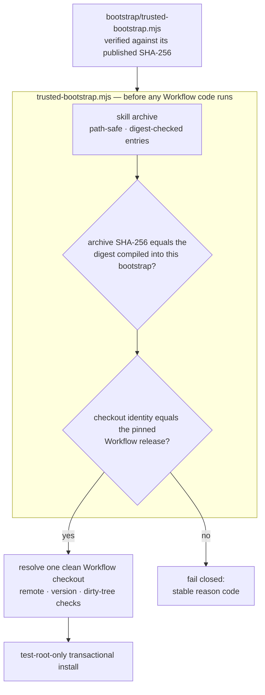

<div align="center">

# TCRN Workflow Helper

### 파일 하나를 손으로 한 번만 확인하세요. 그 뒤로는 그것이 나머지 전부를 거부합니다.

**단일 파일, 의존성 0의 부트스트랩이 코드 한 줄이 돌기 전에 그 릴리스가 공개된 바로 그것임을 증명합니다.**

[English](./README.md) · [简体中文](./README.zh-CN.md) · [日本語](./README.ja.md) · 한국어 · [Français](./README.fr.md)

   

    

[먼저 이것부터 확인하세요](#먼저-이것부터-확인하세요) · [이 프로젝트가 존재하는 이유](#이-프로젝트가-존재하는-이유) · [무엇을 강제하는가](#무엇을-강제하는가) · [빠른 시작](#빠른-시작) · [솔직한 답변](#솔직한-답변) · [라이선스](#라이선스)

</div>

---

> **한 문장으로 말하면**: 작은 파일 하나를 여러 독립적인 곳에 공개된 다이제스트와 한 번 대조하면 — 그 뒤로 그 파일은 검토된 것과 바이트 단위로 동일하지 않은 릴리스를 암호학적으로 거부합니다. `--force`는 없습니다.

## 먼저 이것부터 확인하세요

부트스트랩은 당신이 신뢰해야 하는 유일한 것입니다. 그러니 그것이 하는 말을 믿기 전에 그것부터 확인하십시오. 명령 하나, 비교 한 번입니다.

```sh
shasum -a 256 bootstrap/trusted-bootstrap.mjs
# 3366ba063d04cc3bb94a9ea7a0d188fce069cc6f323102866f2fda8436712e2b
```

이 다이제스트는 여기, `SECURITY.md`, 그리고 GitHub 릴리스 노트에 공개되어 있습니다. **계산한 값이 맞지 않으면 멈추십시오** — 아무것도 실행하지 말고, "그래도 한번 해보자"도 하지 마십시오. 불일치는 이 장치가 제대로 작동하고 있다는 뜻입니다.

## 이 프로젝트가 존재하는 이유

저장소에서 에이전트 스킬이나 워크플로를 설치하는 일은 공급망에 관한 결정이며, 대개 눈을 감은 채 이루어집니다.

- **릴리스 신원이 없습니다**. `git clone`은 *어떤* 커밋을 건네줄 뿐, 그것을 실제로 검토되고 수용된 릴리스에 묶어주는 것은 아무것도 없습니다.
- **바이트를 묶는 것이 없습니다**. 조용히 교체된 아카이브나, 취약한 옛 버전으로의 다운그레이드는 진짜와 똑같아 보입니다. 1인 배포자가 스스로 만든 서명 키는 이를 해결하지 못합니다 — 같은 미답의 질문을 한 칸 왼쪽으로 옮길 뿐입니다. 해결하는 것은 *다운로드와 독립적으로* 얻을 수 있는 다이제스트입니다.
- **신뢰가 신뢰해야 할 대상 자신에서 부트스트랩됩니다**. 대부분의 설치기는 아카이브 *안의* 파일로 그 아카이브를 검증합니다 — 이는 아무것도 증명하지 않습니다. 이 저장소의 초기 후보판이 더 그럴듯한 옷을 입고 바로 그 실수를 저질렀습니다: 루트 지문이 사용자가 닿을 수 있는 어디에도 공개되지 않은 Ed25519 서명 체인이었습니다. 그 체인은 치장되는 대신 제거되었고, 지금 읽고 계신 것이 정직한 판본입니다.

Helper는 TCRN Workflow에 대한 답입니다: 단일 파일, 의존성 0의 부트스트랩이 지원되는 두 호스트(Codex 또는 Claude Code) 어느 쪽에서든 **Workflow 코드가 실행되기 전에 릴리스 바이트와 신원을 완전히 검증합니다**. 어떤 검사든 실패하면 안정적이고 기계가 읽을 수 있는 reason code와 함께 멈춥니다.

## 당신에게 맞는가

| | |
| --- | --- |
| ✅ **맞습니다** | 중요한 머신에서 남이 만든 에이전트 워크플로를 돌리려 하고, 설치 대상 스스로가 그린 초록 체크 표시 이상을 원하는 경우. 혹은 그런 워크플로를 배포하는 쪽이라, 키 인프라를 직접 운영하지 않고도 사용자에게 릴리스를 믿을 *진짜* 이유를 주고 싶은 경우. |
| ❌ **아마 아닙니다** | 직접 쓴 워크플로를, 당신만 만지는 머신에 설치하는 경우. 바이트가 어디서 왔는지 이미 알고 있으며, 이것은 이미 답한 질문에 단계를 하나 더하는 일일 뿐입니다. |

## 무엇을 강제하는가

| 보장 | 작동 방식 |
| --- | --- |
| **재현 가능한 산출물** | 스킬 아카이브, 소스 아카이브, SBOM은 결정적입니다. 클린 클론 CI 리플레이가 그것들을 처음부터 재구축하고 다이제스트가 커밋된 것과 같은지 단언합니다. 누구나 바이트를 재구축해 확인할 수 있다 — 이것이 일차적인 신뢰 원리입니다. |
| **정확한 릴리스 신원** | 수용된 Workflow 릴리스는 저장소 URL, 버전, commit, tree, **그리고** 주석 태그 객체로 고정되며, 실제 Git 체크아웃에 대해 검사됩니다. Git 객체 id는 내용 해시이므로 이 결속은 자기 인증적입니다. |
| **고정된 릴리스 바이트** | 수용된 아카이브와 provenance 다이제스트는 `bootstrap/trusted-bootstrap.mjs` 자신에 컴파일되어 있습니다. 그 외의 아카이브는 페일클로즈합니다(`IDENTITY_MISMATCH`). 부트스트랩 자신의 SHA-256이 바로 위에서 손으로 확인하는 그 하나의 값입니다. |
| **롤백 방지** | GitHub 불변 릴리스: 태그는 옮길 수 없고 에셋은 바꿀 수 없습니다. 옛 릴리스 역시 고정 다이제스트 비교에서 실패합니다. 각 부트스트랩은 정확히 하나의 아카이브만 수용하기 때문입니다. |
| **적대적 아카이브 안전성** | 경로 탈출, 절대 경로, 제어 문자, 비 NFC 경로, 중복 및 대소문자 충돌 경로, 링크, 특수 파일, 항목별 다이제스트 변조, 항목/바이트 상한 — 모두 추출 *이전에* 거부됩니다. |
| **라이브 호스트 보호** | install, update, reinstall, uninstall은 일회용 `tcrn-helper-test-*` 루트 **안에서만** 동작합니다. `.claude`나 `.codex` 구성요소를 포함한 경로는 — 대소문자에 관계없이 — 파일시스템을 살펴보기도 전에 거부됩니다(`LIVE_LOCATION_FORBIDDEN`). |
| **트랜잭션 라이프사이클** | 모든 변경은 스테이징되고 저널링된 트랜잭션이며, 그 크래시 복구는 진짜 `SIGKILL` 주입으로 증명됩니다. 실패한 작업은 바이트 단위로 동일한 이전 상태와 잔여물 0을 남깁니다. |

## 빠른 시작

```sh
# run the full proof suite (offline; expect 10-20 minutes — it includes real SIGKILL fault injection)
npm test

# validate a release bundle before anything executes
node bootstrap/trusted-bootstrap.mjs validate \
  --archive <archive.json> --provenance <provenance.json> --state <state.json>

# verify a copy of this Skill that a standard installer placed in ~/.claude/skills (read-only)
node bootstrap/trusted-bootstrap.mjs verify-installed-copy \
  --installed-dir <~/.claude/skills/tcrn-workflow-helper> \
  --provenance <provenance.json> --state <state.json> --marker <marker.json>

# resolve exactly one approved Workflow checkout (rejects ambiguity, symlinks, dirty trees)
node bootstrap/trusted-bootstrap.mjs resolve --root <workflow-checkout>

# plan a network operation (prints a static plan; performs nothing)
node bootstrap/trusted-bootstrap.mjs plan-network --approved true --operation clone

# test-root-only lifecycle (explicit approval required)
node bootstrap/trusted-bootstrap.mjs install --test-root <dir>/tcrn-helper-test-x \
  --archive ... --provenance ... --state ... --approved true
```

성공하면 정규 JSON 영수증 하나가 나옵니다(`TRUST_VALIDATED`, `ROOT_RESOLVED`, `NETWORK_PLAN_APPROVED`, `INSTALL_COMPLETED`, `UNINSTALL_COMPLETED`). 실패하면 안정적인 reason code 하나가 나옵니다. 그 사이는 없습니다.

## 일상적으로 사용하기

위의 명령들은 신뢰 장치입니다. 일상에서는 당신이 직접 실행할 일이 거의 없습니다 — 실행하는 것은 에이전트이고, 이 저장소의 진짜 제품은 에이전트에게 건네지는 규율입니다.

1. **한 번 배치합니다.** 에이전트(또는 표준 skills 설치기)가 `skill/tcrn-workflow-helper/`를 호스트의 skills 폴더에 넣게 하십시오 — Claude Code라면 `~/.claude/skills` 또는 프로젝트의 `.claude/skills`. 배치는 그저 파일일 뿐이며, 거기서 어떤 코드도 실행되지 않습니다.
2. **한 번 신뢰합니다.** 내려받은 `trusted-bootstrap.mjs`를 위에 공개된 SHA-256과 대조한 뒤, 배치된 사본을 읽기 전용으로 검사하게 하십시오: `verify-installed-copy`는 `INSTALLED_COPY_VALIDATED`를 내거나, 정확히 무엇이 잘못됐는지 지목합니다. 이후 모든 세션이 이 읽기 전용 검사를 다시 실행하므로, 오래되거나 수정된 사본은 무언가를 안내하기 전에 붙잡힙니다.
3. **설정은 대화로 합니다.** 에이전트에게 TCRN Workflow 설정을 부탁하십시오. Skill의 최초 실행 마법사가 나머지를 — 당신에게도 — 쉬운 말로 안내합니다: 승인된 단 하나의 Workflow 체크아웃 해석(`ROOT_RESOLVED`), 워크스페이스 생성, 백업 목적지와 주기 선택. 경로를 직접 입력할 일은 없습니다.
4. **그다음은 그냥 일합니다.** Skill은 에이전트에게 어떤 작업의 순간이 기록될 가치가 있는지 — 결정, 분해, 완료된 산출물, 다툼이 있는 "완료" — 그리고 어떤 동사가 그것을 기록하는지 가르칩니다. 관통하는 단단한 규칙은 하나: 에이전트는 제안할 뿐이며, 당신의 명시적 동의 없이는 아무것도 기록되지 않습니다. 바탕의 루프를 직접 보고 싶다면, Workflow 저장소의 `docs/tutorial/governed-loop.md`에 증명으로 고정된 튜토리얼이 있습니다.

당신의 것으로 남는 것: 모든 결정. 엔진의 것으로 남는 것: 그 강제. 검증 가능한 것으로 남는 것: 그 전부.

## 신뢰 사슬은 어떻게 맞물리는가



## 솔직한 답변

### 왜 의존성이 0인가

부트스트랩 *자체가* 신뢰 경계이기 때문입니다. 모든 의존성은 검증이 존재하기 전에 실행되는 코드가 됩니다 — 바로 이 프로젝트가 막는 구멍입니다. `bootstrap/trusted-bootstrap.mjs`는 Node 내장 기능만 사용하고, 릴리스 스크립트도 같은 규율을 따릅니다.

### 그러면 비기술 사용자는 어떻게 설치하나

스킬의 산문 부분(`SKILL.md`와 `references/`)은 표준 스킬 설치기가 라이브 호스트의 스킬 폴더(예: `~/.claude/skills`)에 배포해도 됩니다 — 그 배치는 그저 파일일 뿐, 거기서 코드가 돌지 않습니다. 신뢰는 그 다음에 옵니다: **독립적으로 획득한** 부트스트랩이 — 위에 공개된 SHA-256과 대조된 상태로 — 디스크의 그 사본을 `verify-installed-copy`로 읽기 전용 검증하고 기계가 확인 가능한 마커를 씁니다. 그 마커가 존재한 뒤에야 안내형 **첫 실행 마법사**(`references/first-run-wizard.md`)가 진행되며, 모든 reason code를 쉬운 말로 설명하며 설정을 안내합니다. 즉 배포는 표준 설치기로, 신뢰는 암호학적 부트스트랩으로.

### 왜 helper 자신의 명령은 실제 스킬 위치에 설치할 수 없나

helper의 변경 계열 명령(`install`/`update`/`reinstall`/`uninstall`)은 검증과 라이프사이클만 담당하며 테스트 루트 전용으로 남습니다. 그것들을 통한 라이브 호스트 활성화는 별도로 게이트된 릴리스 결정입니다. 가드는 구조적입니다: 라이브 위치 검사는 테스트 루트 검사보다 먼저, 그리고 어떤 파일시스템 탐색보다도 먼저 실행되고, 대소문자를 접어 비교하며(대소문자를 구분하지 않는 파일시스템의 `.Claude`도 빠져나갈 수 없습니다), 테스트로 덮여 있습니다.

### 신원 고정은 왜 이렇게 공격적인가 — 저장소, 버전, commit, tree, 게다가 태그 객체까지

각 항목이 서로 다른 공격을 죽입니다: 저장소 URL은 유사 리모트를 막고, 버전은 "저장소는 맞는데 릴리스가 틀린" 경우를 막고, commit과 tree는 태그 이름을 유지한 히스토리 재작성을 막고, 태그 객체는 기존 태그 이름을 다른 바이트에 다시 붙이는 것을 막습니다. 모두 실제 Git 객체 id로 검증됩니다 — 내용 해시이며, 자기 인증적이고, 누구의 서명에도 의존하지 않습니다.

### 테스트 스위트는 실제로 무엇을 다루는가

**87개 테스트, 전부 오프라인**(`node:net`을 쓰는 유일한 곳은 특수 파일 거부를 위한 로컬 유닉스 도메인 소켓 픽스처입니다):

- 신뢰 매트릭스: 고정 다이제스트 불일치, 변조된 provenance, 변조된 아카이브 항목 — 각각 정확한 reason code를 단언합니다.
- 라이프사이클: install / update / reinstall / uninstall을, 바이트 단위로 동일한 프라이빗 워크스페이스 보존, 모든 유효 주입 지점에서의 진짜 `SIGKILL`(결함 목록은 실제 작업에서 발견되며 손으로 나열한 것이 아닙니다), 서로 다른 PID 경쟁자의 잠금 경합, 교체·외래 파일 보존과 함께.
- 설치된 사본 검증: 표준 설치기가 배치한 스킬 디렉터리의 읽기 전용 재구성, 변조 → 정확한 reason code, 심볼릭 링크 거부, state/marker 경로에 대한 라이브 위치 거부.
- 라이브 위치 가드: 사용자 수준, 프로젝트 수준, `.codex`, 그리고 두 호스트 형태에서의 대소문자 변형 경로.
- 재현성: `LANG`/`LC_ALL`/`TZ`/`umask`를 교란한 환경에서의 결정적 아카이브, 커밋된 산출물과의 바이트 일치, 그리고 클린 클론 전체 CI 리플레이(`npm run ci:replay`).
- 정렬: 다이제스트를 만드는 모든 순회는 코드 단위로 비교하며 로케일로는 비교하지 않습니다 — 호스트가 다른 언어를 쓴다는 이유로 설치가 거부되는 일은 결코 없습니다.

### 왜 CI 리플레이 영수증은 커밋된 산출물이 아닌가

검증 실행을 증명하는 영수증이 정작 자신은 아무 근거도 없는 상태여서는 안 되기 때문입니다. 이전 후보판은 `ci-replay-readback.json`을 커밋했지만, 검토 결과 그 파일은 어떤 게이트에도 결속되지 않았고 공개 히스토리 바깥의 커밋을 참조하고 있었습니다. 지금은 매번 새로 생성되는 CI 출력(gitignore 대상)이며, 커밋되는 산출물 집합은 모든 게이트가 서로 교차 결속하는 정확히 다섯 파일입니다: `candidate-manifest.json`, `checksums.txt`, `sbom.json`, `skill-archive.json`, `source-archive.json`.

## 저장소 구조

| 경로 | 내용 |
| --- | --- |
| `bootstrap/trusted-bootstrap.mjs` | 단일 파일 신뢰 경계: 아카이브 검증, 고정된 릴리스 바이트 다이제스트, 신원 고정, 트랜잭션 라이프사이클. **사용 전 SHA-256을 대역 외로 확인하십시오.** |
| `skill/tcrn-workflow-helper/` | Agent Skill 페이로드: `SKILL.md`, 트러스트 컨트랙트, settings 청취 레퍼런스, 호스트별 메타데이터. 이 디렉터리가 바로 고정 아카이브가 담고 있는 내용입니다. |
| `manifests/` | 바이트 단위로 복사된 Workflow 릴리스 provenance. 이것은 *자기 선언적 로컬 빌드 진술*(타임스탬프 0)이지 호스팅 빌더의 증명이 아닙니다 — 다이제스트로 고정되어 교체가 불가능하며, 제3자 확인 가능성은 재현 빌드 사슬에서 옵니다. |
| `artifacts/` | 다섯 개의 재현 가능한 릴리스 산출물. |
| `scripts/` | 결정적 아카이브/SBOM/체크섬 생성기, 릴리스 검증기, CI 리플레이, 푸시 게이트. |
| `test/` | 87개 테스트의 증명 스위트. |
| `RELEASING.md` | 릴리스 런북 — 강제되는 순서, provenance 복사 규칙, 신뢰 표면을 건드리는 커밋의 전체 스위트 규칙. |

## 고정된 Workflow 릴리스가 관장하는 것

helper의 역할은 그대로입니다 — 돌기 전에 릴리스를 증명하는 것. 그리고 지금 고정하고 있는 릴리스인 TCRN Workflow `v0.6.0`은, 스킬의 레퍼런스가 운영자에게 다루는 법을 가르치는 통제된 표면을 제공합니다.

- **콘퍼런스와 게이트 거버넌스** — 숙의는 이벤트 로그에 기록되고(`conference-open` / `-append-position` / `-close` / `-cancel`), 충족되지 않은 게이트는 콘퍼런스 회의록 증거가 해소할 때까지 작업 항목이 `done`에 도달하는 것을 막습니다(`WORKSPACE_GATE_PENDING`, `WORKSPACE_GATE_EVIDENCE_UNRESOLVED`).
- **액터 어테스테이션** — 켜지면 모든 변경 계열 동사가 행위한 액터를 귀속해야 하며, 없거나 형식이 잘못되면 페일클로즈합니다(`WORKSPACE_ACTOR_REQUIRED`, `WORKSPACE_ACTOR_INVALID`).
- **활성화 사다리** — 통제 표면은 하나의 전역 스위치가 아니라 단계적이고 가역적인 단을 통해 활성화됩니다. 거버넌스 레코드가 없는 워크스페이스의 동작은 그대로입니다.
- **백업과 복원** — 밀폐된, 같은 경로의 전체 트리 스냅샷과 결정적 영수증, 그리고 바이트 단위 증명(`snapshot-manifest` / `snapshot-verify` → `SNAPSHOT_VERIFIED`). `skill/tcrn-workflow-helper/references/backup-elicitation.md` 참조.
- **증류** — 통제된 저장소 위에서의 대사 완료된 지식 증류.

이 숙의들을 산문으로 촉발하는 것은 권고적이며 gate-v1 전까지는 설계상 신뢰할 수 없습니다. 스킬은 이를 명시하고, 신뢰할 수 있는 강제는 기계가 확인 가능한 게이트에 맡깁니다.

## 상태, 정직하게

- `0.1.0-candidate.28`는 **프리릴리스 후보**이며 정확히 TCRN Workflow `v0.6.0`을 지원합니다.
- 설치와 제거는 두 호스트 모두 **테스트 루트 전용**이며, 라이브 Codex 또는 Claude Code 호스트 지원은 주장하지 않습니다.
- **직접 만든 Ed25519 서명 체인은 2026-07-19에 제거되었습니다**. 그것은 한 번도 닻을 내린 적이 없었습니다: 의존하던 다이제스트와 키 지문이 사용자가 독립적으로 얻을 수 있는 어디에도 공개되지 않아, 이 저장소 밖의 누구에게도 아무것도 증명하지 못했습니다. 그것을 대신하는 것은 더 단순하고 정직합니다: *실제로 공개된* 부트스트랩 다이제스트, 그 부트스트랩에 컴파일된 수용 릴리스 다이제스트, GitHub 불변 릴리스, 그리고 재현 빌드 사슬.
- Claude Code 고유의 세 가지 동작(settings 조각 가역성, 사용자 대 프로젝트 우선순위, CLAUDE.md 폴백)은 이 저장소가 아니라 **고정된 Workflow 릴리스**에서 구현되고 증명되었습니다 — 정확한 증거 대응은 `skill/tcrn-workflow-helper/references/trust-contract.md`를 참조하십시오.

## 지원과 보안

- 질문 → GitHub Discussions ｜ 결함 → Issues.
- 보안 신고 → GitHub 비공개 취약점 보고(`SECURITY.md` 참조).

## 라이선스

[Apache-2.0](./LICENSE)
