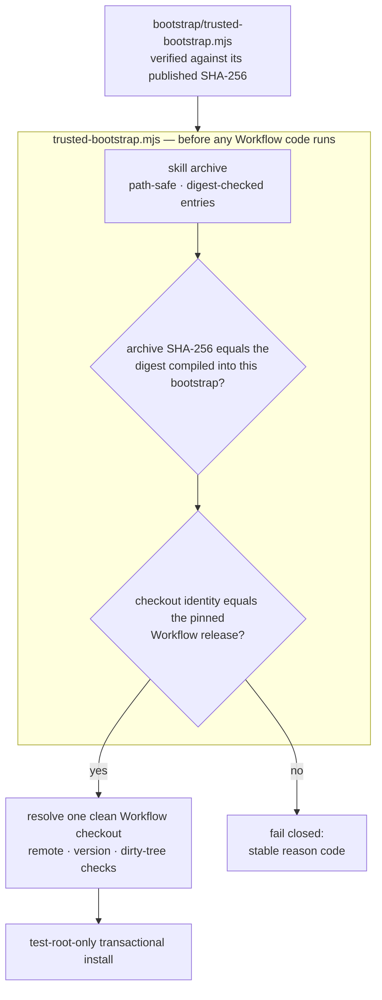

<div align="center">

# TCRN Workflow Helper

### Check one file by hand, once. It refuses everything else for you.

**A single-file, zero-dependency bootstrap that proves a release is exactly what was published — before a single line of it runs.**

English · [简体中文](./README.zh-CN.md) · [日本語](./README.ja.md) · [한국어](./README.ko.md) · [Français](./README.fr.md)

   

    

[Verify this first](#verify-this-first) · [Why](#why-this-project-exists) · [What it enforces](#what-it-enforces) · [Quick start](#quick-start) · [Plain answers](#plain-answers-to-fair-questions) · [License](#license)

</div>

---

> **The whole idea in one sentence:** you verify one small file against a digest published in several independent places — and from then on, that file cryptographically refuses any release that is not byte-for-byte the one that was reviewed. There is no `--force`.

## Verify this first

The bootstrap is the only thing you ever have to trust, so check it before you trust anything it tells you. One command, one comparison:

```sh
shasum -a 256 bootstrap/trusted-bootstrap.mjs
# c63a514495cc507b22d7e66b6e0c8b6775d902ae721d02a5b2b3991899a50ecb
```

That digest is published here, in `SECURITY.md`, and in the GitHub release notes. **If what you compute does not match, stop** — do not run anything, do not "try it anyway". A mismatch is the system working.

## Why this project exists

Installing an agent skill or workflow from a repository is a supply-chain decision, and it is usually made blind:

- **No release identity.** A `git clone` hands you *some* commit — nothing binds it to the release that was actually reviewed and accepted.
- **Nothing binds the bytes.** A silently replaced archive, or a downgrade to an older vulnerable release, looks identical to the real thing. A solo publisher's self-generated signing key does not fix this — it moves the same unanswered question one file to the left. What fixes it is a digest you can obtain *independently of the download*.
- **Trust bootstrapped from the thing being trusted.** Most installers validate an archive using files *inside* that archive — which proves nothing. Earlier candidates of this very repository made that mistake in a more flattering costume: an Ed25519 signing chain whose root fingerprint was published nowhere a user could reach. That chain was removed rather than dressed up, and the honest version is what you are reading.

The helper is the answer for TCRN Workflow: a single-file, zero-dependency bootstrap that validates **the complete release bytes and identity before any Workflow code executes**, on either supported host (Codex or Claude Code). If any check fails, it stops with a stable, machine-readable reason code.

## Is this for you?

| | |
| --- | --- |
| ✅ **Yes, if** | you are about to run someone else's agent workflow on a machine that matters, and you want more than a green checkmark drawn by the thing you are installing. Or you publish such a workflow and want your users to have a *real* reason to trust a release — without running key infrastructure yourself. |
| ❌ **Probably not, if** | you are installing a workflow you wrote yourself on a machine only you touch. You already know where the bytes came from; this adds a step for a question you have already answered. |

## What it enforces

| Guarantee | How it works |
| --- | --- |
| **Reproducible artifacts** | The skill archive, source archive, and SBOM are deterministic. A clean-clone CI replay rebuilds them from scratch and asserts the digests match the committed ones. Anyone can rebuild the bytes and check — that is the primary trust primitive. |
| **Exact release identity** | The accepted Workflow release is pinned by repository URL, version, commit, tree, *and* annotated tag object — checked against a real Git checkout. Git object ids are content hashes, so the binding is self-authenticating. |
| **Pinned release bytes** | The accepted archive and provenance digests are compiled into `bootstrap/trusted-bootstrap.mjs` itself. Any other archive fails closed (`IDENTITY_MISMATCH`). The bootstrap's own SHA-256 is the one value you check by hand, above. |
| **Anti-rollback** | GitHub immutable releases: tags cannot be moved, assets cannot be swapped. An older release also fails the pinned-digest comparison, because each bootstrap accepts exactly one archive. |
| **Hostile-archive safety** | Path traversal, absolute paths, control characters, non-NFC paths, duplicate and case-colliding paths, links, special files, per-entry digest tampering, and entry/byte limits are all rejected *before* extraction. |
| **Live-host protection** | Install, update, reinstall, and uninstall operate **only** inside disposable `tcrn-helper-test-*` roots. Any path containing a `.claude` or `.codex` component — in any letter case — is rejected before the filesystem is even probed (`LIVE_LOCATION_FORBIDDEN`). |
| **Transactional lifecycle** | Every mutation is a staged, journaled transaction with crash recovery proven by real `SIGKILL` injection. A failed operation leaves byte-identical prior state and zero residue. |

## Quick start

```sh
# run the full proof suite (offline; expect 10-20 minutes — it includes real SIGKILL fault injection)
npm test

# validate a release bundle before anything executes
node bootstrap/trusted-bootstrap.mjs validate \
  --archive <archive.json> --provenance <provenance.json> --state <state.json>

# verify a copy of this Skill that a standard installer placed in ~/.claude/skills (read-only)
node bootstrap/trusted-bootstrap.mjs verify-installed-copy \
  --installed-dir <~/.claude/skills/tcrn-workflow-helper> \
  --provenance <provenance.json> --state <state.json> --marker <marker.json>

# resolve exactly one approved Workflow checkout (rejects ambiguity, symlinks, dirty trees)
node bootstrap/trusted-bootstrap.mjs resolve --root <workflow-checkout>

# plan a network operation (prints a static plan; performs nothing)
node bootstrap/trusted-bootstrap.mjs plan-network --approved true --operation clone

# test-root-only lifecycle (explicit approval required)
node bootstrap/trusted-bootstrap.mjs install --test-root <dir>/tcrn-helper-test-x \
  --archive ... --provenance ... --state ... --approved true
```

Success emits one canonical JSON receipt (`TRUST_VALIDATED`, `ROOT_RESOLVED`, `NETWORK_PLAN_APPROVED`, `INSTALL_COMPLETED`, `UNINSTALL_COMPLETED`). Failure emits one stable reason code. Nothing in between.

## Using it day to day

The commands above are the trust machinery. Day to day, you mostly do not run them — your agent does, and this repository's real product is the discipline it hands your agent.

1. **Place once.** Have your agent (or any standard skills installer) put `skill/tcrn-workflow-helper/` into your host's skills folder — for Claude Code, `~/.claude/skills` or a project's `.claude/skills`. Placement is just files; no code runs from it.
2. **Trust once.** Verify your download of `trusted-bootstrap.mjs` against the SHA-256 published above, then let it check the placed copy read-only: `verify-installed-copy` either says `INSTALLED_COPY_VALIDATED` or names exactly what is wrong. Each later session re-runs this one read-only check, so a stale or edited copy is caught before it guides anything.
3. **Set up through conversation.** Ask your agent to set up TCRN Workflow. The Skill's first-run wizard walks it — and you — through the rest with plain-language explanations: resolving one approved Workflow checkout (`ROOT_RESOLVED`), creating the workspace, choosing a backup destination and cadence. You type no paths.
4. **Then just work.** The Skill teaches your agent when a working moment deserves a record — a decision, a decomposition, a completed deliverable, a contested "done" — and which verb records it. The one hard rule: it offers, and nothing is written without your explicit yes. To see the underlying loop with your own eyes, the Workflow repository ships a proof-backed tutorial at `docs/tutorial/governed-loop.md`.

### Install through the Skills registry

After a public source is authorized, the standard copy-oriented installer is:

```sh
npx skills add <owner>/<repository> \
  --skill tcrn-workflow-helper \
  --global --agent claude-code --agent codex --copy --yes
```

The installer places files; it is not the trust root. Independently verify the
bootstrap and run `verify-installed-copy` for each host copy. The publication
handoff and scratch matrix are documented in `docs/skills-registry.md`.

What stays yours: every decision. What stays the engine's: enforcing them. What stays checkable: all of it.

## How the trust chain fits together



## Plain answers to fair questions

### Why zero dependencies?

The bootstrap *is* the trust boundary. Every dependency would be code that runs before verification exists — exactly the hole this project closes. `bootstrap/trusted-bootstrap.mjs` uses only Node built-ins, and the release scripts share that discipline.

### How does a non-technical user install this, then?

The Skill's prose (`SKILL.md` + `references/`) may be distributed into a live host skills folder (for example `~/.claude/skills`) by a standard skills installer — that placement is just files; no code runs from it. Trust comes afterwards: an **independently obtained** bootstrap — checked against the SHA-256 published above — verifies that on-disk copy read-only with `verify-installed-copy` and writes a machine-checkable marker. Only after that marker exists does the guided **first-run wizard** (`references/first-run-wizard.md`) proceed, walking the user through setup with plain-language explanations of every reason code. Standard installer for distribution; cryptographic bootstrap for trust.

### Why can't the helper's own commands install into a real skill location?

The helper's mutating commands (`install`/`update`/`reinstall`/`uninstall`) are validation-and-lifecycle only, and they stay test-root-only; live-host activation through them is a separately gated release decision. The guard is structural: the live-location check runs before the test-root check and before any filesystem probe, is case-folded (so `.Claude` on a case-insensitive filesystem cannot slip past), and is covered by tests.

### Why is the identity pin so aggressive — repository, version, commit, tree, *and* tag object?

Each field kills a different attack: the repository URL stops look-alike remotes; the version stops "right repo, wrong release"; the commit and tree stop history rewrites that keep a tag name; the tag object stops re-tagging an existing name onto different bytes. All of it is verified with real Git object ids — content hashes, self-authenticating, never dependent on anyone's signature.

### What does the test suite actually cover?

**87 tests, all offline** (the only `node:net` use is a local unix-domain-socket fixture for special-file rejection):

- Trust matrix: pinned-digest mismatch, tampered provenance, tampered archive entries — each asserting its exact reason code.
- Lifecycle: install / update / reinstall / uninstall with byte-identical private workspace preservation, real `SIGKILL` at every effective injection point (the fault inventory is discovered from the real operations, not hand-listed), lock contention with distinct-PID contenders, and replacement/foreign-file preservation.
- Installed-copy verification: read-only reconstruction of a standard-installer-placed skill directory, tamper → exact reason code, symlink rejection, and live-location refusal of the state/marker path.
- Live-location guard: user-level, project-level, `.codex`, and case-variant paths on both host shapes.
- Reproducibility: deterministic archives under perturbed `LANG`/`LC_ALL`/`TZ`/`umask` environments, byte-equality with committed artifacts, and a full clean-clone CI replay (`npm run ci:replay`).
- Ordering: every digest-bearing walk compares by code unit, never by locale — so an install can never be refused because the host speaks a different language.

### Why is the CI replay receipt not a committed artifact?

Because a receipt that certifies a validation run should not itself be certified by nothing. Earlier candidates committed `ci-replay-readback.json`; review showed it was bound by no gate and referenced commits outside the published history. It is now a regenerated CI output (gitignored), and the committed artifact set is exactly the five files every gate cross-binds: `candidate-manifest.json`, `checksums.txt`, `sbom.json`, `skill-archive.json`, `source-archive.json`.

## Repository layout

| Path | Contents |
| --- | --- |
| `bootstrap/trusted-bootstrap.mjs` | The single-file trust boundary: archive validation, pinned release-byte digests, identity pinning, transactional lifecycle. **Verify its SHA-256 out-of-band before use.** |
| `skill/tcrn-workflow-helper/` | The Agent Skill payload: `SKILL.md`, trust contract, first-run/platform-layout guidance, settings-elicitation reference, per-host metadata. The committed candidate archive remains separately pinned until the release train re-pins this source tree. |
| `manifests/` | The byte-copied Workflow release provenance. It is a *self-asserted local build statement* (zeroed timestamps), not a hosted-builder attestation — pinned by digest so it cannot be swapped; third-party checkability comes from the reproducible-build chain. |
| `artifacts/` | The five reproducible release artifacts. |
| `scripts/` | Deterministic archive/SBOM/checksum generators, release verifier, CI replay, push gate. |
| `docs/skills-registry.md` | Skills registry source shape, copy-oriented install command, trust matrix, and publication park boundary. |
| `test/` | The 87-test proof suite. |
| `RELEASING.md` | The release runbook — the forced ordering, the provenance copy rule, and the full-suite rule for trust-surface commits. |

## What the pinned Workflow release governs

The helper's job is unchanged — prove the release before it runs. The release it pins, TCRN Workflow `v0.11.10`, ships a governed surface that the Skill's references teach the operator to drive:

- **Conference & gate governance** — deliberations are recorded on the event log (`conference-open` / `-append-position` / `-close` / `-cancel`), and a pending gate blocks a work item from reaching `done` until conference-minutes evidence resolves it (`WORKSPACE_GATE_PENDING`, `WORKSPACE_GATE_EVIDENCE_UNRESOLVED`).
- **Actor attestation** — once enabled, every mutating verb must attribute an acting actor, failing closed on an absent or malformed one (`WORKSPACE_ACTOR_REQUIRED`, `WORKSPACE_ACTOR_INVALID`).
- **Activation ladder** — the governed surface activates in staged, reversible rungs rather than through a single global switch; a workspace with no governance records is behaviorally unchanged.
- **Backup & restore** — hermetic, same-path, whole-tree snapshots with a deterministic receipt and a byte-identical proof (`snapshot-manifest` / `snapshot-verify` → `SNAPSHOT_VERIFIED`); see `skill/tcrn-workflow-helper/references/backup-elicitation.md`.
- **Governed relocation** — a workspace has a recorded route to a new path or a new machine (`relocation-plan` / `-vacate` / `-adopt` / `-abort` / `-inspect`). The verbs move the binding, the operator moves the bytes, and no event is rewritten. It does not prevent a fork; it makes one legible — read the release's `docs/adr/0003-workspace-relocation.md` before relying on it.
- **A readable chain** — `event-list` returns events verbatim, page by page, so a consumer can re-derive a chain that is too large for `export`.
- **Distillation** — reconciled knowledge distillation over the governed store.

Prose triggering of these deliberations is advisory and unreliable-by-design pending gate-v1; the Skill states so explicitly and defers reliable enforcement to machine-checkable gates.

## Status, honestly

- `0.1.0-candidate.35` is a **pre-release candidate** supporting exactly TCRN Workflow `v0.11.10`.
- Installation and removal are **test-root-only** on both hosts; no live Codex or Claude Code host support is asserted.
- **The self-built Ed25519 signing chain was removed on 2026-07-19.** It was never anchored: the digest and key fingerprint it depended on were published nowhere a user could independently obtain them, so the chain proved nothing to anyone outside this repository. What replaces it is simpler and honest: a bootstrap digest that is *actually published* in independent places, accepted release digests compiled into that bootstrap, GitHub immutable releases, and the reproducible-build chain.
- The three Claude-Code-specific behaviors (settings-fragment reversibility, user-vs-project precedence, CLAUDE.md fallback) are implemented and proven **in the pinned Workflow release**, not in this repository — see `skill/tcrn-workflow-helper/references/trust-contract.md` for the exact evidence map.

## Support & security

- Questions → GitHub Discussions · defects → Issues.
- Security reports → GitHub Private Vulnerability Reporting (see `SECURITY.md`).

## License

[Apache-2.0](./LICENSE)
