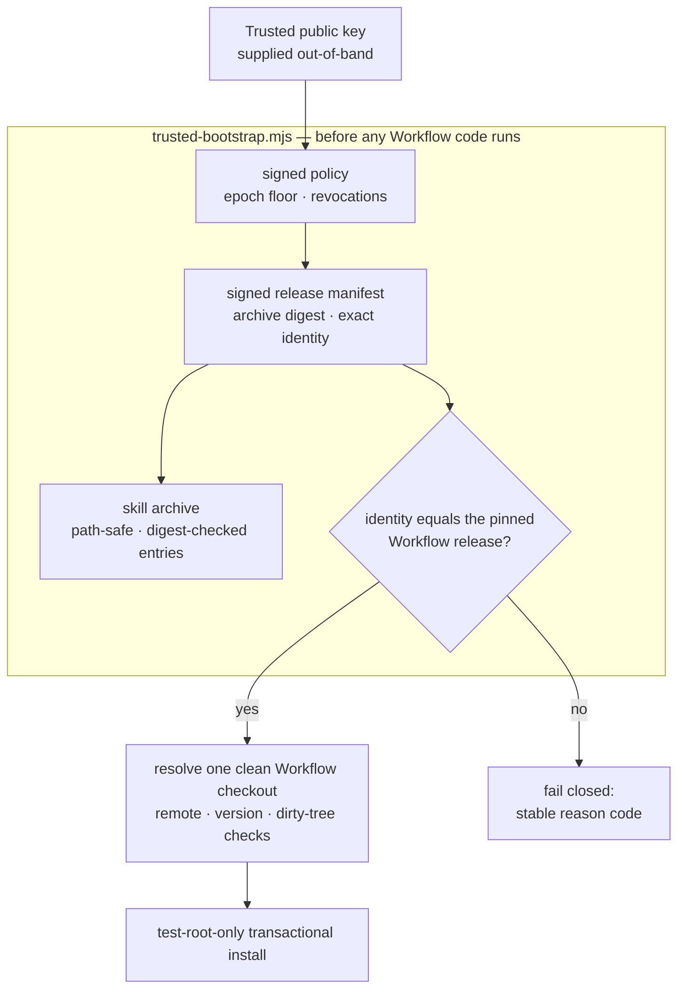

**English** | [简体中文](./README.zh-CN.md) | [日本語](./README.ja.md) | [한국어](./README.ko.md) | [Français](./README.fr.md)

# TCRN Workflow Helper

**A dependency-free trusted bootstrap and dual-host Agent Skill that refuses to run a TCRN Workflow release it cannot cryptographically prove.**

`Status: 0.1.0-candidate.3 (pre-release candidate)` · `License: Apache-2.0` · `Node ≥ 24` · `Dependencies: zero` · `Supports: TCRN Workflow v0.1.0-rc.4`

---

## Why this project exists

Installing an agent skill or workflow from a repository is a supply-chain decision, usually made blind:

- **No release identity.** A `git clone` gives you *some* commit — nothing binds it to the release that was reviewed and accepted.
- **No signature, no rollback floor.** Nothing stops a silently replaced archive, a transplanted policy file, or a downgrade to an older, vulnerable release that still carries a valid-looking signature.
- **Trust bootstrapped from the thing being trusted.** Most installers validate an archive using files *inside* that archive — which proves nothing.

The helper is the answer for TCRN Workflow: a single-file, zero-dependency bootstrap that validates **the complete signed release identity before any Workflow code executes**, on either supported Agent App host (Codex or Claude Code). If any check fails, it stops with a stable reason code. There is no `--force`.

## What it enforces

| Guarantee | Mechanism |
| --- | --- |
| **Exact release identity** | The accepted Workflow release is pinned by repository URL, version, commit, tree, *and* annotated tag object. A validly signed manifest for a different release fails closed (`IDENTITY_MISMATCH`). |
| **Real signatures, external trust** | The Ed25519 release manifest and a separately signed policy are verified against a public key supplied *independently of the archive* — the archive can never authenticate itself. Policy transplant and replay are rejected before any policy field is honored. |
| **Anti-rollback** | A monotonic policy epoch floor persisted outside the Skill directory; an older epoch fails closed (`ROLLBACK_REJECTED`), even with a valid signature. |
| **Hostile-archive safety** | Path traversal, absolute paths, control characters, non-NFC paths, duplicate/case-colliding paths, links, special files, per-entry digest tampering, and entry/byte limits are all rejected before extraction. |
| **Live-host protection** | Install, update, reinstall, and uninstall operate **only** inside disposable `tcrn-helper-test-*` roots. Any path containing a `.claude` or `.codex` component — in any letter case — is rejected lexically (`LIVE_LOCATION_FORBIDDEN`) before the filesystem is even probed. |
| **Transactional lifecycle** | Every mutation is a staged, journaled transaction with crash recovery proven by real `SIGKILL` injection; a failed operation leaves byte-identical prior state and zero residue. |
| **Reproducible release artifacts** | The skill archive, source archive, and SBOM are deterministic; a clean-clone CI replay rebuilds them and asserts digest equality with the committed artifacts under a fixed locale/timezone environment. |

## Quick start

```sh
# run the full proof suite (offline; ~10 minutes, includes SIGKILL fault injection)
npm test

# validate a signed release bundle before anything executes
node bootstrap/trusted-bootstrap.mjs validate \
  --archive <archive.json> --manifest <manifest.json> --policy <policy.json> \
  --provenance <provenance.json> --state <state.json> --trusted-key <public-key.pem>

# verify a copy of this Skill that a standard installer placed in ~/.claude/skills (read-only)
node bootstrap/trusted-bootstrap.mjs verify-installed-copy \
  --installed-dir <~/.claude/skills/tcrn-workflow-helper> \
  --manifest <manifest.json> --policy <policy.json> --provenance <provenance.json> \
  --state <state.json> --trusted-key <public-key.pem> --marker <marker.json>

# resolve exactly one approved Workflow checkout (rejects ambiguity, symlinks, dirty trees)
node bootstrap/trusted-bootstrap.mjs resolve --root <workflow-checkout>

# plan a network operation (prints a static plan; performs nothing)
node bootstrap/trusted-bootstrap.mjs plan-network --approved true --operation clone

# test-root-only lifecycle (explicit approval required)
node bootstrap/trusted-bootstrap.mjs install --test-root <dir>/tcrn-helper-test-x \
  --archive ... --manifest ... --policy ... --provenance ... --state ... \
  --trusted-key ... --approved true
```

Success emits one canonical JSON receipt (`TRUST_VALIDATED`, `ROOT_RESOLVED`, `NETWORK_PLAN_APPROVED`, `INSTALL_COMPLETED`, `UNINSTALL_COMPLETED`). Failure emits one stable reason code. Nothing in between.

## How the trust chain fits together



## Design Q&A

### Why zero dependencies?

The bootstrap *is* the trust boundary. Every dependency would be code that runs before verification exists — exactly the hole this project closes. `bootstrap/trusted-bootstrap.mjs` uses only Node built-ins, and the release scripts share that discipline.

### How does a non-technical user install this, then?

The Skill's prose (`SKILL.md` + `references/`) may be distributed into a live host skills folder (e.g. `~/.claude/skills`) by a standard skills installer — that placement is just files, no code runs from it. What makes it trustworthy is that an **independently obtained** trusted bootstrap then verifies that on-disk copy **read-only** with `verify-installed-copy`, which reconstructs the copy's archive, checks it against the signed manifest (identity, digest, anti-rollback floor), and writes a machine-checkable marker. Only after that marker exists does the guided **first-run wizard** (`references/first-run-wizard.md`) proceed — fetching the pinned release, validating it, and walking the user through setup with plain-language explanations of every reason code. So: standard installer for distribution, cryptographic bootstrap for trust.

### Why can't the helper's own commands install into a real skill location?

The helper's **mutating** commands (`install`/`update`/`reinstall`/`uninstall`) are validation-and-lifecycle only and stay test-root-only; live-host activation through them is a separately gated release decision. The guard is structural: the lexical live-location check runs before the test-root marker check and before any filesystem probe, is case-folded (so `.Claude` on a case-insensitive filesystem cannot slip past), and is covered by tests. Distribution of the Skill prose (above) uses a standard installer plus read-only `verify-installed-copy` — it never routes through these mutating commands.

### Why is the identity pin so aggressive — repository, version, commit, tree, *and* tag object?

Each field kills a different attack: the repository URL stops look-alike remotes; the version stops "right repo, wrong release"; the commit and tree stop history rewrites that keep a tag name; the tag object stops re-tagging an existing name onto different bytes. The test suite includes a manifest that is *validly signed and policy-bound* but names a different version — it must fail on the identity comparison itself (`IDENTITY_MISMATCH`), proving the check is not shadowed by signature validation.

### What does the test suite actually cover?

**79 tests, all offline** (the only `node:net` use is a local unix-domain-socket fixture for special-file rejection):

- Signing-path hardening: owner-only key directories, descriptor-stable reads, rogue-key rejection, pre-write failures with zero residue.
- Trust matrix: signature/key substitution, policy transplant and replay, epoch rollback, revocation, expiry, tampered provenance, tampered archive entries, and the mismatched-identity manifest — each asserting its exact reason code.
- Lifecycle: install / update / reinstall / uninstall with byte-identical private workspace preservation, real `SIGKILL` at every effective injection point (the fault inventory is discovered from the real operations, not hand-listed), lock contention with distinct-PID contenders, and replacement/foreign-file preservation.
- Installed-copy verification: read-only reconstruction of a standard-installer-placed skill directory, tamper → exact reason code, symlinked directory/entry rejection, anti-rollback floor advancement on success, and live-location refusal of the state/marker path.
- Live-location guard: user-level, project-level, `.codex`, and case-variant paths on both host shapes.
- Reproducibility: deterministic archives under perturbed `LANG`/`LC_ALL`/`TZ`/`umask` environments, byte-equality with committed artifacts, and a full clean-clone CI replay (`npm run ci:replay`) that re-runs the entire command sequence and asserts rebuilt digests equal committed digests.

### Why is the CI replay receipt not a committed artifact?

Because a receipt that certifies a validation run should not itself be certified by nothing. Earlier candidates committed `ci-replay-readback.json`; review showed it was bound by no gate and referenced commits outside the published history. It is now a regenerated CI output (gitignored), and the committed artifact set is exactly the five files every gate cross-binds: `candidate-manifest.json`, `checksums.txt`, `sbom.json`, `skill-archive.json`, `source-archive.json`.

## Repository layout

| Path | Contents |
| --- | --- |
| `bootstrap/trusted-bootstrap.mjs` | The single-file trust boundary: archive validation, signature verification, identity pinning, anti-rollback, transactional lifecycle. |
| `skill/tcrn-workflow-helper/` | The Agent Skill payload: `SKILL.md`, trust contract, settings-elicitation reference, per-host metadata. This directory is what the signed archive contains. |
| `manifests/` | The Ed25519-signed release manifest and policy, plus the byte-copied Workflow release provenance. |
| `artifacts/` | The five reproducible release artifacts. |
| `scripts/` | Deterministic archive/SBOM/checksum generators, release verifier, CI replay, signing tool (the private key never lives in this repository). |
| `test/` | The 79-test proof suite. |

## Status, honestly

- `0.1.0-candidate.3` is a **pre-release candidate** supporting exactly TCRN Workflow `v0.1.0-rc.4`.
- Installation and removal are **test-root-only** on both hosts; no live Codex or Claude Code host support is asserted.
- The three Claude-Code-specific behaviors (settings-fragment reversibility, user-vs-project precedence, CLAUDE.md fallback) are implemented and proven **in the pinned Workflow release**, not in this repository — see `skill/tcrn-workflow-helper/references/trust-contract.md` for the exact evidence map.

## Support & security

- Questions → GitHub Discussions · defects → Issues.
- Security reports → GitHub Private Vulnerability Reporting (see `SECURITY.md`).

## License

[Apache-2.0](./LICENSE)
