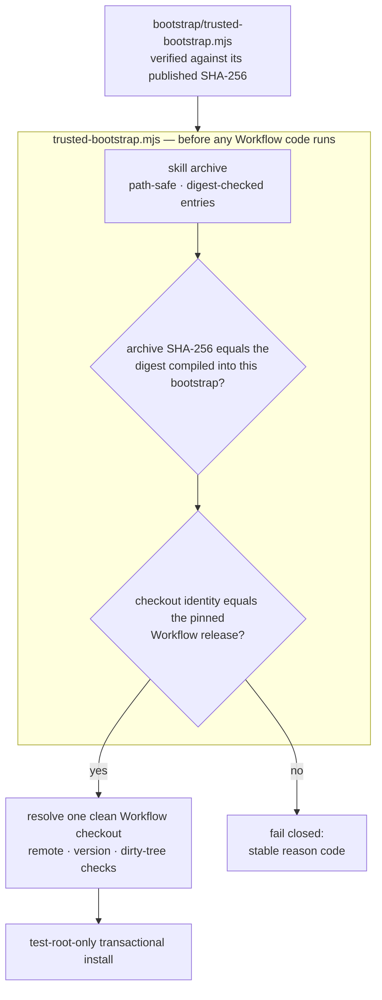

<div align="center">

# TCRN Workflow Helper

**One file you check by hand, once. After that it refuses every byte that is not the release you were promised.**

English · [简体中文](./README.zh-CN.md) · [日本語](./README.ja.md) · [한국어](./README.ko.md) · [Français](./README.fr.md)

   

    

[Why](#why-this-project-exists) · [Who it is for](#who-this-is-for) · [Verify this first](#verify-this-first) · [What it enforces](#what-it-enforces) · [Install](#install) · [License](#license)

</div>

---

## Why this project exists

Installing an agent skill or workflow from a repository is a supply-chain decision, usually made blind:

- **No release identity.** A `git clone` gives you *some* commit — nothing binds it to the release that was reviewed and accepted.
- **Nothing binds the bytes.** A silently replaced archive or a downgrade to an older, vulnerable release looks identical to the real thing. A solo publisher's self-generated signing key does not fix this — it moves the same unanswered question one file to the left. What fixes it is a digest you can obtain independently of the download.
- **Trust bootstrapped from the thing being trusted.** Most installers validate an archive using files *inside* that archive — which proves nothing. Earlier candidates of this repository committed exactly this error in a more flattering costume: an Ed25519 chain whose root fingerprint and whose bootstrap digest were published nowhere a user could reach, so every check ran against an anchor that shipped inside the download. That chain has been removed rather than dressed up.

The helper is the answer for TCRN Workflow: a single-file, zero-dependency bootstrap that validates **the complete release bytes and identity before any Workflow code executes**, on either supported Agent App host (Codex or Claude Code). If any check fails, it stops with a stable reason code. There is no `--force`.

## Who this is for

**A good fit if you** are about to run someone else's agent workflow on a machine that matters and want more than a green checkmark from the thing you are installing. Also if you publish such a workflow and want users to have a real reason to trust a release, without you running key infrastructure.

**Probably not for you if** you are installing a workflow you wrote yourself on a machine only you touch — you already know where the bytes came from, and this adds a step for a question you have already answered.

## Verify this first

The bootstrap is the only thing you have to trust, so check it before you trust anything it tells you:

```sh
shasum -a 256 bootstrap/trusted-bootstrap.mjs
# 19a6e6138401fcc3277a1a7222016ae5f222fb7992b8109e38e2121bc043b15d
```

That digest is published here, in `SECURITY.md`, and in the GitHub release notes. If it does not match, stop.

## What it enforces

| Guarantee | Mechanism |
| --- | --- |
| **Reproducible release artifacts** | The skill archive, source archive, and SBOM are deterministic; a clean-clone CI replay rebuilds them and asserts digest equality with the committed artifacts under a fixed locale/timezone environment. This is the primary trust primitive: anyone can rebuild the bytes and check them. |
| **Exact release identity** | The accepted Workflow release is pinned by repository URL, version, commit, tree, *and* annotated tag object. These are checked against a real Git checkout with real Git object ids, which are content hashes and therefore self-authenticating. |
| **Pinned release bytes** | The accepted archive and provenance digests are compiled into `bootstrap/trusted-bootstrap.mjs`. The bootstrap's own SHA-256 is published in this README, in `SECURITY.md`, and in the release notes; verify it before you trust anything it says. Any other archive fails closed (`IDENTITY_MISMATCH`). |
| **Anti-rollback** | GitHub immutable releases: tags cannot be moved or deleted and assets cannot be changed. An older release also fails the pinned-digest comparison, because each bootstrap accepts exactly one archive. |
| **Hostile-archive safety** | Path traversal, absolute paths, control characters, non-NFC paths, duplicate/case-colliding paths, links, special files, per-entry digest tampering, and entry/byte limits are all rejected before extraction. |
| **Live-host protection** | Install, update, reinstall, and uninstall operate **only** inside disposable `tcrn-helper-test-*` roots. Any path containing a `.claude` or `.codex` component — in any letter case — is rejected lexically (`LIVE_LOCATION_FORBIDDEN`) before the filesystem is even probed. |
| **Transactional lifecycle** | Every mutation is a staged, journaled transaction with crash recovery proven by real `SIGKILL` injection; a failed operation leaves byte-identical prior state and zero residue. |

## Quick start

```sh
# run the full proof suite (offline; ~10 minutes, includes SIGKILL fault injection)
npm test

# validate a release bundle before anything executes
node bootstrap/trusted-bootstrap.mjs validate \
  --archive <archive.json> --provenance <provenance.json> --state <state.json>

# verify a copy of this Skill that a standard installer placed in ~/.claude/skills (read-only)
node bootstrap/trusted-bootstrap.mjs verify-installed-copy \
  --installed-dir <~/.claude/skills/tcrn-workflow-helper> \
  --provenance <provenance.json> --state <state.json> --marker <marker.json>

# resolve exactly one approved Workflow checkout (rejects ambiguity, symlinks, dirty trees)
node bootstrap/trusted-bootstrap.mjs resolve --root <workflow-checkout>

# plan a network operation (prints a static plan; performs nothing)
node bootstrap/trusted-bootstrap.mjs plan-network --approved true --operation clone

# test-root-only lifecycle (explicit approval required)
node bootstrap/trusted-bootstrap.mjs install --test-root <dir>/tcrn-helper-test-x \
  --archive ... --provenance ... --state ... --approved true
```

Success emits one canonical JSON receipt (`TRUST_VALIDATED`, `ROOT_RESOLVED`, `NETWORK_PLAN_APPROVED`, `INSTALL_COMPLETED`, `UNINSTALL_COMPLETED`). Failure emits one stable reason code. Nothing in between.

## How the trust chain fits together



## Design Q&A

### Why zero dependencies?

The bootstrap *is* the trust boundary. Every dependency would be code that runs before verification exists — exactly the hole this project closes. `bootstrap/trusted-bootstrap.mjs` uses only Node built-ins, and the release scripts share that discipline.

### How does a non-technical user install this, then?

The Skill's prose (`SKILL.md` + `references/`) may be distributed into a live host skills folder (e.g. `~/.claude/skills`) by a standard skills installer — that placement is just files, no code runs from it. What makes it trustworthy is that an **independently obtained** trusted bootstrap — obtained through a repo-independent channel and checked against the SHA-256 published above — then verifies that on-disk copy **read-only** with `verify-installed-copy`, which reconstructs the copy's archive, compares its digest against the digest compiled into that verified bootstrap, and writes a machine-checkable marker. Only after that marker exists does the guided **first-run wizard** (`references/first-run-wizard.md`) proceed — fetching the pinned release, validating it, and walking the user through setup with plain-language explanations of every reason code. So: standard installer for distribution, cryptographic bootstrap for trust.

### Why can't the helper's own commands install into a real skill location?

The helper's **mutating** commands (`install`/`update`/`reinstall`/`uninstall`) are validation-and-lifecycle only and stay test-root-only; live-host activation through them is a separately gated release decision. The guard is structural: the lexical live-location check runs before the test-root marker check and before any filesystem probe, is case-folded (so `.Claude` on a case-insensitive filesystem cannot slip past), and is covered by tests. Distribution of the Skill prose (above) uses a standard installer plus read-only `verify-installed-copy` — it never routes through these mutating commands.

### Why is the identity pin so aggressive — repository, version, commit, tree, *and* tag object?

Each field kills a different attack: the repository URL stops look-alike remotes; the version stops "right repo, wrong release"; the commit and tree stop history rewrites that keep a tag name; the tag object stops re-tagging an existing name onto different bytes. The checkout identity is verified with real Git object ids, which are content hashes — self-authenticating, and never dependent on anyone's signature.

### What does the test suite actually cover?

**72 tests, all offline** (the only `node:net` use is a local unix-domain-socket fixture for special-file rejection):

- Trust matrix: pinned-digest mismatch, tampered provenance, and tampered archive entries — each asserting its exact reason code.
- Lifecycle: install / update / reinstall / uninstall with byte-identical private workspace preservation, real `SIGKILL` at every effective injection point (the fault inventory is discovered from the real operations, not hand-listed), lock contention with distinct-PID contenders, and replacement/foreign-file preservation.
- Installed-copy verification: read-only reconstruction of a standard-installer-placed skill directory, tamper → exact reason code, symlinked directory/entry rejection, verified-digest recording on success, and live-location refusal of the state/marker path.
- Live-location guard: user-level, project-level, `.codex`, and case-variant paths on both host shapes.
- Reproducibility: deterministic archives under perturbed `LANG`/`LC_ALL`/`TZ`/`umask` environments, byte-equality with committed artifacts, and a full clean-clone CI replay (`npm run ci:replay`) that re-runs the entire command sequence and asserts rebuilt digests equal committed digests.

### Why is the CI replay receipt not a committed artifact?

Because a receipt that certifies a validation run should not itself be certified by nothing. Earlier candidates committed `ci-replay-readback.json`; review showed it was bound by no gate and referenced commits outside the published history. It is now a regenerated CI output (gitignored), and the committed artifact set is exactly the five files every gate cross-binds: `candidate-manifest.json`, `checksums.txt`, `sbom.json`, `skill-archive.json`, `source-archive.json`.

## Repository layout

| Path | Contents |
| --- | --- |
| `bootstrap/trusted-bootstrap.mjs` | The single-file trust boundary: archive validation, pinned release-byte digests, identity pinning, transactional lifecycle. **Verify its SHA-256 out-of-band before use.** |
| `skill/tcrn-workflow-helper/` | The Agent Skill payload: `SKILL.md`, trust contract, settings-elicitation reference, per-host metadata. This directory is what the pinned archive contains. |
| `manifests/` | The byte-copied Workflow release provenance. Note: it is a *self-asserted local build statement* (build type `tcrn.workflow.local-unpublished-candidate.v1`, zeroed timestamps), not a hosted-builder attestation. It is pinned by digest so it cannot be swapped; third-party checkability comes from the reproducible-build chain, not from this file. |
| `artifacts/` | The five reproducible release artifacts. |
| `scripts/` | Deterministic archive/SBOM/checksum generators, release verifier, CI replay. |
| `test/` | The 72-test proof suite. |

## What the pinned Workflow release governs (new in v0.1.0-rc.5)

The helper's job is unchanged — prove the release before it runs — but the release it now pins, TCRN Workflow `v0.1.0-rc.5`, ships a broader governed surface that the Skill's references teach the operator to drive:

- **Conference & gate governance** — deliberations are recorded on the event log (`conference-open` / `-append-position` / `-close` / `-cancel`), and a pending gate blocks a work item from reaching `done` until conference-minutes evidence resolves it (`WORKSPACE_GATE_PENDING`, `WORKSPACE_GATE_EVIDENCE_UNRESOLVED`).
- **Actor attestation** — every mutating verb must attribute an acting actor, failing closed on an absent or malformed actor (`WORKSPACE_ACTOR_REQUIRED`, `WORKSPACE_ACTOR_INVALID`).
- **Activation ladder** — the governed surface activates in staged rungs rather than through a single global switch; a workspace with no governance records is behaviorally unchanged.
- **Backup & restore** — hermetic, same-path, whole-tree snapshots with a deterministic receipt and a byte-identical proof (`snapshot-manifest` / `snapshot-verify` → `SNAPSHOT_VERIFIED`); see `skill/tcrn-workflow-helper/references/backup-elicitation.md`.
- **Distillation** — reconciled knowledge distillation over the governed store.

Prose triggering of these deliberations is advisory and unreliable-by-design pending gate-v1; the Skill states so explicitly and defers reliable enforcement to machine-checkable gates.

## Status, honestly

- `0.1.0-candidate.4` is a **pre-release candidate** supporting exactly TCRN Workflow `v0.1.0-rc.5`.
- Installation and removal are **test-root-only** on both hosts; no live Codex or Claude Code host support is asserted.
- **The self-built Ed25519 signing chain was removed on 2026-07-19, in `0.1.0-candidate.4`.** It was never anchored: the bootstrap digest and key fingerprint it depended on were published nowhere a user could independently obtain them, so the chain proved nothing to anyone outside this repository. The key was generated by an automated agent rather than signed for by the human owner, sat unencrypted on disk, and had no rotation path (byte-equality against a compiled-in constant). Its expiry was hardcoded to a fixed date, which scheduled an outage for every honest install while constraining no attacker. The install base was zero. What replaces it: a bootstrap digest that is *actually published*, accepted release digests compiled into that bootstrap, GitHub immutable releases, and the reproducible-build chain.
- The three Claude-Code-specific behaviors (settings-fragment reversibility, user-vs-project precedence, CLAUDE.md fallback) are implemented and proven **in the pinned Workflow release**, not in this repository — see `skill/tcrn-workflow-helper/references/trust-contract.md` for the exact evidence map.

## Support & security

- Questions → GitHub Discussions · defects → Issues.
- Security reports → GitHub Private Vulnerability Reporting (see `SECURITY.md`).

## License

[Apache-2.0](./LICENSE)
