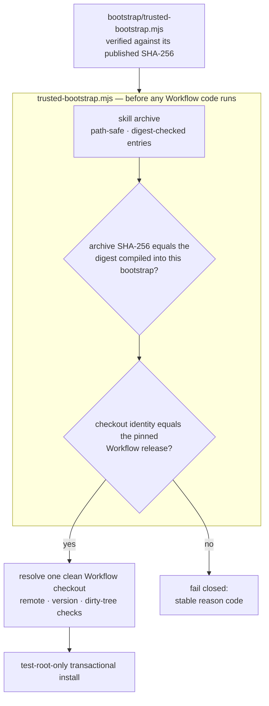

<div align="center">

# TCRN Workflow Helper

**一个文件,你亲手校验一次。此后,凡不是你被许诺的那个发布,一个字节它也不收。**

[English](./README.md) · 简体中文 · [日本語](./README.ja.md) · [한국어](./README.ko.md) · [Français](./README.fr.md)

   

    

[为什么有这个项目](#why-this-project-exists) · [适合谁用](#who-this-is-for) · [请先校验它](#verify-this-first) · [它强制什么](#what-it-enforces) · [安装](#install) · [许可证](#license)

</div>

---

## 为什么有这个项目

从一个仓库安装智能体技能或工作流,本质上是一次供应链决策——而这个决策通常是闭着眼做的:

- **没有发布身份。**`git clone` 给你的只是*某一个*提交,没有任何东西把它和那个被评审、被接受的发布绑在一起。
- **没有任何东西约束字节。**归档被悄悄掉包,或者被降级回一个有漏洞的旧版本,看上去和真品一模一样。单人发布者自己生成的签名密钥并不能解决这件事——它只是把同一个没被回答的问题往左挪了一个文件。真正能解决的,是一个你能独立于下载渠道拿到的摘要。
- **信任从被信任之物自举。**多数安装器用归档*内部*的文件来校验这个归档本身——这什么也证明不了。本仓库更早的候选版本正是穿着更体面的外衣犯了同一个错:一条 Ed25519 信任链,它的根指纹和引导程序摘要都没有发布在任何用户够得着的地方,于是每一次校验都是在拿随下载一起送来的锚点做比对。那条链已被移除,而不是被粉饰。

Helper 就是 TCRN Workflow 给出的答案:一个单文件、零依赖的引导程序,在**任何 Workflow 代码执行之前**校验完整的发布字节与身份,两个受支持的 Agent App 宿主(Codex 与 Claude Code)都适用。任何一项检查不过,它就以一个稳定原因码停下。没有 `--force` 这种东西。

## 适合谁用

**如果你**正打算在一台要紧的机器上运行别人写的智能体工作流,而且不满足于"被安装的东西自己给自己打了个勾",那么它适合你。如果你是这类工作流的发布者,希望用户有一个真实的理由信任某个发布,又不想自己去运维一套密钥基础设施,它同样适合你。

**如果你**是在只有自己碰的机器上安装自己写的工作流,那大概不必——字节从哪来你本来就清楚,这只是为一个你早已回答过的问题多加一道手续。

## 请先校验它

引导程序是你唯一必须信任的东西,所以在相信它说的任何话之前,先检查它:

```sh
shasum -a 256 bootstrap/trusted-bootstrap.mjs
# 4b704bdbc9c2020be04fa6c3d307913bf864d5fbea2d08eb0a29a9f0a3d68611
```

该摘要发布在本文件、`SECURITY.md` 和 GitHub 发布说明三处。若对不上,请就此停止。

## 它强制什么

| 保证 | 机制 |
| --- | --- |
| **可复现的发布工件** | 技能归档、源码归档与 SBOM 均为确定性产物;干净克隆的 CI 重放会在固定的语言区/时区环境下重建它们,并断言其摘要与已提交工件相等。这是首要的信任原语:任何人都可以自己把这些字节重建出来,自己核对。 |
| **精确的发布身份** | 被接受的 Workflow 发布由仓库 URL、版本、commit、tree **以及**注解标签对象共同钉定。这些字段是对着一个真实的 Git 检出、用真实的 Git 对象 ID 核验的,而 Git 对象 ID 是内容哈希,因此可自我认证。 |
| **钉死的发布字节** | 被接受的归档摘要与来源证明摘要被编译进 `bootstrap/trusted-bootstrap.mjs`。引导程序自身的 SHA-256 发布在本 README、`SECURITY.md` 与发布说明中;在相信它说的任何话之前先校验它。任何其他归档一律失败关闭(`IDENTITY_MISMATCH`)。 |
| **防回滚** | GitHub 不可变发布:标签不可移动、不可删除,资产不可更改。更旧的发布同样过不了钉死摘要比对,因为每个引导程序只接受唯一一个归档。 |
| **敌意归档安全** | 路径穿越、绝对路径、控制字符、非 NFC 路径、重复/大小写冲突路径、链接、特殊文件、逐条目摘要篡改,以及条目数与字节数上限——全部在解包之前拒绝。 |
| **在线宿主保护** | 安装、更新、重装、卸载**只**在一次性的 `tcrn-helper-test-*` 根内进行。任何含 `.claude` 或 `.codex` 组件的路径——不论大小写——都会在文件系统被探测之前就被词法拒绝(`LIVE_LOCATION_FORBIDDEN`)。 |
| **事务化生命周期** | 每一次变更都是分阶段、带日志的事务,崩溃恢复由真实的 `SIGKILL` 注入来证明;失败的操作留下逐字节相同的原有状态,零残留。 |

## 快速开始

```sh
# run the full proof suite (offline; ~10 minutes, includes SIGKILL fault injection)
npm test

# validate a release bundle before anything executes
node bootstrap/trusted-bootstrap.mjs validate \
  --archive <archive.json> --provenance <provenance.json> --state <state.json>

# verify a copy of this Skill that a standard installer placed in ~/.claude/skills (read-only)
node bootstrap/trusted-bootstrap.mjs verify-installed-copy \
  --installed-dir <~/.claude/skills/tcrn-workflow-helper> \
  --provenance <provenance.json> --state <state.json> --marker <marker.json>

# resolve exactly one approved Workflow checkout (rejects ambiguity, symlinks, dirty trees)
node bootstrap/trusted-bootstrap.mjs resolve --root <workflow-checkout>

# plan a network operation (prints a static plan; performs nothing)
node bootstrap/trusted-bootstrap.mjs plan-network --approved true --operation clone

# test-root-only lifecycle (explicit approval required)
node bootstrap/trusted-bootstrap.mjs install --test-root <dir>/tcrn-helper-test-x \
  --archive ... --provenance ... --state ... --approved true
```

成功时输出一条规范 JSON 收据(`TRUST_VALIDATED`、`ROOT_RESOLVED`、`NETWORK_PLAN_APPROVED`、`INSTALL_COMPLETED`、`UNINSTALL_COMPLETED`)。失败时输出一个稳定原因码。没有中间状态。

## 信任链如何咬合



## 设计问答

### 为什么零依赖?

引导程序*本身就是*信任边界。每引入一个依赖,都是在校验存在之前就已运行的代码——恰恰是本项目要堵上的那个洞。`bootstrap/trusted-bootstrap.mjs` 只使用 Node 内建模块,发布脚本也遵守同样的纪律。

### 那没有技术背景的用户怎么安装?

Skill 的说明文本(`SKILL.md` + `references/`)可以由标准技能安装器分发到在线宿主的技能目录(例如 `~/.claude/skills`)——那只是放文件,不会从中运行任何代码。让它变得可信的,是随后由一个**独立获取的**可信引导程序(经与本仓库无关的渠道取得,并对照上文公布的 SHA-256 校验过)用 `verify-installed-copy` 对磁盘上那份副本做**只读**核验:重建该副本的归档、把它的摘要与那个已校验引导程序中编译进去的摘要比对,并写下一个机器可校验的 marker。只有该 marker 存在之后,引导式的**首次运行向导**(`references/first-run-wizard.md`)才会继续——取回钉定的发布、校验它,并用大白话解释每一个原因码,一步步带用户完成设置。所以:分发交给标准安装器,信任交给密码学引导程序。

### 为什么 helper 自己的命令不能安装到真实技能位置?

helper 的**变更类**命令(`install`/`update`/`reinstall`/`uninstall`)只负责校验与生命周期,并且始终只限测试根;通过它们做在线宿主激活,是另一个单独门控的发布决策。这道守卫是结构性的:词法层面的在线位置检查跑在测试根标记检查之前、跑在任何文件系统探测之前,并做了大小写折叠(所以在大小写不敏感的文件系统上,`.Claude` 也溜不过去),而且有测试覆盖。Skill 说明文本的分发(见上)走的是标准安装器加只读的 `verify-installed-copy`,完全不经过这些变更类命令。

### 身份钉定为什么这么激进——仓库、版本、commit、tree、*还有*标签对象?

每个字段各杀死一类攻击:仓库 URL 挡掉仿冒远端;版本挡掉"仓库对、发布错";commit 与 tree 挡掉保留标签名的历史改写;标签对象挡掉把一个已有名字重新打到不同字节上。检出身份是用真实的 Git 对象 ID 核验的,而它们是内容哈希——可自我认证,且从不依赖任何人的签名。

### 测试套件到底覆盖了什么?

**72 个测试,全部离线**(唯一用到 `node:net` 的地方是一个本地 unix 域套接字夹具,用于特殊文件拒斥):

- 信任矩阵:钉死摘要不匹配、来源证明被篡改、归档条目被篡改——每一项都断言其精确的原因码。
- 生命周期:安装/更新/重装/卸载,私有工作区逐字节保持不变,在每一个有效注入点投递真实的 `SIGKILL`(故障清单是从真实操作中发现的,不是手写罗列的),用不同 PID 的竞争者做锁争用测试,以及替换文件/外来文件的保全。
- 已安装副本核验:对标准安装器放置的技能目录做只读重建、篡改 → 精确原因码、符号链接目录/条目的拒斥、成功时记录已校验摘要,以及对 state/marker 路径的在线位置拒绝。
- 在线位置守卫:两种宿主形态下的用户级、项目级、`.codex` 以及大小写变体路径。
- 可复现性:在被扰动的 `LANG`/`LC_ALL`/`TZ`/`umask` 环境下的确定性归档、与已提交工件的字节相等,以及一次完整的干净克隆 CI 重放(`npm run ci:replay`)——重跑整条命令序列并断言重建摘要等于已提交摘要。

### 为什么 CI 重放收据不是已提交工件?

因为一张为某次校验运行作证的收据,自己不该无人作证。早期候选版本提交过 `ci-replay-readback.json`;评审发现它不被任何门绑定,还引用了已发布历史之外的提交。它现在是重新生成的 CI 输出(已 gitignore),而已提交的工件集恰好就是每道门都交叉绑定的那五个文件:`candidate-manifest.json`、`checksums.txt`、`sbom.json`、`skill-archive.json`、`source-archive.json`。

## 仓库结构

| 路径 | 内容 |
| --- | --- |
| `bootstrap/trusted-bootstrap.mjs` | 单文件的信任边界:归档校验、钉死的发布字节摘要、身份钉定、事务化生命周期。**使用前请带外校验它的 SHA-256。** |
| `skill/tcrn-workflow-helper/` | Agent Skill 载荷:`SKILL.md`、信任契约、设置引导参考、各宿主元数据。被钉定的归档装的就是这个目录。 |
| `manifests/` | 逐字节拷贝的 Workflow 发布来源证明。注意:它是一份*自述的本地构建声明*(构建类型 `tcrn.workflow.local-unpublished-candidate.v1`,时间戳归零),不是托管构建方出具的证明。它按摘要钉死,因此无法被掉包;可供第三方核查的能力来自可复现构建链,而不是这个文件。 |
| `artifacts/` | 五个可复现的发布工件。 |
| `scripts/` | 确定性的归档/SBOM/校验和生成器、发布校验器、CI 重放。 |
| `test/` | 72 个测试的证明套件。 |

## 被钉定的 Workflow 发布治理了什么(v0.1.0-rc.5 新增)

Helper 的职责没有变——在发布运行之前先证明它——但它现在钉定的发布 TCRN Workflow `v0.1.0-rc.5` 提供了一个更宽的受治理面,Skill 的参考文档会教操作者如何驱动它:

- **会议与门治理** — 审议被记录在事件日志上(`conference-open` / `-append-position` / `-close` / `-cancel`);一个待决的门会阻止某个工作项进入 `done`,直到会议纪要证据将其解除(`WORKSPACE_GATE_PENDING`、`WORKSPACE_GATE_EVIDENCE_UNRESOLVED`)。
- **执行者证明** — 每个变更类动词都必须归属一个执行者,执行者缺失或格式非法即失败关闭(`WORKSPACE_ACTOR_REQUIRED`、`WORKSPACE_ACTOR_INVALID`)。
- **激活阶梯** — 受治理面按分级逐级激活,而不是靠一个全局开关;没有治理记录的工作区,行为完全不变。
- **备份与恢复** — 密闭、同路径、整树的快照,带确定性收据与逐字节一致的证明(`snapshot-manifest` / `snapshot-verify` → `SNAPSHOT_VERIFIED`);见 `skill/tcrn-workflow-helper/references/backup-elicitation.md`。
- **蒸馏** — 对受治理存储做对账式的知识蒸馏。

用散文触发这些审议属于建议性质,并且在 gate-v1 落地之前按设计就是不可靠的;Skill 对此有明确说明,并把可靠的强制执行推迟到机器可校验的门。

## 状态,如实陈述

- `0.1.0-candidate.4` 是一个**预发布候选**,精确支持 TCRN Workflow `v0.1.0-rc.5`。
- 两个宿主上的安装与卸载都**仅限测试根**;不声称任何在线 Codex 或 Claude Code 宿主支持。
- **自建的 Ed25519 签名链已于 2026-07-19 在 `0.1.0-candidate.4` 中移除。**它从来就没有被锚定过:它所依赖的引导程序摘要和密钥指纹,都没有发布在任何用户能独立获取的地方,所以这条链对本仓库之外的任何人都什么也证明不了。密钥是由一个自动化智能体生成的,而非由人类所有者签署认可,以未加密形式躺在磁盘上,且没有轮换路径(它是与一个编译进代码的常量做字节比对)。它的有效期被硬编码成一个固定日期,等于给每一次诚实的安装都预约了一次故障,却对攻击者没有任何约束。安装基数为零。取而代之的是:一个*确实被公开发布*的引导程序摘要、被编译进该引导程序的已接受发布摘要、GitHub 不可变发布,以及可复现构建链。
- 三项 Claude Code 专属行为(设置片段可逆性、用户级与项目级优先序、CLAUDE.md 回退)是在**被钉定的 Workflow 发布**中实现并证明的,而不在本仓库——精确的证据映射见 `skill/tcrn-workflow-helper/references/trust-contract.md`。

## 支持与安全

- 使用问题 → GitHub Discussions;缺陷 → Issues。
- 安全报告 → GitHub 私密漏洞报告(见 `SECURITY.md`)。

## 许可证

[Apache-2.0](./LICENSE)
</content>
</invoke>
