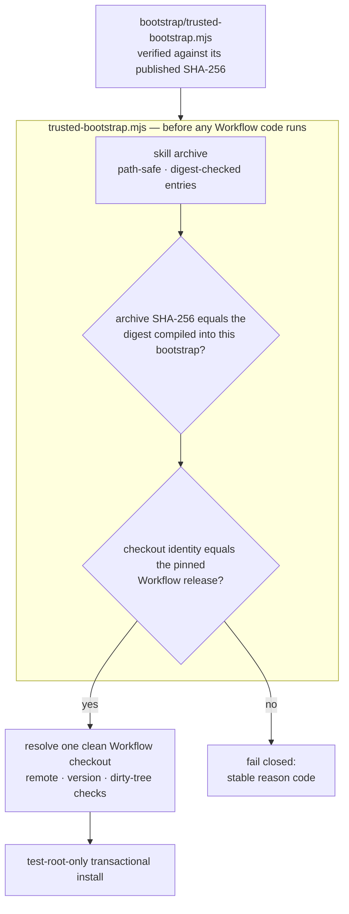

<div align="center">

# TCRN Workflow Helper

### 亲手核对一个文件，一次。此后它替你拒绝其它一切。

**一个单文件、零依赖的引导程序，在任何一行代码运行之前，证明这份发布正是被公开的那一份。**

[English](./README.md) · 简体中文 · [日本語](./README.ja.md) · [한국어](./README.ko.md) · [Français](./README.fr.md)

   

    

[先核对这个](#先核对这个) · [为什么做这个项目](#为什么做这个项目) · [它强制什么](#它强制什么) · [快速开始](#快速开始) · [直白的回答](#直白的回答) · [许可证](#许可证)

</div>

---

> **一句话说清整件事**：你只需把一个小文件与发布在若干个独立位置的摘要核对一次——从此之后，这个文件会以密码学方式拒绝任何不是逐字节等同于被评审版本的发布。没有 `--force`。

## 先核对这个

引导程序是你唯一需要信任的东西，所以在信任它说的任何话之前，先核对它。一条命令，一次比对：

```sh
shasum -a 256 bootstrap/trusted-bootstrap.mjs
# 8c0de6f8d1c3b61a0dc46844a6660889394a2be28e8e0b5653b24e557bfe58a6
```

该摘要发布在这里、在 `SECURITY.md` 中，以及 GitHub 发布说明里。**如果你算出来的值对不上，就停下**——不要运行任何东西，也不要"先试试看"。对不上，正是这套机制在起作用。

## 为什么做这个项目

从某个仓库安装一个智能体技能或工作流，是一次供应链决策，而它通常是闭着眼做的：

- **没有发布身份**。`git clone` 给你的是*某个*提交——没有任何东西把它绑定到那个真正被评审并接受的发布上。
- **没有东西约束字节**。一个被悄悄替换的归档，或者一次回退到有漏洞的旧版本，看起来和真货一模一样。单人发布者自己生成的签名密钥并不能解决这件事——它只是把同一个未回答的问题往左挪了一格。真正能解决的，是一个你能*独立于下载渠道*获得的摘要。
- **信任从被信任之物自举**。多数安装器用归档*内部*的文件去校验那个归档——这什么也证明不了。本仓库早期的候选版本正是穿着更体面的外衣犯了这个错：一条 Ed25519 签名链，其根指纹没有发布在任何用户能触及的地方。那条链被移除了，而不是被粉饰，你现在读到的就是诚实的版本。

Helper 是 TCRN Workflow 的答案：一个单文件、零依赖的引导程序，在两种受支持的宿主（Codex 或 Claude Code）上，**在任何 Workflow 代码执行之前，校验完整的发布字节与身份**。任何一项检查失败，它就带着一个稳定、机器可读的 reason code 停下。

## 这是否适合你

| | |
| --- | --- |
| ✅ **适合，如果** | 你正要在一台重要的机器上运行别人写的智能体工作流，而你想要的不只是那个被安装物自己画出来的一个绿色对勾。或者你发布这样的工作流，希望用户有*真正的*理由信任一次发布——而不需要你自己去运营一套密钥基础设施。 |
| ❌ **可能不适合，如果** | 你要安装的是自己写的工作流，装在只有你会碰的机器上。你已经知道字节从哪来，这只是为一个你已经回答过的问题多加一道步骤。 |

## 它强制什么

| 保证 | 如何做到 |
| --- | --- |
| **可复现的产物** | 技能归档、源码归档与 SBOM 都是确定性的。一次干净克隆的 CI 重放会从零重建它们，并断言摘要与已提交的一致。任何人都可以重建这些字节并核对——这是首要的信任原语。 |
| **精确的发布身份** | 被接受的 Workflow 发布由仓库 URL、版本、commit、tree **以及**注解标签对象共同钉死——并对着一个真实的 Git 检出核验。Git 对象 id 是内容哈希，因此这层绑定是自证的。 |
| **被钉死的发布字节** | 被接受的归档与 provenance 摘要编译在 `bootstrap/trusted-bootstrap.mjs` 自身之内。任何其它归档都失败即关闭（`IDENTITY_MISMATCH`）。而引导程序自己的 SHA-256，就是上面那个你亲手核对的值。 |
| **防回滚** | GitHub 不可变发布：标签不能被移动，资产不能被替换。旧版本同样会在钉定摘要比对中失败，因为每个引导程序只接受恰好一个归档。 |
| **敌意归档安全** | 路径穿越、绝对路径、控制字符、非 NFC 路径、重复与大小写冲突的路径、链接、特殊文件、逐条目摘要篡改，以及条目/字节上限——全部在解包*之前*被拒绝。 |
| **实时宿主保护** | install、update、reinstall 与 uninstall **只**在一次性的 `tcrn-helper-test-*` 根目录内操作。任何包含 `.claude` 或 `.codex` 组件的路径——不分大小写——都会在文件系统被探测之前就遭拒绝（`LIVE_LOCATION_FORBIDDEN`）。 |
| **事务化生命周期** | 每一次改动都是暂存、带日志的事务，其崩溃恢复由真实的 `SIGKILL` 注入证明。一次失败的操作留下逐字节一致的先前状态，零残留。 |

## 快速开始

```sh
# run the full proof suite (offline; expect 10-20 minutes — it includes real SIGKILL fault injection)
npm test

# validate a release bundle before anything executes
node bootstrap/trusted-bootstrap.mjs validate \
  --archive <archive.json> --provenance <provenance.json> --state <state.json>

# verify a copy of this Skill that a standard installer placed in ~/.claude/skills (read-only)
node bootstrap/trusted-bootstrap.mjs verify-installed-copy \
  --installed-dir <~/.claude/skills/tcrn-workflow-helper> \
  --provenance <provenance.json> --state <state.json> --marker <marker.json>

# resolve exactly one approved Workflow checkout (rejects ambiguity, symlinks, dirty trees)
node bootstrap/trusted-bootstrap.mjs resolve --root <workflow-checkout>

# plan a network operation (prints a static plan; performs nothing)
node bootstrap/trusted-bootstrap.mjs plan-network --approved true --operation clone

# test-root-only lifecycle (explicit approval required)
node bootstrap/trusted-bootstrap.mjs install --test-root <dir>/tcrn-helper-test-x \
  --archive ... --provenance ... --state ... --approved true
```

成功会产出一份规范化 JSON 收据（`TRUST_VALIDATED`、`ROOT_RESOLVED`、`NETWORK_PLAN_APPROVED`、`INSTALL_COMPLETED`、`UNINSTALL_COMPLETED`）。失败会产出一个稳定的 reason code。中间没有第三种情况。

## 日常怎么用

上面的命令是信任机械。日常里你基本不亲自跑它们——你的 agent 跑，而这个仓库真正的产品，是它交到 agent 手上的那套纪律。

1. **放置一次。** 让你的 agent（或任何标准的 skills 安装器）把 `skill/tcrn-workflow-helper/` 放进宿主的 skills 目录——Claude Code 是 `~/.claude/skills` 或项目的 `.claude/skills`。放置只是文件；不会有任何代码从中运行。
2. **信任一次。** 把你下载的 `trusted-bootstrap.mjs` 与上方公布的 SHA-256 核对，然后让它只读地检查已放置的副本：`verify-installed-copy` 要么给出 `INSTALLED_COPY_VALIDATED`，要么点名说出哪里不对。之后每个会话都重跑这一个只读检查，陈旧或被改动的副本在指导任何事之前就会被抓住。
3. **通过对话完成设置。** 让 agent 去设置 TCRN Workflow。Skill 的首次运行向导会用平实语言带着它——也带着你——走完其余步骤：解析唯一被认可的 Workflow 检出（`ROOT_RESOLVED`）、创建工作区、选定备份目的地与节奏。你不需要敲任何路径。
4. **然后正常工作。** Skill 教你的 agent 判断什么样的工作时刻值得一条记录——一个决定、一次分解、一件完成的交付、一个有争议的「完成」——以及用哪个动词记录。一条硬规则贯穿始终：它只提议，没有你的明确同意什么都不会写入。想亲眼看一遍底层闭环，Workflow 仓库在 `docs/tutorial/governed-loop.md` 带有一份被证明钉住的教程。

### 通过 Skills 注册表安装

公开来源获得 Owner 授权后，使用标准的复制式安装器：

```sh
npx skills add tpmoonchefryan/tcrn-workflow-helper \
  --skill tcrn-workflow-helper \
  --global --agent claude-code --agent codex --copy --yes
```

安装器只负责放置 Skill 文件；`trusted-bootstrap.mjs` 仍会独立校验信任根。临时矩阵可使用 `<scratch-host>/.claude/skills` 与 `<scratch-host>/.agents/skills`，不要把符号链接根目录当作已验证副本。

属于你的：每一个决定。属于引擎的：强制执行它们。可以查验的：以上全部。

## 信任链是怎么拼起来的



## 直白的回答

### 为什么零依赖

引导程序*就是*信任边界。每一个依赖都会是"在校验存在之前就运行的代码"——正是这个项目要堵上的那个洞。`bootstrap/trusted-bootstrap.mjs` 只使用 Node 内置模块，发布脚本也遵守同一条纪律。

### 那非技术用户要怎么安装

技能的散文部分（`SKILL.md` 与 `references/`）可以由标准的技能安装器分发到实时宿主的技能目录（例如 `~/.claude/skills`）——那次放置只是文件，没有代码从中运行。信任来自之后一步：一个**独立获取的**引导程序——对着上面公布的 SHA-256 核对过——用 `verify-installed-copy` 以**只读**方式校验磁盘上的那份副本，并写下一个机器可查的标记。只有该标记存在之后，引导式的**首次运行向导**（`references/first-run-wizard.md`）才会继续，用平实的语言逐条解释每个 reason code，带用户走完配置。所以：分发用标准安装器，信任用密码学引导程序。

### 为什么 helper 自己的命令不能装进真实的技能位置

Helper 的改动型命令（`install`/`update`/`reinstall`/`uninstall`）只做校验与生命周期，且保持仅限测试根目录；通过它们做实时宿主激活，是一个独立的、带门的发布决定。这道守卫是结构性的：实时位置检查在测试根检查之前、也在任何文件系统探测之前运行，且做了大小写折叠（因此大小写不敏感文件系统上的 `.Claude` 也溜不过去），并有测试覆盖。

### 身份钉定为什么这么严——仓库、版本、commit、tree 还要加标签对象

每一项都掐死一种不同的攻击：仓库 URL 挡住仿冒远端；版本挡住"仓库对了、发布不对"；commit 与 tree 挡住保留标签名的历史改写；标签对象挡住把已有标签名重新指向不同字节。全部以真实的 Git 对象 id 核验——内容哈希，自证，且从不依赖任何人的签名。

### 测试套件到底覆盖了什么

**87 个测试，全部离线**（唯一用到 `node:net` 的地方，是一个用于特殊文件拒绝的本地 unix 域套接字 fixture）：

- 信任矩阵：钉定摘要不匹配、被篡改的 provenance、被篡改的归档条目——每一项都断言其确切的 reason code。
- 生命周期：install / update / reinstall / uninstall，伴随逐字节一致的私有工作区保全、在每一个有效注入点投递真实 `SIGKILL`（故障清单是从真实操作中发现的，不是手写罗列的）、不同 PID 竞争者的锁争用，以及替换/外来文件的保全。
- 已安装副本校验：对标准安装器放置的技能目录做只读重建、篡改 → 确切 reason code、符号链接拒绝，以及对 state/marker 路径的实时位置拒绝。
- 实时位置守卫：用户级、项目级、`.codex`，以及两种宿主形态上的大小写变体路径。
- 可复现性：在扰动过的 `LANG`/`LC_ALL`/`TZ`/`umask` 环境下产出确定性归档、与已提交产物的逐字节相等，以及一次完整的干净克隆 CI 重放（`npm run ci:replay`）。
- 排序：每一条产生摘要的遍历都按码元比较，绝不按区域设置——因此一次安装绝不会因为宿主讲另一种语言而被拒绝。

### 为什么 CI 重放收据不是已提交产物

因为一张为某次校验运行作证的收据，自己不该无人作证。早期候选版本提交过 `ci-replay-readback.json`；评审发现它不被任何门绑定，还引用了已发布历史之外的提交。它现在是重新生成的 CI 输出（已 gitignore），而已提交的产物集恰好就是每道门都交叉绑定的那五个文件：`candidate-manifest.json`、`checksums.txt`、`sbom.json`、`skill-archive.json`、`source-archive.json`。

## 仓库结构

| 路径 | 内容 |
| --- | --- |
| `bootstrap/trusted-bootstrap.mjs` | 单文件信任边界：归档校验、钉定的发布字节摘要、身份钉定、事务化生命周期。**使用前请带外核验它的 SHA-256。** |
| `skill/tcrn-workflow-helper/` | Agent Skill 载荷：`SKILL.md`、信任契约、settings 征询参考、各宿主元数据。这个目录就是被钉定归档所包含的内容。 |
| `manifests/` | 逐字节拷贝的 Workflow 发布 provenance。它是一份*自述的本地构建声明*（时间戳归零），不是托管构建方的证明——它以摘要钉定因此不可被替换；第三方可核查性来自可复现构建链。 |
| `artifacts/` | 五个可复现的发布产物。 |
| `scripts/` | 确定性的归档/SBOM/校验和生成器、发布校验器、CI 重放、推送门。 |
| `test/` | 87 个测试的证明套件。 |
| `RELEASING.md` | 发布运行手册——被强制的顺序、provenance 拷贝规则，以及触碰信任面的提交必须跑全套的规则。 |

## 被钉定的 Workflow 发布治理什么

Helper 的职责没有变——在它运行之前证明这份发布。而它所钉定的这个版本，TCRN Workflow `v0.11.11`，带来了一个受治理的表面，技能的参考文档会教操作者去驱动它：

- **会议与门治理**——审议被记录在事件日志上（`conference-open` / `-append-position` / `-close` / `-cancel`），而一个未满足的门会阻止工作项到达 `done`，直到会议纪要证据将其解决（`WORKSPACE_GATE_PENDING`、`WORKSPACE_GATE_EVIDENCE_UNRESOLVED`）。
- **执行者留痕**——一旦启用，每个改动型动词都必须归属一个执行中的执行者，缺失或格式错误都失败即关闭（`WORKSPACE_ACTOR_REQUIRED`、`WORKSPACE_ACTOR_INVALID`）。
- **激活阶梯**——受治理表面通过分阶段、可逆的梯级激活，而不是靠一个全局开关；没有治理记录的工作区行为完全不变。
- **备份与恢复**——密封的、同路径的整树快照，带确定性收据与逐字节一致的证明（`snapshot-manifest` / `snapshot-verify` → `SNAPSHOT_VERIFIED`）；见 `skill/tcrn-workflow-helper/references/backup-elicitation.md`。
- **受治理的迁置**——工作区有了一条被记录在案的路径去往新的路径或新的机器（`relocation-plan` / `-vacate` / `-adopt` / `-abort` / `-inspect`）。这些动词移动的是绑定，字节由操作者自己搬，任何事件都不会被重写。它不能阻止分叉，只能让分叉可见——依赖它之前先读该发布的 `docs/adr/0003-workspace-relocation.md`。
- **可读的事件链**——`event-list` 逐页原样返回事件，因此消费者可以重新推导一条大到 `export` 拒绝处理的链。
- **蒸馏**——在受治理存储之上做对账后的知识蒸馏。

以散文触发这些审议是建议性的、按设计不可靠，等待 gate-v1；技能对此有明确说明，并把可靠的强制推迟到机器可查的门上。

## 状态，如实相告

- `0.1.0-candidate.36` 是一个**预发布候选**，恰好支持 TCRN Workflow `v0.11.11`。
- 安装与移除在两种宿主上都**仅限测试根目录**；不声称支持实时的 Codex 或 Claude Code 宿主。
- **自建的 Ed25519 签名链已于 2026-07-19 移除**。它从来就没有被锚定过：它所依赖的摘要与密钥指纹，都没有发布在任何用户能独立获取的地方，所以这条链对本仓库之外的任何人都什么也证明不了。取代它的东西更简单也更诚实：一个*真正被发布*在多个独立位置的引导程序摘要、编译进该引导程序的被接受发布摘要、GitHub 不可变发布，以及可复现构建链。
- 三项 Claude Code 专有行为（settings 片段可逆性、用户级与项目级优先级、CLAUDE.md 回退）是在**被钉定的 Workflow 发布**中实现并证明的，不在本仓库——确切的证据映射见 `skill/tcrn-workflow-helper/references/trust-contract.md`。

## 支持与安全

- 问题 → GitHub Discussions ｜ 缺陷 → Issues。
- 安全报告 → GitHub 私密漏洞报告（见 `SECURITY.md`）。

## 许可证

[Apache-2.0](./LICENSE)
