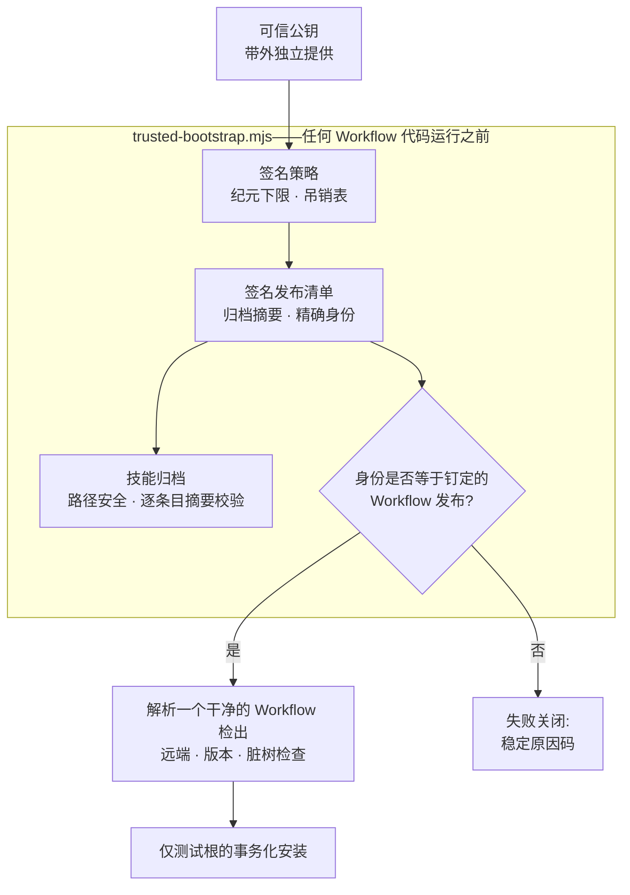

[English](./README.md) | **简体中文** | [日本語](./README.ja.md) | [한국어](./README.ko.md) | [Français](./README.fr.md)

# TCRN Workflow Helper

**零依赖的可信引导程序 + 双宿主 Agent Skill——凡是无法用密码学证明的 TCRN Workflow 发布,一律拒绝运行。**

`状态: 0.1.0-candidate.2(预发布候选)` · `许可证: Apache-2.0` · `Node ≥ 24` · `依赖: 零` · `支持: TCRN Workflow v0.1.0-rc.4`

---

## 为什么要做这个项目

从仓库安装一个智能体技能或工作流,本质上是一次供应链决策,而它通常是盲做的:

- **没有发布身份。**`git clone` 给你的只是*某个*提交——没有任何东西把它绑定到被评审、被接受的那个发布。
- **没有签名、没有回滚下限。**没有东西能阻止被悄悄替换的归档、被移植的策略文件,或降级到仍带着"看起来有效"签名的旧漏洞版本。
- **信任从被信任物自举。**多数安装器用归档*内部*的文件来校验归档自身——这什么也证明不了。

Helper 就是 TCRN Workflow 对此的回答:一个单文件、零依赖的引导程序,在**任何 Workflow 代码执行之前**校验完整的签名发布身份,支持两个 Agent App 宿主(Codex 与 Claude Code)。任何检查失败即以稳定原因码停止。没有 `--force`。

## 它强制什么

| 保证 | 机制 |
| --- | --- |
| **精确发布身份** | 被接受的 Workflow 发布由仓库 URL、版本、commit、tree **及**注解标签对象共同钉定。签名有效但指向不同发布的清单会失败关闭(`IDENTITY_MISMATCH`)。 |
| **真实签名、外部信任** | Ed25519 发布清单与独立签名的策略,用*独立于归档提供*的公钥校验——归档永远无法自我认证。策略移植与重放在任何策略字段被采信之前即被拒绝。 |
| **防回滚** | 单调策略纪元下限,持久化在 Skill 目录之外;更旧的纪元即使签名有效也失败关闭(`ROLLBACK_REJECTED`)。 |
| **敌意归档安全** | 路径穿越、绝对路径、控制字符、非 NFC 路径、重复/大小写冲突路径、链接、特殊文件、逐条目摘要篡改、条目/字节上限——全部在解包前拒绝。 |
| **在线宿主保护** | 安装、更新、重装、卸载**只**在一次性 `tcrn-helper-test-*` 根内进行。路径中含 `.claude` 或 `.codex` 组件——任何大小写——都会在触碰文件系统之前被词法拒绝(`LIVE_LOCATION_FORBIDDEN`)。 |
| **事务化生命周期** | 每次变更都是分阶段、带日志的事务,崩溃恢复由真实 `SIGKILL` 注入证明;失败操作留下逐字节相同的先前状态与零残留。 |
| **可复现发布工件** | 技能归档、源归档与 SBOM 均确定性生成;干净克隆的 CI 重放在固定语言区/时区环境下重建它们,并断言与已提交工件摘要相等。 |

## 快速开始

```sh
# 跑完整证明套件(离线;约 10 分钟,含 SIGKILL 故障注入)
npm test

# 在任何东西执行之前校验签名发布包
node bootstrap/trusted-bootstrap.mjs validate \
  --archive <archive.json> --manifest <manifest.json> --policy <policy.json> \
  --provenance <provenance.json> --state <state.json> --trusted-key <public-key.pem>

# 解析恰好一个被认可的 Workflow 检出(拒绝歧义、符号链接、脏树)
node bootstrap/trusted-bootstrap.mjs resolve --root <workflow-checkout>

# 规划网络操作(仅打印静态计划;不执行任何动作)
node bootstrap/trusted-bootstrap.mjs plan-network --approved true --operation clone

# 仅测试根的生命周期(需要显式批准)
node bootstrap/trusted-bootstrap.mjs install --test-root <dir>/tcrn-helper-test-x \
  --archive ... --manifest ... --policy ... --provenance ... --state ... \
  --trusted-key ... --approved true
```

成功输出一条规范 JSON 收据(`TRUST_VALIDATED`、`ROOT_RESOLVED`、`NETWORK_PLAN_APPROVED`、`INSTALL_COMPLETED`、`UNINSTALL_COMPLETED`);失败输出一个稳定原因码。没有中间态。

## 信任链如何咬合



## 设计问答(QA)

### 为什么零依赖?

引导程序*本身就是*信任边界。每一个依赖都是在校验存在之前就运行的代码——恰恰是本项目要堵上的洞。`bootstrap/trusted-bootstrap.mjs` 只用 Node 内建模块,发布脚本遵循同样纪律。

### 为什么不能装进真实的 Codex 或 Claude Code 技能目录?

因为本候选的职责是校验,不是激活。在线宿主安装是另一个独立门控的发布决策。在那之前,守卫是结构性的:词法在线位置检查先于测试根标记检查、先于任何文件系统探测执行,做了大小写折叠(所以大小写不敏感文件系统上的 `.Claude` 也溜不过去),并有覆盖两宿主用户级、项目级与大小写变体形态的测试。

### 身份钉定为什么这么激进——仓库、版本、commit、tree、还有标签对象?

每个字段杀死一种攻击:仓库 URL 阻止仿冒远端;版本阻止"仓库对、发布错";commit 与 tree 阻止保留标签名的历史改写;标签对象阻止把已有名字重新打到不同字节上。测试套件包含一个*签名有效且策略绑定成立*、但版本不同的清单——它必须恰好败在身份比较本身(`IDENTITY_MISMATCH`),证明该检查没有被签名校验遮蔽。

### 测试套件到底覆盖什么?

**70 个测试,全部离线**(唯一的 `node:net` 用途是本地 unix 域套接字夹具,用于特殊文件拒斥测试):

- 签名路径硬化:仅属主可读的密钥目录、描述符稳定读取、流氓密钥拒斥、预写失败零残留。
- 信任矩阵:签名/密钥替换、策略移植与重放、纪元回滚、吊销、过期、来源证明篡改、归档条目篡改、身份不符清单——每项断言其精确原因码。
- 生命周期:安装/更新/重装/卸载且私有工作区逐字节保真、在每个有效注入点投递真实 `SIGKILL`(故障清单从真实操作发现,不是手写列表)、不同 PID 竞争者的锁争用、替换/外来文件保全。
- 在线位置守卫:两宿主的用户级、项目级、`.codex` 与大小写变体路径。
- 可复现性:在扰动的 `LANG`/`LC_ALL`/`TZ`/`umask` 环境下的确定性归档、与已提交工件的字节相等,以及完整的干净克隆 CI 重放(`npm run ci:replay`)——重跑全部命令序列并断言重建摘要等于已提交摘要。

### 为什么 CI 重放收据不是已提交工件?

因为一张为校验运行作证的收据,不应该自己无人作证。早期候选提交过 `ci-replay-readback.json`;评审发现它不被任何门绑定,且引用了发布历史之外的提交。现在它是再生成的 CI 输出(gitignore),已提交工件集恰好是每道门都交叉绑定的五个文件:`candidate-manifest.json`、`checksums.txt`、`sbom.json`、`skill-archive.json`、`source-archive.json`。

## 仓库结构

| 路径 | 内容 |
| --- | --- |
| `bootstrap/trusted-bootstrap.mjs` | 单文件信任边界:归档校验、签名验证、身份钉定、防回滚、事务化生命周期。 |
| `skill/tcrn-workflow-helper/` | Agent Skill 载荷:`SKILL.md`、信任契约、设置引导参考、宿主元数据。签名归档装的就是这个目录。 |
| `manifests/` | Ed25519 签名的发布清单与策略,以及逐字节拷贝的 Workflow 发布来源证明。 |
| `artifacts/` | 五个可复现发布工件。 |
| `scripts/` | 确定性归档/SBOM/校验和生成器、发布校验器、CI 重放、签名工具(私钥永不进入本仓库)。 |
| `test/` | 70 测试证明套件。 |

## 状态(如实陈述)

- `0.1.0-candidate.2` 是**预发布候选**,精确支持 TCRN Workflow `v0.1.0-rc.4`。
- 两宿主上的安装与卸载均**仅限测试根**;不声称任何在线 Codex 或 Claude Code 宿主支持。
- 三项 Claude Code 专属行为(设置片段可逆性、用户级/项目级优先序、CLAUDE.md 回退)在**钉定的 Workflow 发布**中实现并证明,不在本仓库——精确证据映射见 `skill/tcrn-workflow-helper/references/trust-contract.md`。

## 支持与安全

- 使用问题 → GitHub Discussions;缺陷 → Issues。
- 安全报告 → GitHub 私密漏洞报告(见 `SECURITY.md`)。

## 许可证

[Apache-2.0](./LICENSE)
