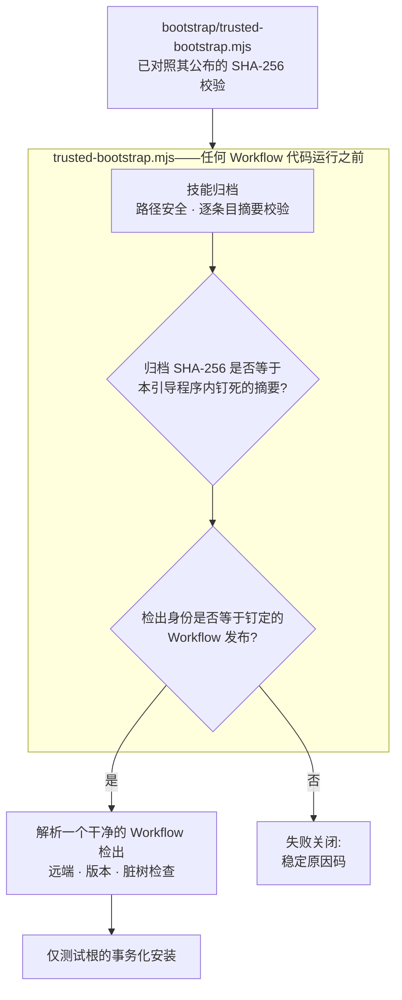

[English](./README.md) | **简体中文** | [日本語](./README.ja.md) | [한국어](./README.ko.md) | [Français](./README.fr.md)

# TCRN Workflow Helper

**零依赖的可信引导程序 + 双宿主 Agent Skill——凡是字节与你已带外校验过的引导程序内钉死的摘要不符的 TCRN Workflow 发布,一律拒绝运行。**

**请先校验它。**引导程序是你唯一必须信任的东西,所以在相信它说的任何话之前先检查它:

```sh
shasum -a 256 bootstrap/trusted-bootstrap.mjs
# 7fa9f51fa024bb38db299f3604a33d071a2fe17e9dc45bc17fe80edc86aea3aa
```

该摘要发布在本文件、`SECURITY.md` 和 GitHub 发布说明中。若不匹配,请停止。

`状态: 0.1.0-candidate.4(预发布候选)` · `许可证: Apache-2.0` · `Node ≥ 24` · `依赖: 零` · `支持: TCRN Workflow v0.1.0-rc.5`

---

## 为什么要做这个项目

从仓库安装一个智能体技能或工作流,本质上是一次供应链决策,而它通常是盲做的:

- **没有发布身份。**`git clone` 给你的只是*某个*提交——没有任何东西把它绑定到被评审、被接受的那个发布。
- **没有任何东西约束字节本身。**被悄悄替换的归档,或降级到旧的、有漏洞的版本,看起来与真品别无二致。单人发布者自己生成的签名密钥并不能解决这一点——它只是把同一个未被回答的问题往左挪了一个文件。真正解决问题的,是一个你能独立于下载渠道获得的摘要。
- **信任从被信任物自举。**多数安装器用归档*内部*的文件来校验归档自身——这什么也证明不了。本仓库更早的候选版本正是穿着更体面的外衣犯了同样的错误:一条 Ed25519 信任链,其根指纹与引导程序摘要都没有发布在任何用户能触及的地方,于是每一次校验都是在对着随下载一同送达的锚点做比较。那条链已被移除,而不是被粉饰。

Helper 就是 TCRN Workflow 对此的回答:一个单文件、零依赖的引导程序,在**任何 Workflow 代码执行之前**校验完整的发布字节与身份,支持两个 Agent App 宿主(Codex 与 Claude Code)。任何检查失败即以稳定原因码停止。没有 `--force`。

## 它强制什么

| 保证 | 机制 |
| --- | --- |
| **精确发布身份** | 被接受的 Workflow 发布由仓库 URL、版本、commit、tree **及**注解标签对象共同钉定。这些字段是对着真实的 Git 检出核对的,而 Git 对象 ID 是内容哈希,因此可自我认证。 |
| **钉死的发布字节** | 被接受的归档与来源证明摘要被编译进 `bootstrap/trusted-bootstrap.mjs`。引导程序自身的 SHA-256 发布在本文件、`SECURITY.md` 与发布说明中;在相信它所说的任何话之前先校验它。任何其他归档都失败关闭(`IDENTITY_MISMATCH`)。 |
| **防回滚** | GitHub 不可变发布:标签不可移动或删除,资产不可更改。更旧的发布同样通不过钉死摘要比较,因为每个引导程序只接受唯一一个归档。 |
| **敌意归档安全** | 路径穿越、绝对路径、控制字符、非 NFC 路径、重复/大小写冲突路径、链接、特殊文件、逐条目摘要篡改、条目/字节上限——全部在解包前拒绝。 |
| **在线宿主保护** | 安装、更新、重装、卸载**只**在一次性 `tcrn-helper-test-*` 根内进行。路径中含 `.claude` 或 `.codex` 组件——任何大小写——都会在触碰文件系统之前被词法拒绝(`LIVE_LOCATION_FORBIDDEN`)。 |
| **事务化生命周期** | 每次变更都是分阶段、带日志的事务,崩溃恢复由真实 `SIGKILL` 注入证明;失败操作留下逐字节相同的先前状态与零残留。 |
| **可复现发布工件** | 技能归档、源归档与 SBOM 均确定性生成;干净克隆的 CI 重放在固定语言区/时区环境下重建它们,并断言与已提交工件摘要相等。 |

## 快速开始

```sh
# 跑完整证明套件(离线;约 10 分钟,含 SIGKILL 故障注入)
npm test

# 在任何东西执行之前校验发布包
node bootstrap/trusted-bootstrap.mjs validate \
  --archive <archive.json> --provenance <provenance.json> --state <state.json>

# 只读核验标准安装器放进 ~/.claude/skills 的本 Skill 副本
node bootstrap/trusted-bootstrap.mjs verify-installed-copy \
  --installed-dir <~/.claude/skills/tcrn-workflow-helper> \
  --provenance <provenance.json> --state <state.json> --marker <marker.json>

# 解析恰好一个被认可的 Workflow 检出(拒绝歧义、符号链接、脏树)
node bootstrap/trusted-bootstrap.mjs resolve --root <workflow-checkout>

# 规划网络操作(仅打印静态计划;不执行任何动作)
node bootstrap/trusted-bootstrap.mjs plan-network --approved true --operation clone

# 仅测试根的生命周期(需要显式批准)
node bootstrap/trusted-bootstrap.mjs install --test-root <dir>/tcrn-helper-test-x \
  --archive ... --provenance ... --state ... --approved true
```

成功输出一条规范 JSON 收据(`TRUST_VALIDATED`、`ROOT_RESOLVED`、`NETWORK_PLAN_APPROVED`、`INSTALL_COMPLETED`、`UNINSTALL_COMPLETED`);失败输出一个稳定原因码。没有中间态。

## 信任链如何咬合



## 设计问答(QA)

### 为什么零依赖?

引导程序*本身就是*信任边界。每一个依赖都是在校验存在之前就运行的代码——恰恰是本项目要堵上的洞。`bootstrap/trusted-bootstrap.mjs` 只用 Node 内建模块,发布脚本遵循同样纪律。

### 那无技术背景的用户怎么安装?

Skill 的说明文本(`SKILL.md` + `references/`)**可以**由标准技能安装器放进在线宿主技能目录(如 `~/.claude/skills`)——那只是放文件,不会从中运行任何代码。让它可信的,是随后由**独立获取的**(经仓库无关渠道取得、并对照上方公布的 SHA-256 校验过的)可信引导程序用 `verify-installed-copy` **只读**核验那份磁盘副本:重建副本的归档、把其摘要与该已校验引导程序内钉死的摘要比对、写一个机器可校验的 marker。只有该 marker 存在后,引导式**首次运行向导**(`references/first-run-wizard.md`)才继续——取钉定发布、校验、用大白话解释每个原因码牵着用户走。所以:分发用标准安装器,信任用密码学引导。

### 为什么 helper 自己的命令不能装进真实技能目录?

helper 的**变更类**命令(`install`/`update`/`reinstall`/`uninstall`)只做校验与生命周期,仍**只限测试根**;经由它们的在线宿主激活是另一个独立门控的发布决策。守卫是结构性的:词法在线位置检查先于测试根标记检查、先于任何文件系统探测,做了大小写折叠(`.Claude` 也溜不过去),并有测试覆盖。Skill 说明文本的分发(见上)走标准安装器 + 只读 `verify-installed-copy`,绝不经过这些变更命令。

### 身份钉定为什么这么激进——仓库、版本、commit、tree、还有标签对象?

每个字段杀死一种攻击:仓库 URL 阻止仿冒远端;版本阻止"仓库对、发布错";commit 与 tree 阻止保留标签名的历史改写;标签对象阻止把已有名字重新打到不同字节上。检出身份是用真实的 Git 对象 ID 核验的——它们是内容哈希,可自我认证,从不依赖任何人的签名。

### 测试套件到底覆盖什么?

**72 个测试,全部离线**(唯一的 `node:net` 用途是本地 unix 域套接字夹具,用于特殊文件拒斥测试):

- 信任矩阵:钉死摘要不符、来源证明篡改、归档条目篡改——每项断言其精确原因码。
- 生命周期:安装/更新/重装/卸载且私有工作区逐字节保真、在每个有效注入点投递真实 `SIGKILL`(故障清单从真实操作发现,不是手写列表)、不同 PID 竞争者的锁争用、替换/外来文件保全。
- 已安装副本核验:对标准安装器放置的技能目录只读重建、篡改 → 精确原因码、符号链接目录/条目拒斥、成功时抬升防回滚下限、以及对 state/marker 路径的在线位置拒斥。
- 在线位置守卫:两宿主的用户级、项目级、`.codex` 与大小写变体路径。
- 可复现性:在扰动的 `LANG`/`LC_ALL`/`TZ`/`umask` 环境下的确定性归档、与已提交工件的字节相等,以及完整的干净克隆 CI 重放(`npm run ci:replay`)——重跑全部命令序列并断言重建摘要等于已提交摘要。

### 为什么 CI 重放收据不是已提交工件?

因为一张为校验运行作证的收据,不应该自己无人作证。早期候选提交过 `ci-replay-readback.json`;评审发现它不被任何门绑定,且引用了发布历史之外的提交。现在它是再生成的 CI 输出(gitignore),已提交工件集恰好是每道门都交叉绑定的五个文件:`candidate-manifest.json`、`checksums.txt`、`sbom.json`、`skill-archive.json`、`source-archive.json`。

## 仓库结构

| 路径 | 内容 |
| --- | --- |
| `bootstrap/trusted-bootstrap.mjs` | 单文件信任边界:归档校验、钉死的发布字节摘要、身份钉定、事务化生命周期。**使用前请带外校验它的 SHA-256。** |
| `skill/tcrn-workflow-helper/` | Agent Skill 载荷:`SKILL.md`、信任契约、设置引导参考、宿主元数据。钉死摘要所对应的归档装的就是这个目录。 |
| `manifests/` | 逐字节拷贝的 Workflow 发布来源证明。注意:它是*自述的本地构建声明*(构建类型 `tcrn.workflow.local-unpublished-candidate.v1`、时间戳归零),并非托管构建方的证明。它按摘要钉死因而无法被替换;可供第三方核查的能力来自可复现构建链,而非此文件。 |
| `artifacts/` | 五个可复现发布工件。 |
| `scripts/` | 确定性归档/SBOM/校验和生成器、发布校验器、CI 重放。 |
| `test/` | 72 测试证明套件。 |

## 钉定的 Workflow 发布所治理的能力(v0.1.0-rc.5 新增)

助手的职责不变——在发布运行前先证明它——但它现在钉定的发布 TCRN Workflow `v0.1.0-rc.5` 提供了更广的受治理面,Skill 的参考文档会教操作者驱动它:

- **会议与门治理** — 审议被记录到事件日志(`conference-open` / `-append-position` / `-close` / `-cancel`);待决门会阻止某工作项到达 `done`,直到会议纪要证据将其解除(`WORKSPACE_GATE_PENDING`、`WORKSPACE_GATE_EVIDENCE_UNRESOLVED`)。
- **执行者证明** — 每个变更类动词都必须归属一个执行者,执行者缺失或格式非法即失败闭合(`WORKSPACE_ACTOR_REQUIRED`、`WORKSPACE_ACTOR_INVALID`)。
- **激活阶梯** — 受治理面按分级逐级激活,而非单一全局开关;不含治理记录的工作区行为不变。
- **备份与恢复** — 密闭、同路径、整树的快照,带确定性收据和逐字节一致的证明(`snapshot-manifest` / `snapshot-verify` → `SNAPSHOT_VERIFIED`);见 `skill/tcrn-workflow-helper/references/backup-elicitation.md`。
- **蒸馏** — 对受治理存储的对账式知识蒸馏。

用散文触发这些审议是建议性的,且在 gate-v1 落地前按设计不可靠;Skill 对此明确说明,并将可靠的强制执行推迟到机器可校验的门。

## 状态(如实陈述)

- `0.1.0-candidate.4` 是**预发布候选**,精确支持 TCRN Workflow `v0.1.0-rc.5`。
- 两宿主上的安装与卸载均**仅限测试根**;不声称任何在线 Codex 或 Claude Code 宿主支持。
- 三项 Claude Code 专属行为(设置片段可逆性、用户级/项目级优先序、CLAUDE.md 回退)在**钉定的 Workflow 发布**中实现并证明,不在本仓库——精确证据映射见 `skill/tcrn-workflow-helper/references/trust-contract.md`。

## 支持与安全

- 使用问题 → GitHub Discussions;缺陷 → Issues。
- 安全报告 → GitHub 私密漏洞报告(见 `SECURITY.md`)。

## 许可证

[Apache-2.0](./LICENSE)
